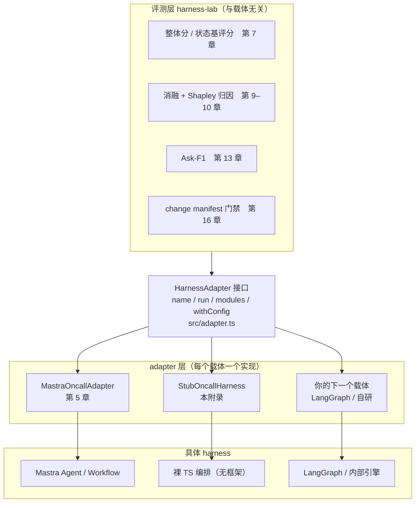
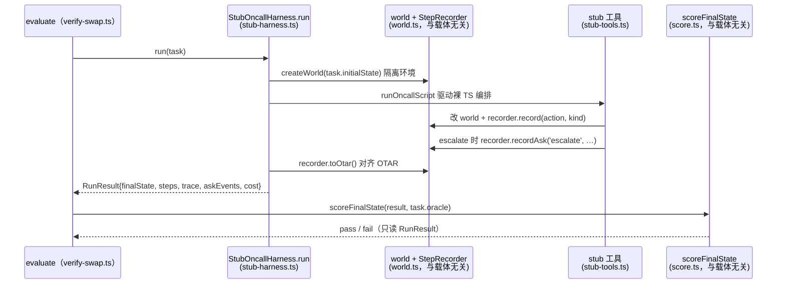

## 开篇：框架不由你选的那天

本书从第 5 章起，所有评测代码都跑在 Mastra 搭的值班助手上。这是一本书的需要：从头到尾用同一个载体，省得你每章重学一套 API。但真实项目里，载体往往不是你能挑的。

设想这样一个场景。你把第 5 到第 16 章这套评测闭环在 Mastra 上跑顺了——整体效果分、OTAR 因果 trace、消融归因、Ask-F1、change manifest 防劣化门禁，一整条都绿了。然后公司里另一个团队的值班系统找上门，希望也接进来评。你打开他们的仓库，发现是 LangGraph 写的：图节点、状态通道、`interrupt()` 中断点，和 Mastra 的 `Agent` / `createWorkflow` 完全不是一套词。更糟的是过两个月，你自己这套也要从 Mastra 迁到一个内部自研的编排引擎，因为运维想统一调度。

这时候你会庆幸第 5 章做的那个决定：评测层从一开始就只依赖 `HarnessAdapter` 接口，没有任何一行评测代码 import 过 `@mastra/core`。换载体，理论上只是再写一个实现了这个接口的类。这一句"理论上"，正是这篇附录要兑现的——把"换 harness 只需换一个 adapter"从一句口号，落成一份能照着做的迁移清单和一个能跑通的非 Mastra 实现。

读完你会得到三样东西：一份"换载体要实现哪些方法、各踩哪些坑"的清单；一个不依赖 Mastra 的 stub adapter，它实现同一个 `HarnessAdapter` 接口、跑通本书同一套任务集；以及把任意 harness 的原生 trace 对齐到 OTAR 的方法。

## 解耦点：评测层只认接口

先把第 5 章那条分界线重新画一遍，因为整篇附录都立在它上面。

评测层 `harness-lab` 和具体 harness 之间，只有一个耦合点——`HarnessAdapter` 接口。评测层的所有能力（并发回放、状态基评分、消融、Ask-F1、门禁）都只面向这个接口编程，从不直接碰底层框架。换句话说，评测代码读到的永远是规整后的 `RunResult`，它分不出底层跑的是 Mastra、LangGraph 还是一段裸 TypeScript。这条分界线如图 A-1 所示：所有载体在接口下方，被同一道 `HarnessAdapter` 横切挡在评测层之外。



> 图 A-1：评测层与载体的解耦拓扑——`HarnessAdapter` 接口横切其间，上方评测能力与下方具体 harness 互不感知。adapter 层三个节点对应三种载体：MA = `MastraOncallAdapter`（第 5 章）、LA = `StubOncallHarness`（本附录新增的裸 TS 实现）、XA = 你的下一个载体（LangGraph / 自研引擎）。

图中关键节点对应的源码：`HarnessAdapter` 接口在第 5 章 `examples/05-eval-layer-adapter/src/adapter.ts` 定义（本书全程不改它的字段）；`MastraOncallAdapter` 在同章 `mastra-adapter.ts`；本附录新增的 `StubOncallHarness` 在 `appendix/A-swap-harness/examples/src/stub-harness.ts`。评测层那四个框（第 7/9–10/13/16 章）在各自章节实现，它们 import 的全是 `adapter.ts` 里的类型，没有一个 import 框架包。

这条分界线决定了换载体的工作量边界：凡是在 `IFACE` 上方的代码，一行都不用动；所有改动都被关在 `ADP` 层里那一个新文件中。

## 换载体要交付什么

`HarnessAdapter` 接口（第 5 章 §4 定义）一共要求三个方法，外加一个 `name` 字段。换载体就是把这三个方法在新框架上重新实现一遍。逐个看它们要你交付什么。

`run(task, opts)` 是主力。它要做四件事：从 `task.initialState` 构造一份隔离的环境状态（绝不能多个 run 共享同一份，否则并发回放会串台）；驱动底层 harness 跑完这个任务；把过程中的每一步动作、每一次主动问人/升级留痕；最后组装成与框架无关的 `RunResult`。`RunResult` 里有七个字段，全是评测层要消费的：`taskId`（回填任务标识）、`status`、`finalState`（状态基评分的输入）、`steps`（轨迹）、`trace`（OTAR 因果节点）、`askEvents`（Ask-F1 的输入）、`cost`。这七个字段的语义在任何载体上都必须一致——这是接口的契约，不是 Mastra 的私货。

`opts` 是 `run` 的第二个可选参数（`{ seed? }`），给需要控制随机性的载体传种子，让一次 run 可复现。本附录的 stub 是确定性脚本，同一输入必产同一结果，不需要 seed，所以它的 `run` 签名直接省掉 `opts`——接口允许省略可选参数。连真模型的载体（如 Mastra adapter）才需要接住 `opts.seed` 透传给底层。

`run` 接到的 `task` 是 `EvalTask`，它带一个可选的 `tier`（`'smoke' | 'core' | 'hard'` 难度档，第 6 章生成任务时写入、第 7 章按档分层聚合）。换载体的 `run` 不需要理解 `tier` 的含义，原样透传即可——分层是评测层的事，与载体无关。第 14 章评前端形态时用的是 `EvalTask` 的子类型 `FrontendEvalTask`，它多一个 `persona`（模拟用户画像）字段；那条线由前端轨的 driver 消费，服务端批跑的 adapter 不碰它。

`modules()` 返回这个 harness 上"可消融的模块清单"。第 9–10 章做消融和 Shapley 归因时，会拿这份清单逐个关模块跑。清单里每一项是 `{ id, kind }`，`kind` 是 `'tool' | 'memory' | 'workflow' | 'instruction'` 之一。换载体时，你要把新框架里的工具、记忆、工作流步骤、系统提示词都映射成这套统一的 `ModuleHandle`。

`withConfig(patch)` 是消融的执行机制：给一个 `{ disable?, replace? }` 补丁，返回一个新的 adapter 实例，其中指定模块被关掉或替换。**这里有个反复有人踩的坑：必须返回新实例，不能原地改 `this`。** 第 9 章消融时会同时持有多个变体（开全、关 A、关 B、关 A+B……）并行跑，如果 `withConfig` 改的是同一个对象，几个变体会互相污染。第 5 章的 Mastra adapter 是用复制一个 `disabled: Set<string>` 来保证不可变的，新载体照搬这个做法即可。

把三个方法摊开，换载体的完整交付清单就是下面这张表。

| 接口成员 | 在新载体上要做什么 | 易错点 |
|---|---|---|
| `name` | 起个能在报表里区分载体的名字 | 多载体对比时别重名 |
| `run` → 隔离环境 | 每次从 `initialState` 深拷贝一份 world | 共享 world 导致并发串台 |
| `run` → 驱动 harness | 用新框架的 API 跑完任务 | 框架返回结构不稳，要包 try/catch 兜成 `status:'error'` |
| `run` → 留痕 | 在工具调用处记 `StepRecord` + `AskEvent` | `kind` 标错（写操作没记成 `'write'`），安全检查会失灵 |
| `run` → 组装 | 产出七字段齐全的 `RunResult` | trace 没对齐 OTAR（见下一节） |
| `modules()` | 把框架内部件映射成统一 `ModuleHandle` | id 要和 `run` 里留痕的 action 名对齐 |
| `withConfig()` | 返回**新实例**，应用 disable/replace | 原地改 `this`，变体互相污染 |

## 原生 trace 对齐 OTAR

`RunResult.trace` 要求是一组 `OtarNode`（第 8 章定义）——Observation / Thought / Action / Result 四类节点，节点间用 `causedBy` 连成因果 DAG。这是本书自己提出的整理范式，不是任何框架的原生格式。所以无论哪个载体，trace 这一块都要做一次"翻译"：把框架的原生执行记录，映射成 OTAR 节点。

各框架的原生格式不一样，但翻译的套路一致：

- Mastra 走 AI Tracing（`packages/core/src/observability/`），通过 OtelBridge 导出 span，每个 tool-call span 翻成一个 `action` 节点。
- LangGraph 每个图节点的执行是一次 step，节点的输入读取翻成 `observation`、节点产出翻成 `result`、其中的工具调用翻成 `action`。
- 裸 TS 编排没有原生 trace，那就在每个工具调用处手动记一笔——这反而最直接，本附录的 stub 就这么做。

不管原生格式多复杂，对齐的最小要求只有两条：每个会改变世界状态或读取外部信息的步骤，至少产出一个 `action` 节点；节点的 `causedBy` 要指向逻辑上的上游步骤，把执行串成链或 DAG。第 5 章的 `StepRecorder.toOtar()` 已经给了一个最简实现——每步一个 `action` 节点、线性串成一条链，第 8 章再升级成完整 DAG。换载体时，只要你的留痕也走 `StepRecorder`，这步就免费拿到了，这也是本附录 stub 复用 `StepRecorder` 的原因。

`module` 字段是归因的关键。第 9–10 章要按模块分账，靠的就是 `OtarNode.module` 标明"这个节点是哪个模块产生的"。换载体时务必让 trace 节点的 `module` 和 `modules()` 返回的 `id`、以及 `StepRecord.action` 三者用同一套命名，否则归因会对不上号。本附录的 stub 里，工具 id 同时充当这三处的名字，省掉一层映射。

## 不依赖 Mastra 的 stub adapter

现在把上面的清单兑现成代码。完整工程在 `examples/`，这里只摘核心论点对应的片段。

stub 的设计目标是：彻底不 import `@mastra/core`，用一段裸 TypeScript 编排冒充"另一个 harness"，但对外实现的是和 Mastra adapter 一模一样的 `HarnessAdapter` 接口。它跑的是本书同一套任务集，产出同一形状的 `RunResult`。如果评测层代码连一行都不用改就能评它，解耦就算验收通过。

先看它怎么实现 `run`。底层"harness"是一段确定性的决策脚本——查监控，错误率超阈值就升级，否则不动。这刻意写得简单，因为附录要演示的是 adapter 的形状，不是 agent 的智能。

```typescript
// examples/src/stub-harness.ts（摘录）—— 完全不 import @mastra/core
import type {
  HarnessAdapter, HarnessConfigPatch, EvalTask, ModuleHandle, RunResult,
} from './adapter.js';
import { createWorld, StepRecorder } from './world.js';
import { buildStubTools } from './stub-tools.js';

export class StubOncallHarness implements HarnessAdapter {
  name = 'stub-oncall'; // 报表里和 mastra-oncall 区分开

  constructor(private config: { disabled: Set<string>; threshold: number }) {}

  // stub 是确定性脚本，同一输入必产同一结果，不需要 seed，故省掉可选的 opts 参数
  async run(task: EvalTask): Promise<RunResult> {
    const t0 = Date.now();
    // 1. 每次 run 一份隔离 world：和 Mastra adapter 用的是同一个 world 模块
    const world = createWorld(task.initialState);
    const recorder = new StepRecorder();
    // 2. 现造工具，关掉 disabled 里的（withConfig 的消融能力）
    const tools = buildStubTools(world, recorder, this.config.disabled);

    let status: RunResult['status'] = 'success';
    try {
      // 3. 驱动底层 harness：这里是裸 TS 脚本，没有模型、没有框架
      await runOncallScript(task.input, tools, world, this.config.threshold);
    } catch {
      status = 'error'; // 框架/脚本异常都兜在这里
    }

    // 4. 组装与框架无关的 RunResult，七个字段齐全
    return {
      taskId: task.id,
      status,
      finalState: world,              // 状态基评分（第 7 章）
      steps: recorder.steps,          // 轨迹
      trace: recorder.toOtar(),       // 对齐 OTAR（第 8 章）
      askEvents: recorder.askEvents,  // Ask-F1（第 13 章）
      cost: { tokens: 0, ms: Date.now() - t0 }, // stub 不烧 token
    };
  }

  modules(): ModuleHandle[] {
    // 与 Mastra adapter 返回同一套 id：归因/消融脚本无需感知载体差异
    return [
      { id: 'queryMetrics', kind: 'tool' },
      { id: 'queryLogs', kind: 'tool' },
      { id: 'patchConfig', kind: 'tool' },
      { id: 'escalateOncall', kind: 'tool' },
      { id: 'instructions', kind: 'instruction' },
    ];
  }

  withConfig(patch: HarnessConfigPatch): HarnessAdapter {
    // 返回新实例，绝不原地改 this（第 9 章并行持有多变体的前提）
    const disabled = new Set(this.config.disabled);
    for (const id of patch.disable ?? []) disabled.add(id);
    return new StubOncallHarness({ ...this.config, disabled });
  }
}
```

三个方法的形状和第 5 章的 `MastraOncallAdapter` 几乎逐行对应。差别只有 `run` 里第 3 步：Mastra 那边是 `agent.generate(task.input)` 把决策交给模型，stub 这边是 `runOncallScript(...)` 用一段写死的脚本替代模型。换载体的全部工作量，集中在"怎么驱动底层 harness"这一处，其余都是照搬接口形状。

`modules()` 故意返回和 Mastra adapter 完全相同的 id 列表。这样一来，第 9–10 章的消融脚本拿到任意一个 adapter，调 `modules()` 拿清单、调 `withConfig({ disable: [...] })` 造变体，整个流程不需要知道底层是 Mastra 还是 stub。换载体对消融脚本是透明的。

工具留痕复用了第 5 章的 `world.ts` 和 `StepRecorder`。stub 自己的工具（`stub-tools.ts`）和 Mastra 的工具长得不一样——它不是 `createTool` 造的，就是普通异步函数——但它们写 world、用 `recorder.record(..., kind)` 记 `StepRecord`（只读查询记 `'read'`、改配置记 `'write'`、升级记 `'escalate'`）、产 `askEvent` 的方式完全一致。于是 trace 通过 `recorder.toOtar()` 自动对齐 OTAR，`escalateOncall` 调一次 `recordAsk('escalate', ...)` 就自动产出一条 `kind: 'escalate'` 的 `askEvent` 供 Ask-F1 消费。安全检查（`score.ts`）据此用 `step.kind === 'write'` 拦禁止的高危写，判据和 Mastra adapter 完全一致。

一次 `run` 内部，数据怎么从 `EvalTask` 流到评测层手里的 `RunResult`、再被评分函数读走，如图 A-2 所示。注意 `score.ts` 自始至终只和 `RunResult` 打交道，从不回头碰 stub 内部的 world 或 recorder——这正是换载体时评测层一行不用改的原因。



> 图 A-2：stub 载体一次 `run` 的数据流向——`EvalTask` 经隔离 world 与 `StepRecorder` 留痕，组装成七字段 `RunResult` 交给评测层，评分函数只读 `RunResult`，与底层框架无关。

## 验收：一段代码评两个载体

解耦做没做到，看一个判据就够了：同一段评测代码，喂 Mastra adapter 和喂 stub adapter，跑出来的 `RunResult` 能用同一套逻辑评分。本附录的 `verify-swap.ts` 就干这件事——它对两个 adapter 跑同一个任务，断言两者产出的 `RunResult` 字段形状一致、状态基评分能用同一个函数算出来。

```typescript
// examples/src/verify-swap.ts（摘录）
import type { HarnessAdapter } from './adapter.js';
import { StubOncallHarness } from './stub-harness.js';
import { scoreFinalState } from './score.js';
import { tasks } from './tasks.js';

// 关键：这段评测代码只认 HarnessAdapter，拿到任意 adapter 都一样跑
async function evaluate(adapter: HarnessAdapter) {
  let pass = 0;
  for (const task of tasks) {
    const result = await adapter.run(task);     // 不关心底层是什么框架
    if (scoreFinalState(result, task.oracle)) pass++; // 同一个评分函数
  }
  return { adapter: adapter.name, pass, total: tasks.length };
}

const stub = new StubOncallHarness({ disabled: new Set(), threshold: 0.05 });
console.log(await evaluate(stub));
// 把 stub 换成第 5 章的 MastraOncallAdapter，evaluate 这个函数一字不改
```

工程里把这段跑通了：`evaluate` 函数体内没有任何 `if (adapter is Mastra)` 的分支，它对载体一无所知。第 5 章那条只让评测层依赖 `HarnessAdapter` 接口的分界线，在这里兑现成了一个具体收益：任务集、评分函数、消融逻辑、门禁这些评测资产不再绑定某个框架，框架换掉，资产原样留用。

为了让你在没有模型 key 的情况下也能完整体验"换载体"，工程默认跑 stub（确定性、零成本、秒级出结果）。`README` 里写了怎么把它换成真正连模型的 Mastra adapter——把 import 从 `stub-harness.js` 改成第 5 章的 `mastra-adapter.js`，`evaluate` 不用动。

## 迁真实框架的最小清单

stub 是教学用的裸编排。迁到真实框架（LangGraph、OpenAI Agents SDK、自研引擎）时，照这份清单逐项落地。

1. **新建一个文件**，比如 `langgraph-adapter.ts`，`implements HarnessAdapter`。所有该框架的 import 只能出现在这一个文件里——这是解耦的物理保证，写完后 grep 一遍评测层，确认没有第二个文件 import 了这个框架。
2. **复用 `adapter.ts` 和 `world.ts`**。接口类型和 world 模块是与载体无关的，直接 import，不要复制一份改。
3. **`run` 里现造隔离 world**，从 `task.initialState` 深拷贝。并发回放（第 7 章）依赖这一点。
4. **驱动框架跑任务**，整段包 try/catch，框架升级改了返回结构时兜成 `status:'error'`，别让评测层崩。
5. **在工具/节点执行处留痕**：每步记 `StepRecord`，把动作类别填进 `kind`（只读查询 `'read'`、写操作 `'write'`、升级 `'escalate'`，模型自言自语可记 `'thought'`）；主动问人/中断点记 `AskEvent`，问澄清填 `kind: 'ask'`、升级给人填 `kind: 'escalate'`，并把 `stepId` 指回对应那一步。框架里凡是"停下来等人类批准/回答"的机制，都映射成 `AskEvent`——例如 LangGraph 的 `interrupt()`；OpenAI Agents SDK 也有等价的人类审批中断（各 SDK 版本叫法不同，以官方文档当前术语为准，不要凭记忆套 API 名）。这是第 13 章 Ask-F1 的数据来源。
6. **对齐 OTAR**：把框架原生 trace（或手动留痕）经 `StepRecorder.toOtar()` 转成 `OtarNode[]`，确保 `module` 字段和 `modules()` 的 id 同名。
7. **`modules()` 映射部件**：把框架的工具、记忆、图节点、提示词映射成统一 `ModuleHandle`，id 与留痕命名对齐。
8. **`withConfig` 返回新实例**，应用 disable/replace，绝不改 `this`。`replace` 在 stub 里因模块是裸函数而省略；迁到真实框架时在此分支注入替身实现/提示词/记忆（按 `patch.replace` 把对应模块换成桩工具、改写后的 instructions 或替身记忆后，再造新实例）。
9. **拿 `verify-swap` 当验收**：用同一段评测代码跑新 adapter，确认 `RunResult` 七字段齐全、评分函数能直接用。跑通即迁移完成。

这份清单里没有一条要求你改评测层。只要新 adapter 把 `RunResult` 填对，第 7 到第 16 章那一整套能力——整体分、OTAR、消融、Shapley、pass^k、Ask-F1、change manifest 门禁——全部白嫖，无需重写。这是把评测层和载体解耦换来的复利。

## 小结

- 真实项目里 harness 框架往往不由你选，还可能中途迁移；评测资产必须能跨载体存活，靠的是第 5 章那条"评测层只认 `HarnessAdapter` 接口"的分界线。
- 换载体的全部工作量被关在一个新 adapter 文件里：实现 `run` / `modules` / `withConfig` 三个方法，评测层一行不用改。
- `run` 的契约是产出七字段齐全、语义跨载体一致的 `RunResult`；`withConfig` 必须返回新实例，否则第 9 章并行消融的变体会互相污染。
- OTAR 不是任何框架的原生格式，每个载体都要把原生 trace 翻译成 `OtarNode[]`，并让 `module` 字段与 `modules()` 的 id、`StepRecord.action` 三者同名，归因才对得上。
- 本附录的 stub adapter 完全不依赖 Mastra，却实现同一接口、跑同一任务集、被同一段评测代码评分，证明解耦可落地；迁到 LangGraph 等真实框架照"最小清单"九步走即可。

## 配套代码

见 `examples/`：一个完全不依赖 Mastra 的 `StubOncallHarness`，实现与第 5 章 Mastra adapter 同一个 `HarnessAdapter` 接口，复用同一套 `world.ts` / `StepRecorder` / 任务集；`verify-swap.ts` 用一段对载体无感知的评测代码跑通它，亲眼确认"换 harness 只需换一个 adapter"。默认跑 stub（无需模型 key、确定性、秒级），README 里写了怎么切回连真模型的 Mastra adapter 做对照。
