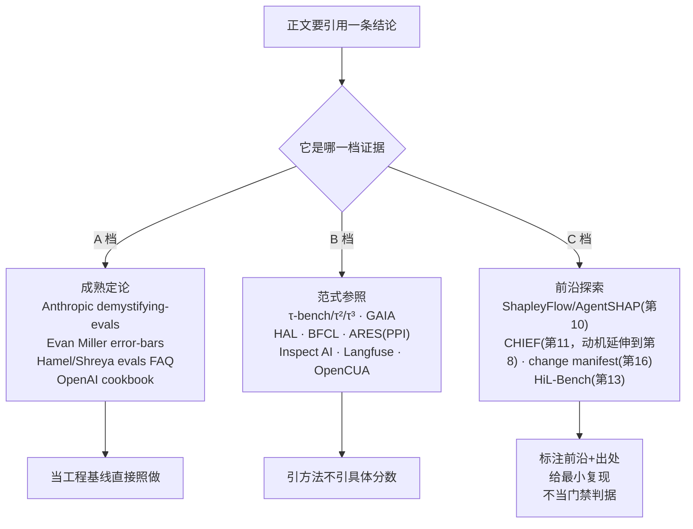
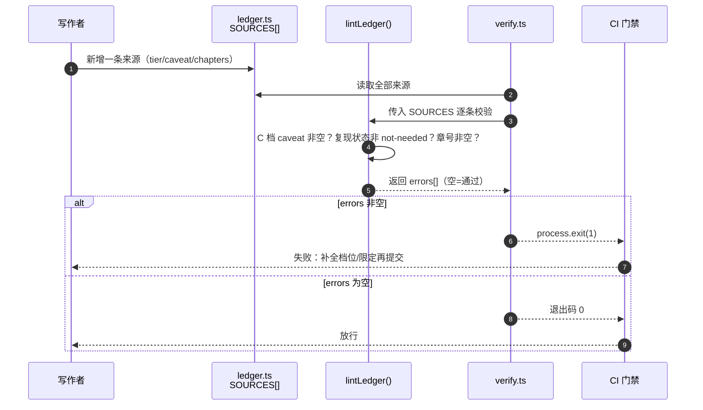

## 开篇：一条 arXiv 链接的误判

一次值班复盘会上，有人提议把全书第 10 章那套 Shapley 模块分账接进回归流水线，理由是"某篇 2026 年的 preprint 报告它能把贡献归因的准确率提到 90% 以上"。会议室里没人读过那篇论文，但那个数字写在 PPT 上、配着一条 arXiv 链接，看上去就很硬。决定当场就做了：下个迭代把它排进去。

两周后真去读论文才发现，那个 90% 是作者在自己构造的合成任务上、用自己的判定标准、没有第三方复现的情况下报出来的。换到自家这套 DevOps 值班助手——真实工具、真实状态、真实的模块交互——它到底还剩多少，论文里一个字都没说。差一点，一个未经独立验证的数字就被当成了回归门禁的判据。

这本书从第 9 章往后大量引用 2026 年的单篇 arXiv preprint：ShapleyFlow、AgentSHAP、CHIEF、change manifest、HiL-Bench。它们提供了新的视角，正文也用了它们的框架。但它们和"Anthropic 工程博客讲的确定性优先"不是一个可信度级别——前者是值得一试的新方向，后者是经过大量实践沉淀的成熟做法。读者读正文时，分不分得清这两者，决定了会不会重蹈那次会议的覆辙。

这篇附录把全书引用过的所有来源集中起来，给每一条标三件事：**它是什么级别的证据、复现到什么程度、引用时该怎么用**。它不教新方法，只做一件事——把"哪些站得住、哪些还在路上"摆清楚，让你引用任何一条结论时心里有数。

## 三档可信度分流

不是所有来源都该用同一种语气引用。本书把全书来源分成三档，正文里凡是出现某条结论，它属于哪一档，决定了该用"这是标准做法"还是"这是个值得试的方向"来转述。

- **A 档·成熟定论（settled）**：经过大量独立实践或严格统计论证，方法本身基本不会错，可以直接当工程基线照做。引用语气：肯定。
- **B 档·范式参照（paradigm）**：一个被广泛采用的 benchmark 或评测范式，方法论站得住，但具体数字有时效性、会随版本变。引用它的"做法"而非它的"分数"。引用语气：肯定方法、谨慎对待数字。
- **C 档·前沿探索（frontier）**：单篇较新论文，多为作者自报结果、未经独立大规模复现。可以借它的思路，但不能拿它的数字当判据。引用语气：明确标注"前沿探索"+出处，给出复现状态。

这篇附录的骨架就是这套三档分流。如图 B-1 所示，正文每要引用一条结论，先判定它落在哪一档，再据此决定引用纪律——A 档直接照做、B 档引方法不引分数、C 档标注前沿并给复现状态。

图 B-1：全书来源的三档分流与对应引用纪律



> 图注：三档分流对应正文不同章的引用。A 档支撑第 4 章统计地基（`examples/04-eval-as-experiment/`）；B 档支撑第 7/12/14 章的评测范式；C 档集中在第 9–16 章的归因与防劣化方法。判定逻辑实现在本附录配套代码 `appendix/B-frontier-caveats/examples/src/ledger.ts` 的 `tierOf()`。

## A 档·成熟定论

这一档的来源，本书引用时用的是肯定语气，因为它们要么经过严格的统计论证，要么沉淀了大量一线实践。

**Anthropic — demystifying-evals（"评 harness 不评模型" + "能用确定性就别用 LLM"）。** 全书的立论锚点。"评测一个 agent，评的是 harness 和 model 一起工作的端到端系统"出自 Anthropic 工程团队对 agent 评测的讨论（第 1 章引为定义）。"能用确定性评测就别用 LLM-judge"这条原则贯穿第 2 章术语地基和第 7 章整体评测。这一档不需要你复现，它是方法论出发点。

**Evan Miller — Adding Error Bars to Evals。** 第 4 章"把评测当统计实验"的主要依据。评测分是随机变量、必须带误差棒、少量样本用合适的区间估计——这些不是某个团队的偏好，是统计学结论。本书把它落成了可运行的 Wilson 区间函数（第 4 章 `examples/04-eval-as-experiment/`），你可以自己验证它在边界样本量下的行为。这一档"复现"的意义不在质疑，而在让你看清公式怎么来的。

**Hamel Husain & Shreya Shankar — evals FAQ。** 第 6 章任务集构建、以及全书对 LLM-judge 校准的态度，主要参照它。两条最反直觉、也最该记住的实践：error analysis（先看错误样本、归类失败模式）是评测里最重要的活动；小团队多数情况下该用"一个仁慈独裁者"单标注员配清晰规范，而不是一上来就堆多人算一致性。Kappa 是团队大了才需要的东西。

**OpenAI — cookbook（评测工程实践）。** 作为工程实践参照，补充 judge 设计、结构化输出判定等具体手法。本书不照搬它的某一段代码，而是把它当"业界常规做法长什么样"的对照。

这四条的共同点：方法本身稳，不依赖某个会过时的数字，引用时可以肯定。

## B 档·范式参照（引方法不引分数）

这一档是被广泛采用的 benchmark 和评测范式。它们的"做法"站得住，但具体分数有强时效性，引用时要把方法和数字分开看。

**τ-bench / τ²-bench / τ³-bench（Sierra）—— pass^k 范式。** 第 12 章 pass^k、第 14 章用 LLM 模拟用户评前端，范式都来自 τ 家族：LLM 模拟用户 ↔ 带工具和策略约束的 agent 动态对话，比对数据库最终态判成功，用 pass^k 衡量可靠性。τ²-bench 的 dual-control（用户模拟器也有工具能力）、τ³-bench（2026-03）是后续演进。本书引的是这个**范式**，不是它某个版本上某个模型的分数。

**GAIA —— 难度天花板参照。** 通用助手基准，466 题。本书只在第 3 章把它当"任务难度上界"的参照提一句。需要明确标注的时效性坑：常被引用的"带插件 GPT-4 仅 15%"是 2023 年的历史值，现顶级 agent 已约 75%。引这个数字一定要带年份，否则就是用三年前的数误导读者。

**HAL（Princeton，Holistic Agent Leaderboard，2025-10）—— 标准化评测 harness。** 第 17 章平台化讨论的参照之一：数百 VM 并行把评测从数周压到数小时，用 LLM 辅助日志审查挖未报告的失败行为。引的是它的工程范式（标准化 + 并行 + 日志审查），不是排行榜名次。

**BFCL（UC Berkeley Gorilla，ICML 2025）—— function-calling 确定性验证。** 工具调用评测的事实标准之一。最值得借鉴的一点：用 AST 子串匹配替代真实执行做确定性验证，适合 CI。注意它自称的 "first comprehensive" 是项目自我表述，引用时不必跟着用这个形容词。

**ARES（Stanford；arXiv:2311.09476，NAACL 2024 Findings）—— PPI 给统计置信区间。** 第 4 章统计严谨性的范式参照：三维度评分 + 用 PPI（prediction-powered inference）给出 95% 置信区间。它的差异点是统计严谨，这正是本书第 4 章想强调的。完整引用：Saad-Falcon et al., "ARES: An Automated Evaluation Framework for Retrieval-Augmented Generation Systems," Findings of the Association for Computational Linguistics: NAACL 2024（arXiv:2311.09476）。

**Inspect AI（UK AISI，MIT）/ Langfuse（MIT）—— 自建评测与持续观测的开源参照。** 第 15 章线上持续评估、第 17 章平台化，参照这两个的定位。Inspect AI 内建 tool-use / multi-turn / model-graded，适合起步自建私有 eval；Langfuse 提供 trace + datasets + 在线监控，可自托管。引的是定位和能力边界，不是它们某个版本的 API 细节。

**OpenCUA（NeurIPS 2025）—— 前后端评测分野 + 消融实例。** 第 14 章在线/离线双轨的主要依据：在线指标贵但真实、离线指标快但是代理，OpenCUA 验证两者强相关，所以离线做日常 CI、在线做里程碑验收。第 9 章消融那个"去掉 reflective CoT，分从 15.3 掉到 11.5"的实例也出自它。它是 B 档里偏可信的一条，因为核心结论（在线/离线相关）有数据支撑。这里要把分档讲清楚：本书早期资料把 OpenCUA 列进"最权威可信来源"，但它本质是单篇 NeurIPS 2025 论文，方法论站得住、可引"在线/离线该怎么分轨"这个做法，具体数字（含上面 15.3→11.5 那组）却随评测设置变，不能当成跨设置的定论照搬。所以本书最终把它定在 B 档：引方法、不引分数；用第 9、14 章那两组数字时，限定语是"OpenCUA 在其设置下报告"。

## C 档·前沿探索（借思路不当判据）

这一档是全书最需要警惕的部分。它们来自 2026 年的单篇 arXiv preprint，结果多为作者自报、未经独立大规模复现。本书用了它们的**思路框架**，但每一处都标注了"前沿探索"，并尽量自己用最小代码复现核心机制。引用纪律只有一条：可以照它的方法搭工具，但不能把它论文里的数字当成你系统上的判据。

**ShapleyFlow / AgentSHAP（第 10 章）—— Shapley 模块贡献分账。** 把 planning / reasoning / action / reflection 当合作博弈的玩家，用 Shapley 值公平分配贡献。ShapleyFlow（美团/上交）面向工作流，AgentSHAP 工具级、模型无关、把 agent 当黑盒。复现状态：本书第 10 章自己用蒙特卡洛采样实现了 Shapley 近似（穷举 2ⁿ 不现实），`examples/10-shapley-attribution/` 是可运行的最小版；论文报告的归因准确率未独立复现，正文未照搬。引用时：用 Shapley 这个**分账思路**，分账结果以你自己在自己 harness 上跑出来的为准。

**CHIEF（第 11 章）—— 反事实根因归因。** 核心定义：决定性错误 = 反事实里只纠正这一步就反败为胜；最早的决定性错误 = 根因。它给本书第 11 章反事实 RCA 提供了思路，也直接催生了第 8 章 OTAR 结构化因果 trace 的设计动机（扁平日志做不了反事实，必须结构化成因果图）。复现状态：第 11 章 `examples/11-counterfactual-rca/` 实现了"在 OTAR DAG 上单点干预重跑、看终态是否翻转"的最小机制；论文的定位准确率未独立复现。

**change manifest（第 16 章）—— 数据反哺防劣化闭环。** 每次改 harness 附一个可证伪预测（失败证据 → 根因 → 目标修复 → 预测影响），下一轮评测用实际 delta 求交，给每个编辑一个裁决。本书第 16 章自己实现了一版最小 change manifest（`examples/16-change-manifest/`）。这一条还带一个必须写进正文的**警示**：原论文报告 harness 能较准预测自己的"修复"（精度约 33.7%，约 5× 随机），但几乎预测不了"回归"（约 11.8%，仅 2× 随机）。结论直接影响工程决策——回归门禁不能靠 agent 自报，必须有独立回归评测集兜底。这是 C 档里最该被记住的一条诚实边界。

**HiL-Bench（Scale AI，2026，已开源 harness + 数据集）—— 人在回路评测 + Ask-F1。** 第 13 章的主要依据。核心洞察：评 HITL agent，瓶颈不是能力而是判断力（知道何时该停下来问人）。核心指标 Ask-F1 把"该问时问了没、不该问时乱问没"当二分类用 F1 度量。它给的那组对比数字很有冲击力——前沿模型普通任务 86–91%（SQL）/64–88%（SWE），放进需要自己判断何时求助的 HITL 场景暴跌到 38% 和 12%。复现状态：HiL-Bench 自身已开源（比纯 preprint 可信度高一档），但本书没有在它的数据集上复现这些数字；第 13 章 `examples/13-hitl-ask-f1/` 在 DevOps 值班场景上自造了一组带 `mustEscalate` 的任务，自己算 Ask-F1。引用那组 38%/12% 时务必带"HiL-Bench 报告"的限定。

还有一条贯穿全书、必须当成诚实边界写进正文的**关键教训**：模块贡献**不可加**。某研究单独测内存 +5.6pp、工具 +3.3pp、middleware +2.2pp，相加应是 +11.1pp，整合系统实测只有 +7.3pp——模块间是冗余而非简单叠加。这条是第 9 章的立论核心，也是第 10 章要用 Shapley 的根本理由。它好就好在不用信论文也能自己验证：本附录配套代码就用一个玩具效用函数把"ΣΔi ≠ 整体"复现出来。

## 可查询的来源账本

把上面三档写成散文容易，写正文时真要做到"每处引用都标对档位"却容易漏。本书的做法是把来源台账写成一份可查询的结构化数据 + 一个校验脚本：每条来源带 `tier`（A/B/C）、`reproduction`（复现状态）、`chapters`（被哪些章引用）、`caveat`（引用时的限定）。写任何一章时，查一下这条来源在账本里是哪一档，就知道该用什么语气、要不要标"前沿探索"。

下面这段是账本与校验逻辑的核心（完整可运行版本在 `appendix/B-frontier-caveats/examples/`）：

```typescript
// src/ledger.ts —— 全书来源的结构化台账（节选）
export type Tier = 'A' | 'B' | 'C'; // A 成熟定论 / B 范式参照 / C 前沿探索

export interface Source {
  id: string;
  name: string;
  tier: Tier;
  reproduction: 'not-needed' | 'paradigm-only' | 'min-repro' | 'not-reproduced';
  chapters: number[];     // 被哪些章引用
  caveat: string;         // 引用时必须带的限定（C 档不可为空）
}

// 校验规则：C 档（前沿探索）必须有非空 caveat，否则正文引用就会失去诚实边界
export function lintLedger(sources: Source[]): string[] {
  const errors: string[] = [];
  for (const s of sources) {
    if (s.tier === 'C' && s.caveat.trim() === '') {
      errors.push(`[${s.id}] C 档来源缺少 caveat，引用前必须补全`);
    }
    // C 档不能标 not-needed：前沿结论必须显式给出复现状态，避免被当成定论
    if (s.tier === 'C' && s.reproduction === 'not-needed') {
      errors.push(`[${s.id}] C 档来源不能标 not-needed，前沿结论必须给复现状态`);
    }
  }
  return errors;
}
```

这套账本不是花架子。它把"诚实边界"从一句口头约定，变成了一条能在 CI 里跑的检查：哪条 C 档来源忘了写限定、哪条把前沿结果说得太满，脚本直接报出来。这等于把第 16 章那套防劣化门禁的做法，反过来用在来源本身上：变更（新引用一条来源）要先过校验，没标清楚档位和限定就不放行。

这条校验链路怎么把一次"新引用"挡在门外，如图 B-2 所示：写作时新增一条来源到 `SOURCES`，`verify.ts` 调 `lintLedger` 逐条过规则，C 档缺 caveat 或标了 not-needed 就攒进错误列表，最后以非零退出码让 CI 失败、把这次变更挡回去。

图 B-2：一条新来源从写入台账到被 CI 门禁校验的数据流向



> 图注：链路里 `lintLedger` 的三条规则（C 档 caveat 非空、复现状态非 not-needed、章号非空）实现在 `appendix/B-frontier-caveats/examples/src/ledger.ts`；`process.exit` 的门禁判定在 `src/verify.ts`。这与第 16 章 change manifest 的门禁是同一套"变更先过校验再放行"的形状，只是校验对象从 harness 编辑换成了来源引用。

## "不可加"教训的最小复现

C 档里有一条不用信论文也能自证的结论——模块贡献不可加。与其转述论文的 pp 数字，不如自己用一个玩具效用函数把它跑出来。这也是本书对待前沿结论的标准姿态：能自己复现的，就自己复现一遍再写进正文。

构造很简单：假设 harness 有内存、工具、middleware 三个模块，定义一个**带交互项**的效用函数（任意两个模块同时在场会有一点冗余惩罚，因为它们的能力部分重叠）。然后分别算每个模块单独的边际贡献 Δi 和三个一起上的整体增益，看两者对不对得上。

```typescript
// src/non-additive.ts —— 复现"模块贡献不可加"（节选）
const modules = ['memory', 'tools', 'middleware'] as const;
type Mod = (typeof modules)[number];

// 单模块基础增益（pp）。数值取自调研报告里那组实测，便于对照
const base: Record<Mod, number> = { memory: 5.6, tools: 3.3, middleware: 2.2 };

// 效用函数：基础增益之和，再扣掉模块两两共存的冗余惩罚（交互效应）
function utility(active: Set<Mod>): number {
  let u = 0;
  for (const m of active) u += base[m];
  const present = modules.filter((m) => active.has(m));
  // 每对同时在场的模块有冗余、能力重叠，整体不能简单叠加
  const pairs = (present.length * (present.length - 1)) / 2;
  return u - pairs * 1.3; // 1.3pp/对：冗余惩罚，这就是"不可加"的来源
}
```

跑起来你会看到：三个 Δi 加起来 11.1pp，三个一起上的整体增益却只有 7.2pp，差的那块（约 3.9pp）正是交互（冗余）项。代码里 1.3 pp/对的冗余惩罚是手动拟合的近似值，目的是演示交互机制而非精确还原那组测量数字，因此输出 7.2pp 与调研报告的 7.3pp 相差 0.1pp——两者背后是同一个交互效应，复现的是机制而非精确值。

这里还有一处口径要讲明：上面 `ablationDelta` 算的是单独上场口径 Φ({i})−Φ(∅)，也就是研究报告里分别只开一个模块所测得的 5.6 / 3.3 / 2.2pp；第 9 章教的正式消融定义是 Φ(H)−Φ(H−i)（从完整 harness 拿掉模块 i 测损失）。两种口径在有交互效应时数值不同，但都能演示不可加性——这里选单独上场口径，是为了和调研报告那组测量数据直接对得上。复现一遍，你引用第 10 章那套方法时，底气就不是来自一条 arXiv 链接，而是来自你亲手跑出来的差值。

## 小结

- 全书来源分三档：A 成熟定论（直接照做）、B 范式参照（引方法不引分数）、C 前沿探索（标注出处、给复现、不当门禁判据）。引用一条结论前先定它在哪一档。
- A 档（Anthropic demystifying-evals、Evan Miller error-bars、Hamel/Shreya evals FAQ、OpenAI cookbook）是地基，引用时用肯定语气。
- B 档（τ 家族、GAIA、HAL、BFCL、ARES、Inspect AI、Langfuse、OpenCUA）引用其评测范式，具体数字带年份、随版本会变；GAIA 上"带插件 GPT-4 仅 15%"是 2023 历史值，顶级 agent 到 2026 已约 75%，引用任一数字都必须标年份，否则就是拿旧数误导。
- C 档（ShapleyFlow/AgentSHAP、CHIEF、change manifest、HiL-Bench）来自 2026 单篇 preprint，多为自报未独立复现；本书用其思路、各章给了最小复现，正文均标注"前沿探索"。
- change manifest 那条警示要单独记住：harness 能较准预测自己的修复、几乎预测不了回归，所以回归门禁必须有独立评测集兜底，不能靠 agent 自报。
- "模块贡献不可加"不用信论文也能自证：本附录用一个带交互项的效用函数把 ΣΔi ≠ 整体复现出来，这是第 9 章立论、第 10 章用 Shapley 的根本理由。

## 配套代码

见 `appendix/B-frontier-caveats/examples/`：一份可查询的全书来源台账（`src/ledger.ts`，每条带 tier / 复现状态 / 引用章 / 限定），配一个 `lintLedger` 校验脚本——把"诚实边界"做成能在 CI 里跑的检查，C 档来源忘标限定就报错；外加 `src/non-additive.ts`，用玩具效用函数亲手复现"模块贡献不可加"，对照第 9、10 章。`npm run report` 打印按档分组的来源清单，`npm run verify` 跑校验 + 不可加复现。
