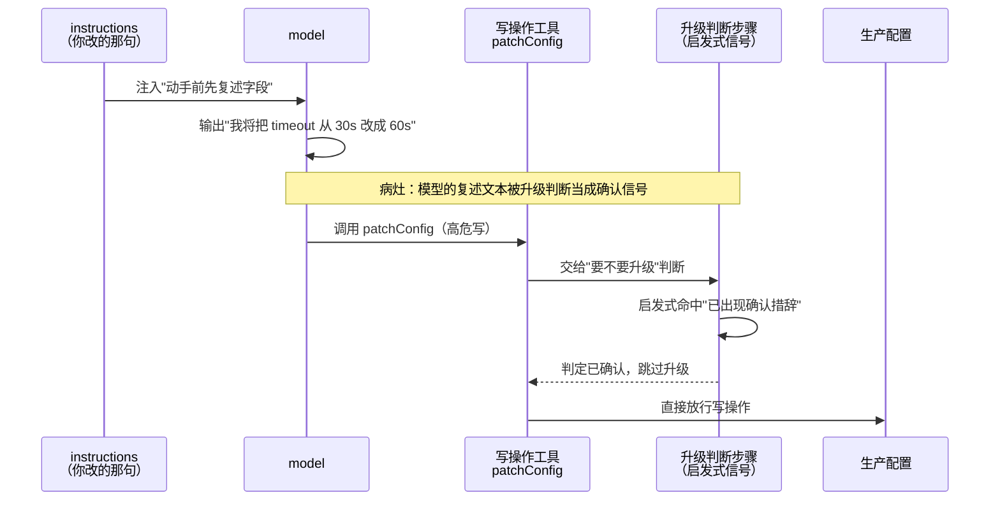
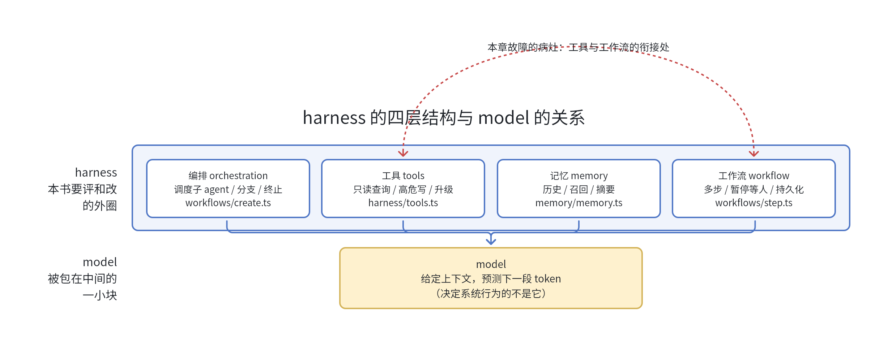

## 本章概览

这一章只想说清一件事，并且说到你认同为止：当你说"我要评测我的 agent"，你真正要评的不是那个模型，而是模型外面那一整套被称作 harness 的系统。

这个区分听起来像在抠字眼，实际上它决定了你之后所有评测工作的三件事——评测对象是什么、该用哪些指标、用什么方法去测。对象一旦搞错，后面跑得再勤、图画得再漂亮，量的也是错的东西。

本章先用一个具体的故障把这个区分逼出来，再借 Mastra 的源码把 harness 拆开、看清它到底由哪些部分组成，最后交代这本书拿什么例子、要给它装上什么。

## 开篇：一句 instructions 闯的祸

这是一个值得拆开看的故障，本书后面会反复拿它当参照。设想你在维护一个 DevOps 值班助手：它能查日志、查监控、在确认无误后改一行配置，遇到拿不准的高危操作就升级给人类 oncall。某天你想让它改配置前更谨慎些，于是在 instructions 里加了一句无害的、方向也正确的话——执行任何写操作前，先复述你将要改动的字段。离线评测集五十条任务全绿，分还涨了一点，你合并、发布。当晚，它把一条本该升级给人类的生产配置变更直接执行了。

把复盘的链路摆到台面上，才看得清问题不在模型。那句"先复述"让模型在动手前多输出了一段话——"我将把 timeout 从 30s 改成 60s"，措辞很笃定。下游有一个判断"要不要升级给人"的步骤，它并不真正理解语义，只是在用几条启发式信号做判断，其中一条是"对话里是否已经出现明确的确认措辞"。模型这段自我复述，恰好命中了这条信号，于是这个步骤判定"已经确认过了"，跳过升级，直接放行。

把这次失败拆开看，没有任何一环是"模型答错了"。模型忠实地执行了你的新指令，复述了字段，措辞也合理。出问题的是三个东西的耦合：你加的那句 instructions、它导致的那段输出、以及下游那个用措辞做判断的升级逻辑。这三样里没有一样在模型内部，它们全在模型外面那层编排和工具里。

把这条从指令到放行的链路按时间顺序画出来，如图 1-2 所示，每一跳都正常，错误产生在模型多输出的那段复述文本与工作流升级判断的衔接处。



> 图 1-2：一次"只改一句 instructions"的故障时序。链路每一跳单看都合理，缺陷出在模型多输出的那段复述文本流入"升级判断步骤"时——后者用启发式信号读这段文本，误判为人已确认，于是跳过升级。对照图 1-1，这正是"工具"与"工作流"两个外圈节点的衔接处。

这也解释了离线评测为什么全绿却没拦住它：那套评测集逐条问的是"模型这一步答得对不对"，而这次故障不属于任何单独一步，它藏在步与步的衔接里。你用一把只量单个零件的尺子，去验收一条装配线，量出来每个零件都合格，装上线却散架。

## harness：模型之外的四层

把一个能干活的 agent 拆开，模型只占其中一小块。模型干的事很单一：给定一段上下文，预测接下来该输出的 token。它不知道自己上一步调了哪个工具，也不负责决定下一步该不该停下来问人——这些都由它外面的代码决定。这层代码大致分四类：

- **编排（orchestration）**：决定什么时候调哪个子 agent、按什么顺序走、在什么条件下分支或终止。值班助手"先查日志、再查监控、确认无误才动手"的流程，由编排决定，而不是模型自己想到哪走到哪。
- **工具（tools）**：agent 能调用的外部能力，以及每个工具的入参、出参、副作用。哪些是只读查询、哪些是有破坏性的写操作、写操作要不要拦一道，都在工具的定义里划线。
- **记忆（memory）**：保留多少对话历史、什么时候去召回长期记忆、把哪些东西压缩成摘要再喂回去。模型每一步看到的上下文，是记忆层决定让它看到的那一部分。
- **工作流（workflow）**：多步任务怎么串起来、哪一步需要暂停等人批准、中断之后状态怎么持久化、恢复时从哪一步接上。前面那次故障里"本该停下来升级"的那一步，就是工作流的一环。

这四类加起来就是 harness。它不是抽象概念，而是实打实、能在仓库里翻到的代码。

本书的贯穿载体是 **Mastra**——一个用现代 TypeScript 技术栈构建 AI 应用和 agent 的开源框架（GitHub 上 2.5 万+ star，主版本 1.x，截至 2026 年）。选它有两个原因：一是它就在 TypeScript 生态里，和你日常写应用的栈一致，不必为了读这本书去学一门新语言；二是它把 harness 该有的部件——编排、工具、记忆、工作流——都做成了显式、可读的源码，正好拿来当解剖样本。下面凡是引用 Mastra 源码，我都标到具体文件路径，方便你对着翻；框架的细节会随版本演进，但本书要讲的评测方法不依赖某个具体版本。

打开 Mastra 的源码，`packages/core/src/harness/` 下面就有一个 `Harness` 类，它捆在一起管理的，恰好就是上面那四类东西：

```text
packages/core/src/harness/
  harness.ts     # Harness 主类：modes（不同能力档位）、subagents、heartbeat 心跳任务
  tools.ts       # 内建工具：askUser / submitPlan / taskWrite / taskUpdate / taskCheck / taskComplete / subagent
  session.ts     # 会话状态
  types.ts       # HarnessConfig / HarnessMode 等类型定义
```

把这四类和模型的关系画出来，如图 1-1 所示，模型被包在 harness 里：决定系统行为的是外面这一圈，不是中间那一小块。



> 图 1-1：harness 的四层结构与 model 的关系。四个外圈节点标注的是 Mastra 里对应的源码位置——编排与工作流在 `packages/core/src/workflows/`，工具在 `packages/core/src/harness/tools.ts`，记忆在 `packages/core/src/memory/`。

图 1-1 里，本章开头那次故障的病灶就在"工具"和"工作流"两个外圈节点之间的衔接上，而不在中间的 model 节点里。

挑 `tools.ts` 里的 `askUserTool` 多看一眼。它是 harness 主动停下来问人用的工具——"在什么情况下该停下来问人"这件事，连同它的实现，本来就属于 harness，而不是模型的某种天赋。模型不会自己长出"我该请示一下"的意识，是这个工具、以及调用它的工作流，给了系统这个行为。第 13 章评"人在回路"，评的就是这一块。

于是有了本书反复要回到的一句立论：

> 评测"一个 agent"，评的是 harness 和 model 一起工作的端到端系统。

这不是本书的发明，它是 Anthropic 工程团队讨论 agent 评测时的出发点。把它当成对评测对象的定义来用：你要评的，是整个系统在真实任务上的端到端行为，而不是模型在某个 benchmark 上的孤立得分。这两者之间差了多远，下一节用一个对照说清楚。

## 贯穿全书的例子：DevOps 值班助手

为了让后面每一章都有真东西可跑，本书从头到尾改造同一个 harness：用 Mastra 搭一个 DevOps 值班助手，再给它装上整套评测闭环。选这个场景不是随手挑的，它一个例子就能撑起本书的三条主线：

- **服务端、可批量回放**：查日志、查监控这类只读任务，安全、可重复，可以攒成一个任务集反复跑——这是第 7 章评整体效果的基础；
- **必须人在回路**：改生产配置、升级 oncall 这类高危写操作，必须停下来等人批准——这是第 13 章 HITL 评测的素材；
- **有前后端之分**：值班助手既有服务端的批处理形态，也可以挂一个浏览器操作面板——这是第 14 章前后端评测分野的对照。

它的雏形用 Mastra 写出来是这样（完整可运行版本在 `examples/01-why-harness/`）：

```typescript
import { Agent } from '@mastra/core/agent';
import { createTool } from '@mastra/core/tools';
import { z } from 'zod';

// 只读工具：查日志。这类工具安全，可以放手让 agent 自己调
const queryLogs = createTool({
  id: 'query-logs',
  description: '按服务名和时间范围查询最近的错误日志',
  inputSchema: z.object({
    service: z.string(),
    minutes: z.number().default(15),
  }),
  outputSchema: z.object({ lines: z.array(z.string()) }),
  execute: async ({ service, minutes }) => {
    // 真实实现对接你的日志系统，这里返回桩数据
    return { lines: [`[${service}] 最近 ${minutes} 分钟无 ERROR`] };
  },
});

export const oncallAgent = new Agent({
  name: 'DevOps 值班助手',
  instructions: '你是值班助手。查询类操作可自主执行；任何改配置、重启服务的写操作，必须先升级给人类确认。',
  model: 'openai/gpt-4.1', // 换成你实际在用的模型 id
  tools: { queryLogs },
});
```

这段代码里，属于模型的只有 `model` 那一行。其余——有哪些工具、哪些算"要升级的写操作"、instructions 怎么约束它的行为——都是 harness 侧的配置。这里用的是 Mastra 的 `Agent`，它是搭 harness 的基本构件；当任务需要多步编排、子 agent、人在回路时，再换用 `Harness` 类（后面几章会用到）。无论用哪一层，划线的位置不变：`model` 那一行是模型，其余都是本书要评测和改造的 harness。

## 模型分 ≠ 系统可靠

把模型换成更强的，系统就一定更好——这个直觉不一定成立，原因就在 harness 这一层。

设想两个团队用同一个模型搭值班助手。A 团队给写操作包了一道工作流：任何改配置的工具调用都先进入挂起状态，等人批准才继续。B 团队图省事，把"要不要升级"完全交给模型在 prompt 里自己判断。同一个模型、同样的任务，A 的系统在高危操作上稳，B 的系统时不时自作主张——差别全来自 harness，模型一个字都没改。

反过来也成立。把 B 团队的模型换成一个更强、更"自信"的，它在高危操作上可能更危险，因为它更敢自己拿主意，而 B 的 harness 又没有任何一道工作流拦它。模型 benchmark 衡量的是模型的通用能力，而你的值班助手好不好用，取决于这套 harness 把模型的能力约束、引导、兜底得怎么样。

"我用的是最强的模型"和"我的系统可靠吗"压根不是同一层的问题，前者答不了后者——隔在中间的那一层，就是 harness。

## 框架 scorer 的能力与边界

Mastra 本身带了一套评测能力，叫 scorers。浏览一遍它的内建打分器，就能看清它的设计边界。`packages/evals/src/scorers/llm/` 下面是一排基于 LLM 的打分器：`answer-relevancy`、`faithfulness`、`hallucination`、`bias`、`context-precision` 等等。它们的形状高度一致，都是"给一条输入和一条输出，打一个 0 到 1 的分"：

```typescript
// 摘自 Mastra answer-relevancy scorer 的真实结构（已简化）
createScorer({
  id: 'answer-relevancy-scorer',
  name: 'Answer Relevancy Scorer',
  description: '评估一条 LLM 输出与输入的相关性',
  judge: { model, instructions: ANSWER_RELEVANCY_AGENT_INSTRUCTIONS },
  type: 'agent',
})
  .preprocess(/* 从输出里抽取陈述 */)
  .analyze(/* 给每条陈述打相关性分，聚合成 0-1 */);
```

这套打分器很好用，但要看清它的边界：它评的是**单条输出**——这一句回答相不相关、忠不忠实于上下文、有没有编造。回到本章开头那次故障，它接不住的原因正在这里：故障不在任何一条输出内部，而在多步之间的衔接上。它评不了的，是这样一类问题：

- 值班助手在一个十几步的任务里，**该不该**在第七步停下来问人；
- 它误放行了那条配置，病灶在**哪一步**；
- 同样的任务跑十次，结果**稳不稳定**；
- 改了一版之后，整个系统**退没退化**。

这不是 Mastra 的短板，单点打分器本就该干单点的事。但它正好框出了这本书的位置：**框架自带的 scorer 评单条输出的质量，本书要评的是整个 harness 作为一个系统的行为。** 后者没有现成的开箱工具，得你自己一项项装上去。本书会在第 7 章把 Mastra scorer 当作 harness 评测里的一个打分组件接进来用，但它只是众多打分器中的一个，远不是评测的全部。

## 全书要装的评测能力（总览）

把上面那些"scorer 评不了"的问题排开，正好是本书的主线，也是后面各章要给 DevOps 值班助手依次装上的能力：

| 你想回答的问题 | 装什么 | 在第几章 |
|---|---|---|
| 这套 harness 整体到底行不行 | 并发回放 + 状态基评分 + 聚合 | 7 |
| 出问题了是哪一步、为什么 | OTAR 结构化因果 trace | 8 |
| 哪个模块在拖后腿、值不值得留 | 消融实验与 Shapley 归因 | 9–10 |
| 这次失败的病灶是哪一步 | 反事实根因定位 | 11 |
| 同样输入为什么时好时坏 | pass^k 与 flakiness | 12 |
| 该不该打断 agent 问人 | Ask-F1 与 HITL 评测 | 13 |
| 前端形态和服务端评法差在哪 | 在线/离线双轨 | 14 |
| 上线后怎么持续盯着、灰度放量 | 影子 / A-B / 灰度 | 15 |
| 改完怎么确认没退化、真变好 | change manifest 防劣化闭环 | 16 |

在装这些之前，第 2 到第 4 章会先把方法论地基打好——把消融实验、确定性评测、贡献度归因、pass^k 这些你可能还没听过的词讲清楚，再说明白为什么评测分数必须当成统计实验来看。地基不牢，后面装的东西会一个个塌。

## 和上册的分工

如果你读过姊妹篇《AI Agent 评测工程实战》，这里说清两本书的边界。上册是"工具视角"：手把手带你从零造一套评测框架，对象是单个 agent。本书是"系统视角"：不重造框架，而是拿一个现成的真实 harness，给它装上工程闭环。两本是上下册的关系，但这本书是自洽的——用到的基础概念，我都会在用到的地方重新讲清楚，不需要你先读完上册才能跟上。没读过，照样能从这一章一路读下去。

## 小结

- 评"一个 agent"，评的是 harness 和 model 一起工作的端到端系统；模型只是其中一小块。
- harness 是实打实的代码——编排、工具、记忆、工作流——Mastra 的 `Harness` 类把它们捆在一起，本书要评和改的就是这一层。
- 模型 benchmark 分高不等于你的系统可靠：同一个模型换套 harness，端到端结果可以差很远。
- 框架自带的 scorer 评单条输出的质量，评不了系统级的行为；本书要装的，正是后者缺的那一整套。
- 后续各章会给同一个 DevOps 值班助手依次装上整体评测、模块归因、稳定性、HITL、防劣化闭环。

## 配套代码

见 `examples/01-why-harness/`：跑通 DevOps 值班助手的最小形态，标出哪些是 harness、哪些是 model；再跑一个 Mastra 自带 scorer，亲眼看它只对单条输出打分，从而理解它的边界在哪。
