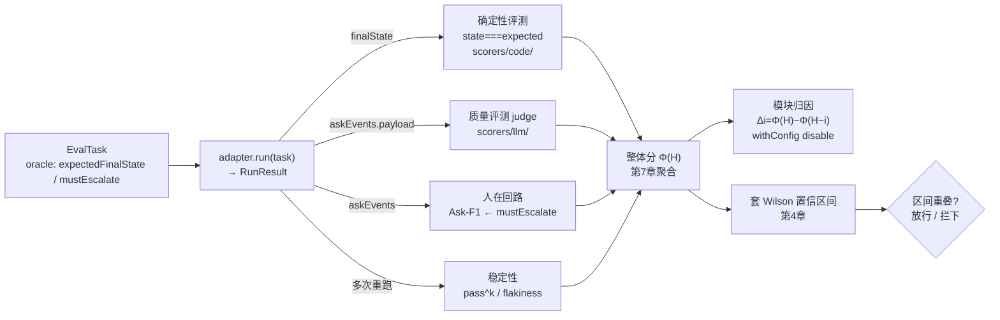
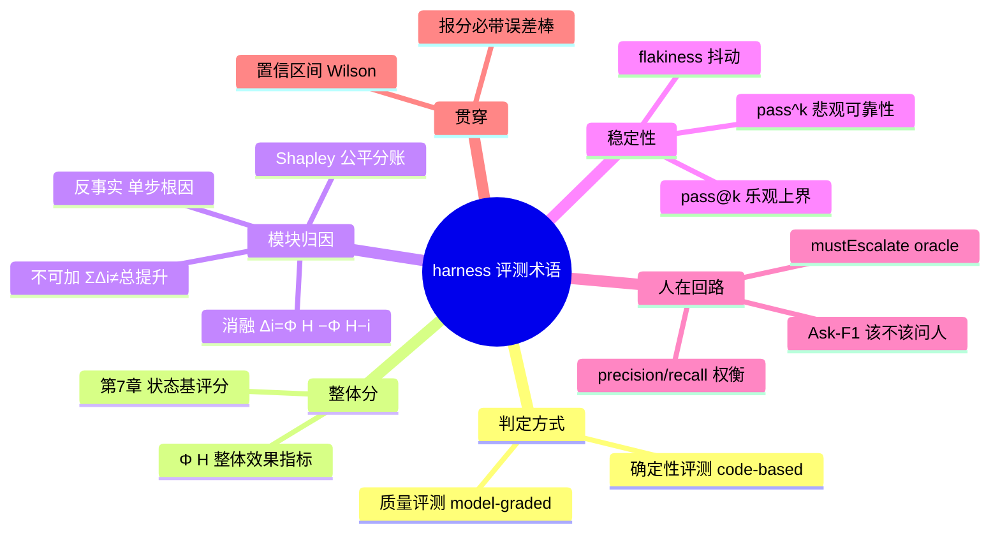

## 开篇：同一个分，三个人吵半小时

复盘会上，值班助手的评测报告投在屏幕上，三个人对着同一个数字争论。

负责数据集的人说"这版 pass 了 92%，可以发"。负责线上的人皱眉："92% 是一次跑出来的吧？我们这种要连着改三步配置的任务，一次过不算过，得每次都过才行。"写工作流的人插话："你俩说的 pass 根本不是一回事——他说的是查日志那种一步到位的只读任务，我担心的是那个三步写操作，中间随便哪步崩了整条就废。还有，'92%' 后面那个误差到底多大？我们一共才跑了五十条。"

吵了半小时，最后发现没人真的不讲理。问题出在词上：同一个"pass"，一个人指"至少跑通一次"，一个人指"每次都得通"；同一个"分还行"，有人心里默认带着置信区间，有人就当它是个确定的真值。评测这件事，名词没对齐，后面所有讨论都是各说各话，越认真吵得越凶。

这一章不教你怎么评，只做一件事：把后面十几章要反复用到的词，一次性摆清楚，给每个词一个全书统一的口径。读完之后，再有人说"pass 了""分还行"，你能立刻反问对——pass@k 还是 pass^k？带没带置信区间？评的是单条输出还是整个 harness？

第 1 章已经把评测对象钉死了：评一个 agent，评的是 harness 和 model 一起工作的端到端系统。这一章是它的延续——既然评的是这么一个多模块、会抖动、还得人在回路的系统，描述它的语言自然比"准确率"三个字要丰富。下面把这些词按"你到底想问系统的哪类问题"分成四组，每组给一个能直接对照源码理解的定义，再配一段值班场景下能跑的最小代码。

## 两种判定方式

进入四组术语之前，有一个更底层的区分得先立起来，因为它贯穿后面每一组：一次评测的"判定"是怎么做出来的？只有两种方式。

**确定性评测（deterministic / code-based）**：用代码、规则、精确匹配来判定对错。比如"改完配置后 timeout 字段是不是等于 60"，写一行 `state.timeout === 60` 就能判，结果可复现、零方差，同样的输入跑一百遍答案一模一样。Mastra 把这类打分器放在 `packages/evals/src/scorers/code/` 下，像 `keyword-coverage`、`tool-call-accuracy` 都是纯代码逻辑，不调用任何模型；`trajectory` 有代码版（`createTrajectoryAccuracyScorerCode`）和 LLM 版（`createTrajectoryAccuracyScorerLLM`，见 `scorers/llm/trajectory/`）两种，本书值班场景用代码版做工具调用序列比对。

**质量评测（quality / model-graded）**：用 LLM 当裁判（judge），给一个没有标准答案的主观质量打分。比如"这段升级说明写得清不清楚"。这类判定本身带方差——同一段文本让 judge 打两次，可能给出不同的分——所以必须校准、必须多次采样估噪声。Mastra 的这类打分器在 `packages/evals/src/scorers/llm/` 下，`answer-relevancy`、`faithfulness`、`hallucination` 都属于此类，内部都揣着一个 judge 模型。

记住这条分界：**能用代码判的，就别请 LLM 判。** 确定性评测便宜、稳定、可复现，质量评测贵且有噪声。值班助手的评测里，"配置改对没有""该升级有没有升级"这种有客观终态的，全部走确定性；只有"措辞清不清楚"这种主观的才动用 judge。后面第 7 章给 harness 算整体分时，骨架是确定性的状态比对，judge 只是接进来的一个补充组件。

下面这段把两种判定摆在一起跑，最直观：

```typescript
import { z } from 'zod';

// 确定性判定：改完配置后，timeout 是否精确等于期望值。一行代码，零方差
function codeScore(finalState: { timeout: number }, expected: number): number {
  return finalState.timeout === expected ? 1 : 0;
}

// 质量判定：升级说明写得清不清楚——没有客观答案，得请 LLM 当裁判
// 这里用伪 judge 表示形状；真实实现见 examples/，judge 内部是一次 LLM 调用
async function qualityScore(escalationNote: string): Promise<number> {
  const judge = makeJudge(); // 内部封装一个 LLM judge
  return judge.rate(escalationNote); // 返回 0~1，且两次调用结果可能不同
}
```

两者不是对立的，而是各管各的判定域。把它们分清，是后面所有评测的地基。

## 第一组：整体分 Φ(H)

第一类问题最朴素："我这套值班助手，整体到底行不行？"要回答它，得先有一个能落到数字上的整体效果指标，本书统一记作 **Φ(H)**：给定一套 harness 配置 H，让它跑完整个任务集，按某种口径聚合出来的一个总分（比如任务成功率）。后面所有"某个改动让系统变好/变坏了多少"的讨论，都是在比较不同 H 的 Φ。

整体分怎么算出来，是第 7 章的主题：并发回放整个任务集，对每条任务用确定性评测比对终态，再聚合。这里只需要立住 Φ(H) 这个记号，以及一个常被忽略的点——**Φ(H) 是个统计量，不是真值**。你跑五十条任务得到 92%，换五十条、或同样五十条再跑一遍，数字会变。所以报 Φ 永远要带不确定性，这是下一组要展开的。

## 第二组：模块归因

整体分告诉你"行不行"，但回答不了"靠的是哪个模块、哪个模块在拖后腿"。harness 是编排、工具、记忆、工作流拼起来的，你迟早要问：把那个查 runbook 的工具去掉，分会掉多少？这个判断该不该升级的工作流，到底贡献了多少？

最直接的办法叫**消融实验（ablation）**：关掉某个模块 i，重新跑，看整体分掉了多少。这个差值就是模块 i 的消融贡献：

> **Δi = Φ(H) − Φ(H−i)**

H−i 表示从完整 harness 里拿掉模块 i 后的配置。Δi 越大，说明模块 i 越重要。这是第 9 章的方法，本书的 adapter 专门留了 `withConfig({ disable: [...] })` 来构造 H−i 这种变体。

消融实验有一个反直觉、又特别容易踩的坑，这一章必须先把警告打在前面：**各模块的 Δi 不可加。** 也就是说，

> ΣΔi ≠ Φ(H) − Φ(空)

你不能把每个模块单独消融出来的 Δ 加起来，指望它等于整套 harness 相对于空配置的总提升。原因是模块之间有交互：查 runbook 的工具和判断升级的工作流可能协同——单独留谁都不顶用，俩一起在才有效；也可能冗余——俩都能独立兜底，去掉任意一个分都不掉，但 Δ 各自算出来都是 0，加起来还是 0，可它俩合起来明明撑着系统。第 9 章会用实测把这个不可加性摆出来。

正因为单纯的消融 Δ 不可加、分不公平，贡献度归因要分三档逐级精细，本书用三章分别讲：

- **第一档：消融差值 Δ**（第 9 章）。粗，算得快，但不可加、对模块间交互无能为力。
- **第二档：Shapley 值**（第 10 章）。把模块贡献当成合作博弈里的"公平分账"问题——考虑模块以**所有可能的顺序**加入时的平均边际贡献，理论上可加、分得公平，代价是组合爆炸，得用蒙特卡洛抽样近似。这一档的前沿落地（ShapleyFlow、AgentSHAP 等 2026 年的 preprint）属于**前沿探索**，本书会标清出处、自己用最小代码复现近似算法，不当成熟定论。
- **第三档：反事实根因**（第 11 章）。前两档是系统级（关掉模块看平均影响），这一档是单次失败级——给定一条失败轨迹，问"哪一步换个走法，结果就翻盘了"，定位到具体的病灶步。

这三档解决的不是同一个问题：消融问"这个模块平均值不值得留"，Shapley 问"公平地说每个模块各占多少功劳"，反事实问"这一次具体栽在哪一步"。先记住这个分层，到对应章节再展开。

不可加这件事光说不够直观，下面这段把三模块逐一消融跑出来，亲眼看 ΣΔi 对不上整体提升，是本组 examples 里最该跑一遍的片段：

```typescript
// Φ：开启哪些模块返回成功率；book 和 flow 有协同项，是不可加的根源
function phi(on: Set<string>): number {
  let s = 0.3; // 空配置也能蒙对一些
  if (on.has('logs')) s += 0.2;
  if (on.has('book')) s += 0.05; // 单独贡献很小
  if (on.has('flow')) s += 0.05; // 单独贡献很小
  if (on.has('book') && on.has('flow')) s += 0.25; // 协同项：俩一起才兜得住
  return Math.min(1, s);
}
const ALL = ['logs', 'book', 'flow'];
const full = new Set(ALL);
const phiUp = phi(full) - phi(new Set()); // 整体提升 Φ(H)−Φ(空) = 0.550
// 逐一消融：Δi = Φ(H) − Φ(H−i)
const sumDelta = ALL.reduce((acc, i) => {
  const minusI = new Set(full); minusI.delete(i);
  return acc + (phi(full) - phi(minusI));
}, 0);
// ΣΔi = 0.800 ≠ phiUp = 0.550：协同项被双重计入，Δ 不可加——这就是第 10 章要 Shapley 的理由
```

## 第三组：稳定性与抖动

agent 评测和传统软件测试最不一样的地方，是它会**抖动**。同一条任务、同一套 harness，跑十次可能成八次、败两次。原因有好几个：模型采样带温度、工具调用本身有非确定性、多步任务里步骤顺序会变。这类"同输入多次跑结果不一致的程度"，本书叫 **flakiness（抖动）**，它是可靠性的头号杀手，是第 12 章的主题。

抖动直接逼出一对极容易混淆、却必须分清的术语：

- **pass@k**：k 次尝试里**至少成功一次**的概率。这是个**乐观**指标，衡量的是能力上界——"这系统在最好情况下够不够得着"。
- **pass^k**：k 次尝试**全部成功**的概率。这是个**悲观**指标，衡量的是可靠性——"这系统能不能每次都稳"。

差别有多大，举个数就清楚。假设值班助手单次成功率是 0.9：pass@3 = 1 − 0.1³ ≈ 0.999，看着几乎完美；但 pass^3 = 0.9³ = 0.729，意味着连着跑三条任务全过的概率只有七成出头。

对 agent 来说，**该盯的是 pass^k 而不是 pass@k**。回想开头那场争论里写工作流的人说的"连着改三步配置，中间随便哪步崩了整条就废"——那正是 pass^k 的场景：一个多步任务，每一步都得成，整体才算成。pass@k 在代码生成里有意义（生成多个候选，挑一个对的就行），但值班助手改生产配置，你不会接受"十次里有一次改对了就行"。第 12 章会讲怎么重复 k 次估 pass^k、怎么量化 flakiness、怎么把 pass^k 纳进第 7 章的整体分。

下面这段把两者的差距算出来，是本章 examples 里最该自己跑一遍的片段：

```typescript
// p 是单次成功率，k 是连续尝试次数
function passAtK(p: number, k: number): number {
  return 1 - Math.pow(1 - p, k); // 至少成功一次：乐观，能力上界
}
function passHatK(p: number, k: number): number {
  return Math.pow(p, k); // 每次都成功：悲观，可靠性
}
// p=0.9, k=3 → pass@3≈0.999（看着完美），pass^3≈0.729（真实可靠性）
```

## 第四组：人在回路

最后一类问题是 agent 独有的，传统软件根本不会遇到：值班助手在一个多步任务里，**该不该在某一步停下来问人**？该停没停（漏升级），可能直接改坏生产；不该停瞎停（过度打断），把人烦到没人再理它。这两类错，离线那套"单条输出对不对"的评测根本测不到，因为它们不在任何一条输出里，而在"要不要停"这个决策上。

本书把这个问题建模成一个二分类：每一步，系统要么"停下来问/升级"，要么"继续往下走"。既然是二分类，就能用分类的标准指标来衡量，本书定义为 **Ask-F1**：

- **precision（精确率）**：在所有"它选择问人"的时刻里，真正该问的占多少。precision 低，说明它老瞎打断（误报多）。
- **recall（召回率）**：在所有"真正该问人"的时刻里，它实际问了的占多少。recall 低，说明它该问的时候不问（漏报多），这是开头故障的那类错。
- **Ask-F1**：precision 和 recall 的调和平均，把两类错揉成一个分。

漏报和误报的代价往往不对称：漏升级一次可能搞挂生产，过度打断只是烦人。所以实践里有时要调权重，偏向保 recall。这套人在回路的评测、Ask-F1 的完整定义和计算，连同用 Mastra workflow 的 suspend/resume/bail 把"停下来问人"真正实现出来，是第 13 章的内容。任务的判定依据落在 adapter 的 oracle 上——`mustEscalate` 字段标记"这条任务到底该不该升级"，评测就拿系统的实际选择跟它比。

这一组里有些更前沿的工作（如 HiL-Bench，2026 年的 preprint），本书归为**前沿探索**，会在第 13 章和附录 B 标清出处与复现状态，不当成已被广泛验证的定论。

## 贯穿全章：置信区间

四组术语之外，有一个词得单拎出来，因为它压住前面每一组——只要你报的是一个评测分，就绕不开它：**置信区间（confidence interval, CI）**，也叫误差棒。

评测分是个统计量。你跑五十条任务、成了四十六条，得到 92%，这不是系统的"真实成功率"，只是真实成功率的一个**估计**。换一批五十条、或同一批再跑一遍，数字会动。置信区间就是给这个估计配上一个范围：92% 的 95% 置信区间可能是 [81%, 97%]，意思是真实成功率有 95% 的把握落在这个区间里。

为什么非要它？开头那场争论里有人想用"92% > 90%，可以发"拍板。但如果这个 92% 的区间是 [81%, 97%]，而上一版 88% 的区间是 [76%, 94%]，两个区间大面积重叠——你这 3 个百分点的"提升"，很可能只是五十条样本带来的噪声，根本不显著。**不带置信区间的评测分，是不能用来做决策的。** 这是第 4 章"把评测当统计实验"的核心，这里先把这个意识立住。

少量样本下，成功率这种二项比例不能用教科书里那个 `p ± 1.96·√(p(1−p)/n)` 的正态近似——样本少、或 p 贴近 0/1 时它会失真，甚至给出超过 100% 的上界。该用 **Wilson 区间**，它对小样本和极端比例都稳健（依据见 Evan Miller 的 "How Not To Sort By Average Rating"，本书附录 B 收录）。examples 里给了一个可直接复用的 Wilson 区间函数：

```typescript
// Wilson 区间：n 次试验成功 success 次，返回 95% 置信下/上界
// 比正态近似 p±1.96·√(p(1-p)/n) 在小样本/极端比例下稳健得多
function wilsonInterval(success: number, n: number): { lower: number; upper: number } {
  if (n === 0) return { lower: 0, upper: 1 };
  const z = 1.96; // 95% 置信水平
  const p = success / n;
  const denom = 1 + (z * z) / n;
  const center = (p + (z * z) / (2 * n)) / denom;
  const margin = (z * Math.sqrt((p * (1 - p)) / n + (z * z) / (4 * n * n))) / denom;
  return { lower: center - margin, upper: center + margin };
}
// 46/50 → 约 [0.81, 0.97]，区间这么宽，3 个点的"提升"基本说明不了问题
```

judge 带来的方差是另一回事——同一段文本 judge 打分本身会波动，那部分噪声靠多次采样估计，也归第 4 章。这里只需要记住：报分必带 CI，不带就是耍流氓。

## 回归评测 vs 能力评测

四组术语描述的是"用什么指标"，但同一个指标可以服务两种完全不同的评测目的，这个区分得单独点明，否则数据集和判定门槛会用错。**回归评测**守住已有行为不退化，是变更门禁：改完一版配置后，让值班助手把以前能稳过的那批旧任务再跑一遍，只要有一条从过变不过，就拦下来。它的数据集是固定的保留集，节奏跟着每次提交走，判定是"对比上一版有没有掉"。**能力评测**探索新任务的上限：给值班助手一个它从没见过的多步高危场景（连改三处配置、中途监控异常、还得判断要不要升级），看它够不够得着。它的数据集是不断翻新的难题，节奏是阶段性摸底，判定是"这类任务的天花板在哪"。两者数据集、节奏、判定都不一样——拿能力评测的难题去做回归门禁会天天误报，拿回归的旧任务去测能力又永远刷高分。第 6 章构造任务集、第 16 章做防劣化闭环时会反复回到这个分野。

## 四组术语连成一张地图

这些词不是孤立的标签，它们卡在一次评测从"跑"到"出决策"的同一条流水线上的不同位置。一条任务进来，adapter 把它跑成一个 `RunResult`，里面的 `finalState`、`steps`、`askEvents` 分别喂给不同的判定逻辑，最后聚合成一个带误差棒的分，决定这版 harness 放不放行。四组术语各自管住这条链路上的一段。如图 2-1 所示，把一次评测的数据流向摆出来，每个词该在哪一步出现就一目了然。



> 图 2-1：一次评测的数据流向——四组术语各管流水线上的一段。

图 2-1 里每条边都对应一个 adapter 字段或一章的方法：`finalState` 走确定性比对，升级说明（从 `askEvents.payload` 提取）走 judge，`askEvents` 配合 oracle 的 `mustEscalate` 算 Ask-F1，重复重跑同一条任务才能估 pass^k；这些分聚合成 Φ(H)，一边按 `withConfig` 关模块做归因，一边套 Wilson 区间，最后看区间重不重叠拍板放不放行。四组术语、加上贯穿它们的两个底层概念（判定方式、置信区间），合起来就是这本书描述一个 harness 评测系统所用的全部基础词汇。流水线讲的是"数据怎么流"，下面换一张图讲"词怎么归类"。如图 2-2 所示，按归属关系把它们摆成一张地图：



> 图 2-2：harness 评测术语地图——四组术语加两个贯穿概念的归属关系。

图 2-2 中节点对应的落地位置：「判定方式」两类对应 Mastra 的 `packages/evals/src/scorers/code/` 与 `scorers/llm/`；「整体分」Φ(H) 与状态基评分见第 7 章；「模块归因」三档（消融/Shapley/反事实）依次是第 9/10/11 章，消融靠 adapter 的 `withConfig({ disable })`；「稳定性」pass^k 与 flakiness 是第 12 章；「人在回路」Ask-F1 与 `mustEscalate` oracle 是第 13 章；「置信区间」Wilson 区间是第 4 章。

## 术语导航表

第 1 章末尾给过一张"要给 harness 装什么"的表，那是按工程动作组织的。这里给一张配套的术语表，按"你想问系统什么"组织，两张表对照着看：第 1 章那张告诉你装什么工具，这张告诉你装的时候该用哪些词、去哪一章学。

| 术语 | 它回答什么问题 | 判定方式 | 展开章节 |
|---|---|---|---|
| 确定性评测 / 质量评测 | 这次判定该用代码还是 LLM | — | 本章 / 全书 |
| Φ(H) 整体效果指标 | 这套 harness 整体行不行 | 确定性为主 | 7 |
| 消融 Δi=Φ(H)−Φ(H−i) | 某个模块值不值得留 | 确定性 | 9 |
| 贡献不可加 ΣΔi≠总提升 | 为什么不能把 Δ 加起来 | — | 9 |
| Shapley 值 | 公平地说每个模块占多少功劳 | 确定性 | 10（前沿） |
| 反事实根因 | 这一次具体栽在哪一步 | 确定性 | 11（前沿） |
| pass@k | 最好情况下够不够得着（能力上界） | 确定性 | 12 |
| pass^k | 能不能每次都稳（可靠性） | 确定性 | 12 |
| flakiness 抖动 | 同输入多次跑有多不一致 | 确定性 | 12 |
| Ask-F1 | 该不该停下来问人，问得准不准 | 确定性 | 13 |
| 回归评测 vs 能力评测 | 该守行为还是探极限 | — | 6/16 |
| 置信区间 / Wilson | 这个分的误差到底有多大 | — | 4 |

把这张表当工具书用。后面任何一章出现这些词，口径都和这里一致，不会换个说法重讲一遍。

## 小结

- 一切评测判定只有两种方式：确定性评测（代码判、零方差、可复现）和质量评测（LLM judge、有噪声、需校准）。能用代码判的别请 LLM 判。
- 描述一个 harness 评测系统的词，按"想问什么"分四组：整体分（Φ(H)）、模块归因（消融 Δ / Shapley / 反事实）、稳定性（pass@k / pass^k / flakiness）、人在回路（Ask-F1）。
- 模块归因里 Δi = Φ(H) − Φ(H−i)，但各 Δi **不可加**——模块间有交互，ΣΔi ≠ 整体提升，这是后面 Shapley 章存在的理由。
- agent 评测要盯 **pass^k**（每次都成的悲观可靠性）而非 pass@k（至少成一次的乐观上界）；同输入跑出不同结果的 flakiness 是可靠性头号杀手。
- 任何评测分都是统计量，报分必带**置信区间**；小样本二项比例用 **Wilson 区间**而非正态近似。
- Shapley、反事实、HiL-Bench 等属于**前沿探索**，本书标清出处、给最小复现，不当成熟定论；集中说明见附录 B。

## 配套代码

见 `examples/02-eval-vocabulary/`，四个可独立运行的片段，对应本章四组术语的核心计算：

- `code-vs-quality.ts`：同一个值班场景，一边用确定性 code scorer 判"配置改对没有"，一边用 LLM judge 评"升级说明写得清不清楚"，看清两种判定方式的差异（judge 部分按 Mastra `createScorer` 形状写，未配 key 也能读懂输入输出）。
- `passk.ts`：算 pass@k vs pass^k，并用蒙特卡洛模拟一个会抖动的多步任务，亲眼看 pass^k 怎么随步数掉下去。
- `ablation-toy.ts`：玩具版消融——三个模块，逐个关掉算 Δi，再把 ΣΔi 和整体提升摆一起，看它们不相等。
- `wilson.ts`：Wilson 置信区间函数，对 46/50 这种小样本算出区间，并和正态近似对比，看小样本下后者怎么失真。
