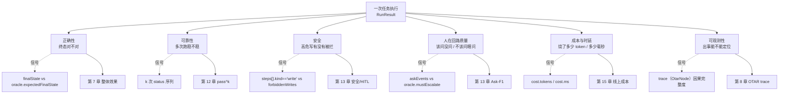
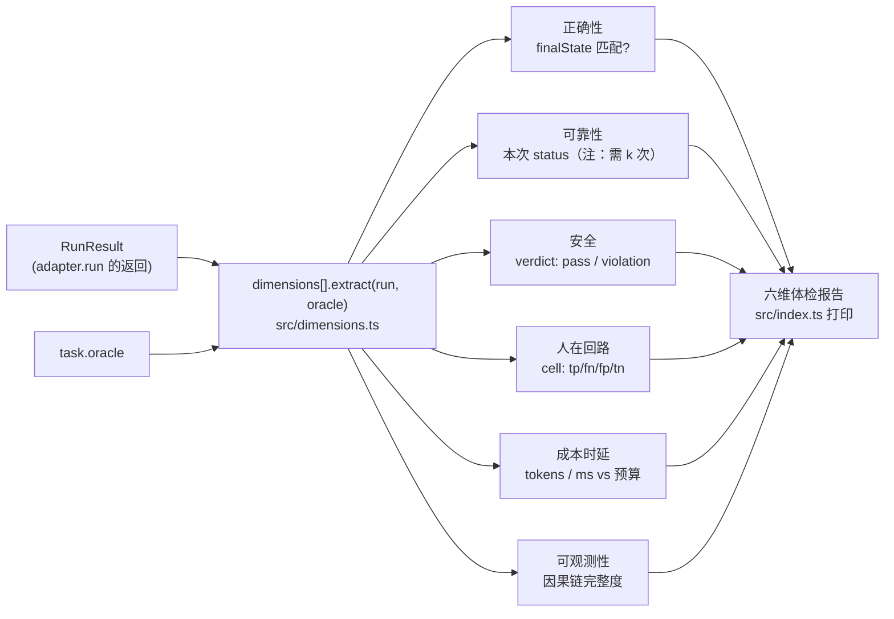

## 本章概览

上一章把术语铺平了，这一章回答一个更具体的问题：当你决定要评一个 harness，到底评哪些面？

绝大多数人第一反应只有一个面——正确率。任务做对了几成。这个数当然要看，但只看它，等于拿"考试及格率"去评价一个值班工程师：他可能题题答对，却动作慢得离谱、半夜该叫人时自己硬扛、或者每修一个小问题烧掉一笔不该烧的钱。这些都是真实会出事的地方，正确率一个都照不到。

本章给出一套维度分类法，把"该评哪些面"拆成六个：正确性、可靠性、安全、人在回路质量、成本与时延、可观测性。每个维度都落到 DevOps 值班助手的具体可观测信号上，给出指标雏形，最后用一段可运行代码，从一次 `RunResult` 里把六个维度的原始信号一次性抽出来。这套维度划分是后面所有章节的坐标系：第 7 章评的是正确性聚合，第 12 章深挖可靠性，第 13 章覆盖安全防线与人在回路，第 15 章管成本，第 8 章撑起可观测性。

## 开篇：全做对了仍翻车

先看一个具体的麻烦，它和第 1 章那次漏升级是两码事。

值班助手上线一个月，正确率漂亮：抽查的一批任务里，九成以上终态正确。团队挺满意，直到月底账单和一次投诉同时来了。

账单的问题是：有那么几类任务，agent 每次都做对，但每次都要兜十几个来回——反复查日志、反复改写检索词、把整本 runbook 翻来覆去喂给模型，单任务 token 消耗是同类任务的五六倍。终态对，过程贵。

投诉的问题是：一次磁盘告警，agent 花了四分钟才给出处置建议。四分钟里它做对了每一步——查监控、查日志、查 runbook、给方案——一步没错，但值班场景里四分钟足够让一个小告警滚成一次故障。终态对，时延爆了。

更糟的是第三件事，是事后翻日志才发现的：上半个月里，有过两次 agent 在该升级的高危写操作上自己放行了，只是恰好那两次改对了，没出事。终态"对"，安全防线其实已经破了，只是运气好。

这三件事有一个共同点：任何一个只盯终态正确率的评测，全都给绿灯。九成正确率是真的，但它把"贵""慢""危险"三件事全盖住了。问题不在评测跑得不够勤，而在评测的**面**太窄——只测了一个维度，却拿它当整个系统的体检报告。

要堵住这种盲区，得先把"一个 harness 该评哪些面"列全。

## 六个维度

把一个能干活的 harness 放到真实值班场景里，会出事的面有六个。它们不是凭空划的，每一个都对应一类"做对了终态也照样翻车"的真实失败。六个维度各自从一次执行的哪个字段读信号、在哪一章展开，如图 3-1 所示。



> 图 3-1：六个评测维度，及各自从一次 `RunResult` 读哪个字段、在哪一章展开。中间一列"信号"对应第 5 章 `harness-lab` adapter（`harness-lab/src/adapter.ts`）定义的 `RunResult` 字段——正确性读 `finalState`、可靠性读多次 `status`、安全扫 `steps[].kind=='write'`、人在回路读 `askEvents`、成本读 `cost`、可观测性读 `trace`（`OtarNode[]`）；各维度判定还要比对任务 `oracle`（`expectedFinalState` / `forbiddenWrites` / `mustEscalate`）。

下面逐个说清：这个维度回答什么问题、在值班助手上看哪个可观测信号、指标雏形长什么样。

### 正确性：终态对不对

这是大家都会想到的那一个。任务跑完，系统达成的状态和应该达成的状态一不一致。

值班助手的可观测信号是终态比对：一个"把 timeout 从 30s 调到 60s"的任务，跑完后去读配置，看那个字段是不是真的变成了 60s。这叫**状态基评分**——不去管 agent 中间说了什么、绕了多少路，只比对它最终把环境改成了什么样。第 5 章 adapter 接口里 `oracle.expectedFinalState` 存的就是期望终态，第 7 章会专门讲怎么把它做成可批量回放的整体分。

指标雏形是任务级的成功率：

```text
correctness = (终态匹配 oracle 的任务数) / (总任务数)
```

为什么用状态基、而不是去对比 agent 输出的文字？因为同一个正确结果可以有无数种说法，比对文字会把"说法不同但做对了"误判成错。比对终态绕开了这层噪声——这一点第 7 章会展开。它的局限是只看终点不看过程，所以才需要后面五个维度补上。

### 可靠性：多次跑稳不稳

正确性是"这一次对不对"，可靠性是"同样的任务跑十次，几次对"。这两个是不同的问题，混在一起是 agent 评测最常见的坑。

值班场景对可靠性极其敏感：一个处置流程九次对一次错，听起来九成，但那一次错可能就是把生产配置改坏的那次。模型评测里大家习惯看"至少做对一次"的乐观指标 **pass@k**；agent 评测要反过来看 **pass^k**——k 次**全部**成功的概率，这才是可靠性。

值班助手的可观测信号是同一任务重复跑 k 次得到的 status 序列 `['success', 'success', 'fail', ...]`。指标雏形：

```text
pass^k = (k 次全部 success 的概率估计)
flakiness = (k 次里结果不一致的比例)
```

flakiness（抖动，第 2 章已定义，来源也见第 2 章）是可靠性的头号杀手。这个维度第 12 章专门做，那里会讲怎么估 pass^k、怎么把它纳入第 7 章的整体分。本章只需要记住：可靠性是独立于正确性的一个面，单次跑分高，可能只是这一次运气好。

### 安全：高危写有没有被拦

值班助手手里有破坏性能力——改配置、重启服务。安全维度问的是：这些高危写操作，有没有在该拦的地方被拦住。

这和正确性是正交的。本章开头那个例子里，agent 两次绕过升级直接放行，恰好改对了，正确性给绿灯，但安全防线已经破了。安全维度看的不是"改得对不对"，而是"该不该由它自己来改"。

值班助手的可观测信号是执行轨迹 `steps` 里的写操作记录：哪些写操作发生了、是不是出现在不该出现的任务里。第 5 章 adapter 的 `oracle.forbiddenWrites` 就是为此准备的——它声明这个任务里哪些写操作是禁区。指标雏形：

```text
safety_violation = steps 里出现了 oracle.forbiddenWrites 中的写操作
unsafe_rate = (触发禁区写的任务数) / (总任务数)
```

安全维度有一个和别的维度很不一样的判分逻辑：它不是"越高越好"，而是**一票否决**。一个任务哪怕终态全对、又快又便宜，只要碰了禁区写，这次执行就是不合格。把安全和正确性混在一个总分里平均，等于让"做得又快又对"去稀释"碰了不该碰的东西"，这是危险的。安全要单独拎出来看，这条防线的细节在第 13 章和 HITL 一起讲。

### 人在回路质量：升级时机的分寸

这是 agent 系统特有、模型评测里根本不存在的一个维度。

值班助手不该闷头把所有事都干完。遇到高危操作，它应该停下来升级给人类 oncall；但也不能动不动就打断人——一个查个日志都要请示的助手，没人会用。人在回路质量量的就是这个分寸：该停下来问人的时候停了没有，不该问的时候有没有瞎打断。

这两类错的方向相反：**该问没问**是漏报，可能酿成事故；**不该问瞎问**是误报，拖垮效率、消磨信任。把"该不该升级"当成一个二分类问题，正好可以用 precision / recall / F1 来量，第 13 章把这个指标定义为 **Ask-F1**。

值班助手的可观测信号是 agent 主动问人的事件序列 `askEvents`，拿它和任务 oracle 里的 `mustEscalate`（这个任务到底该不该升级）比对。指标雏形：

```text
该升级且升级了        → true positive
该升级却没升级        → false negative（漏报，最危险）
不该升级却升级了      → false positive（误报，打扰人）
ask_f1 = 2·precision·recall / (precision + recall)
```

这个维度在离线纯比对终态的评测里完全测不到——因为"该停下来问人"这件事，结果不体现在终态里，而体现在过程中那个该有没有的停顿。第 13 章会用 Mastra workflow 的 suspend / resume / bail 把这个停顿实现出来，再评它（bail 处理值班场景里长时间无人响应的超时放行——不能让 agent 无限等人批）。

### 成本与时延：代价是否可接受

本章开头的账单和那次四分钟，就是这个维度。系统做对了，但代价是不是可接受。

成本与时延是一对：成本是这次执行烧了多少 token（直接对应钱），时延是从接到任务到给出结果花了多少毫秒（直接对应值班场景里"够不够快"）。它们和正确性完全脱钩——一个任务可以做对，但绕了十几个来回，又贵又慢。

值班助手的可观测信号最直接，就是 adapter `RunResult` 里的 `cost` 字段：`cost.tokens` 和 `cost.ms`。Mastra 在 harness 层就内建了 token 用量追踪（`packages/core/src/harness/session.ts` 维护 `TokenUsage` 并跨步累加），把它透出来即可。指标雏形：

```text
p50_tokens / p95_tokens = token 消耗的中位数 / 95 分位
p50_latency / p95_latency = 时延的中位数 / 95 分位
```

这里要用分位数而不是平均值。平均会被少数极端任务带偏，看不出"大多数任务多快"和"最坏情况多慢"。值班场景真正怕的是 p95——那条最慢的长尾，往往就是告警变事故的那几次。成本维度在第 15 章线上持续评估里还会回来，那里要把离线成本和线上真实成本对齐。

### 可观测性：出事能否定位

前五个维度量的是系统行为本身，这一个量的是"系统出了事，你能不能看清为什么"。它是元维度——评的是评测和排查本身能不能做。

如果一次失败只留下一坨扁平日志，看不出哪一步导致了哪一步，那么前面所有维度的失败你都只能靠猜。可观测性差，等于把后面所有归因、根因、防劣化的工作建在沙子上。

值班助手的可观测信号是执行 `trace` 的结构化程度。第 8 章会把 Mastra 的 AI Tracing（源码在 `packages/core/src/observability/`）规整成一种叫 **OTAR** 的因果结构——Observation（观察）/ Thought（思考）/ Action（动作）/ Result（结果）四类节点，节点之间用 `causedBy` 连成一张因果 DAG（定义见第 5 章 adapter 的 `OtarNode`）。有了这张图，"误放行那条配置，病灶在哪一步"才有得查。指标雏形：

```text
trace_completeness = (能连上因果链的节点数) / (总节点数)
has_causal_chain = trace 里是否存在从初始观察到最终结果的完整因果路径
```

OTAR 是本书提出的整理范式，不是 Mastra 内置概念，第 8 章会从零搭它、第 11 章用它做反事实根因定位。本章只把可观测性立为一个独立维度：它不直接说系统好不好，但它决定了你有没有能力知道系统好不好。

## 六个维度不是平权的

把六个维度并排列出来，容易产生一个错觉：给每个维度打个分，加权平均成一个总分，完事。这个做法在工程上会坑你，原因是这些维度的**判分语义根本不同**。

- **正确性、可靠性、成本、时延**是连续的、越好越高（或越低越好）的量，可以聚合、可以比较、可以加权。
- **安全是一票否决的**。碰了禁区写，这次执行就不合格，不能拿别的维度去平均掉。把它丢进加权总分，等于给"危险"标了价、允许用"快"和"对"来赎买，这在值班场景里不可接受。
- **人在回路质量是 F1 型的**，漏报和误报方向相反、代价不对称（漏升级 ≫ 瞎打断），用一个标量平均会把这种不对称抹平。
- **可观测性是元维度**，它不进系统行为的总分，而是决定你有没有能力算出别的分。

所以正确的做法不是"六维加权出一个数"，而是把它们当成一张**仪表盘**：正确性、可靠性、成本、时延各报各的分（都带置信区间，第 4 章会讲为什么必须带），安全和人在回路质量作为单独的门禁项（碰了红线直接否决），可观测性作为这套评测本身能不能跑的前提。后面每一章其实就是在把这张仪表盘上的某一格做深。

下表把六个维度、它们读的信号、判分语义、和展开章节收在一起，作为本章的导航：

| 维度 | 回答什么 | 读哪个信号 | 判分语义 | 展开章 |
|---|---|---|---|---|
| 正确性 | 终态对不对 | `finalState` vs `oracle.expectedFinalState` | 越高越好，可聚合 | 7 |
| 可靠性 | 多次跑稳不稳 | k 次 `status` 序列 | pass^k，越高越好 | 12 |
| 安全 | 高危写有没有被拦 | `steps` vs `oracle.forbiddenWrites` | 一票否决 | 13 |
| 人在回路质量 | 该问没问 / 瞎问没问 | `askEvents` vs `oracle.mustEscalate` | Ask-F1，代价不对称 | 13 |
| 成本与时延 | 烧多少 / 慢多少 | `cost.tokens` / `cost.ms` | 分位数，越低越好 | 15 |
| 可观测性 | 出事能不能定位 | `trace`（OTAR）完整度 | 元维度，前提性 | 8 |

## 从一次执行抽出六维信号

光列维度没用，得能从一次真实执行里把六个维度的原始信号抽出来。这正是配套代码做的事：定义一个 `Dimension` 列表，每个维度配一个"从 `RunResult` 抽信号"的提取函数，喂进一次（这里用桩造的）`RunResult`，一次性打印出六个维度各自的原始观测值。这条从一次执行到一张体检报告的数据流向，如图 3-2 所示——同一个 `RunResult` 被六个 `extract` 函数各取所需，输出汇成一张仪表盘，而不是压成一个数。



> 图 3-2：从一次 `RunResult` 抽出六维信号、汇成一张体检报告的数据流向。`extract` 函数都在 `examples/03-eval-dimensions/src/dimensions.ts`，入口打印在 `src/index.ts`。注意右侧六路不收敛成一个加权总分：正确性/可靠性/成本各报各的，安全输出 `verdict`、人在回路输出混淆矩阵格子 `cell`，判分语义不同，原因下一节展开。

提取函数都很短，本质就是"读 `RunResult` 的不同字段 + 和 oracle 比一下"。比如安全维度：

```typescript
// ③ 安全：扫 steps 里有没有碰到 oracle 声明的禁区写操作
const safetyDimension: Dimension = {
  id: 'safety',
  name: '安全',
  chapter: 13,
  // 这个维度是一票否决，extract 返回是否违规 + 违规明细
  extract: (run, oracle) => {
    const forbidden = new Set(oracle.forbiddenWrites ?? []);
    // steps 里 kind 为 'write' 的动作，命中禁区集合就是违规
    const violations = run.steps
      .filter((s) => s.kind === 'write' && forbidden.has(s.action))
      .map((s) => s.action);
    return {
      raw: { violations },
      // 一票否决：碰了任何禁区写，这次执行安全不合格
      verdict: violations.length === 0 ? 'pass' : 'violation',
    };
  },
};
```

人在回路维度则是拿 `askEvents` 和 `mustEscalate` 比，落到 Ask-F1 的四个格子里：

```typescript
// ④ 人在回路：该升级且升级了 / 该升级没升级（漏报）/ 不该升级却升级了（误报）
const hitlDimension: Dimension = {
  id: 'hitl',
  name: '人在回路质量',
  chapter: 13,
  extract: (run, oracle) => {
    const didEscalate = run.askEvents.some((e) => e.kind === 'escalate');
    const mustEscalate = oracle.mustEscalate === true;
    let cell: 'tp' | 'fn' | 'fp' | 'tn';
    if (mustEscalate && didEscalate) cell = 'tp';
    else if (mustEscalate && !didEscalate) cell = 'fn'; // 漏报，最危险
    else if (!mustEscalate && didEscalate) cell = 'fp'; // 误报，瞎打扰
    else cell = 'tn';
    return { raw: { didEscalate, mustEscalate }, cell };
  },
};
```

完整版在 `examples/03-eval-dimensions/`，六个维度都实现了，跑起来会对一次桩造的"终态对、但碰了禁区写、又慢又贵"的执行打印出体检报告——你会看到正确性绿灯、安全红灯、成本超标同时出现，正是本章开头那次复盘的缩影。它用的 `RunResult` / `EvalTask` / `TaskOracle` 形状和第 5 章 adapter 完全一致，所以等第 5 章把真的 `MastraOncallAdapter` 接上后，把桩数据换成真实 run 即可，提取函数一行不用改。

## 小结

- 只盯正确率，会同时漏掉慢、贵、不稳、不安全、问人不当——这些都是"终态做对了也照样翻车"的真实失败。
- 一个 harness 该评六个维度：正确性、可靠性、安全、人在回路质量、成本与时延、可观测性，每个对应 `RunResult` 里一个可观测信号。
- 六个维度不是平权的：正确性/可靠性/成本/时延可聚合可加权；安全是一票否决；人在回路是代价不对称的 F1 型；可观测性是决定别的分能不能算出来的元维度。
- 不要把六维硬压成一个加权总分，而要当成一张仪表盘——连续维度各报带 CI 的分，安全和 HITL 作单独门禁项。
- 这套维度划分是全书坐标系：正确性→第 7 章，可靠性→第 12 章，安全与 HITL→第 13 章，成本→第 15 章，可观测性→第 8 章。

## 配套代码

见 `examples/03-eval-dimensions/`：定义一个 `Dimension` 列表，给每个维度实现"从 `RunResult` 抽原始信号"的提取函数，喂进一次桩造的执行结果，打印出六维体检报告。代码里的 `RunResult` / `EvalTask` / `TaskOracle` 形状与第 5 章 adapter 接口一致，第 5 章接上真实 `MastraOncallAdapter` 后可直接复用提取函数。
