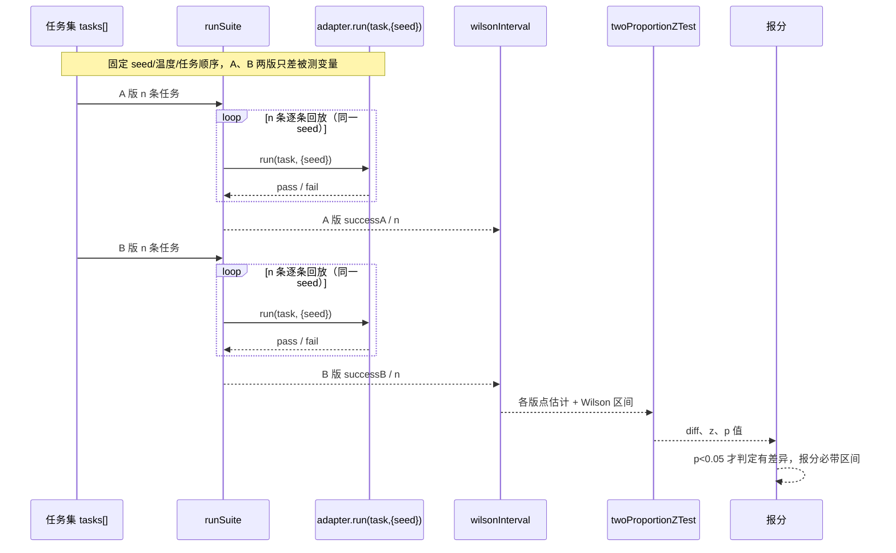
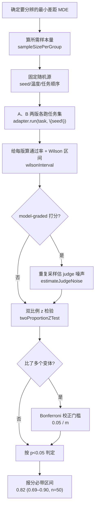

## 本章概览

这一章只解决一件事：怎么读评测分，才不会被噪声骗。要做到这点，得把每一次评测当成一次统计实验来设计和解读——分数要带误差棒，比较两版要做显著性检验，下结论前要先算清楚自己的样本量够不够分辨出在意的差距。这些不是学术上的洁癖，它们直接决定你那句"新版更好"站不站得住。

本章先用一次让人迷惑的分数反弹把问题逼出来，再依次讲清楚误差棒（Wilson 区间）、样本量与 MDE、judge 噪声、显著性检验、多重比较，最后把这些拼成一条可照着走的 A/B 实验流程。本章讲的置信区间和显著性，会贯穿到第 7 章的整体分报告、第 12 章的 pass^k、第 15 章的线上 A/B、第 16 章的防劣化门禁。

## 开篇：噪声里的假提升

你给值班助手换了个新的检索策略，跑了一遍五十条任务的评测集，整体分从 0.82 涨到 0.84。涨了 0.02，方向也对，于是你合并、发布、写进周报。一周后有人复跑同一套评测集、同一版代码，分数是 0.80。代码没动，分却掉了 0.04，比你上次"涨的"还多。

问题出在你把一个随机变量当成了一个确定的数。评测分不是一把卡尺量出来的固定值，它是从有限样本里估出来的统计量，自带波动。0.82 和 0.84 之间那 0.02，很可能整个落在噪声里——它既不能证明新策略更好，也不能证明它没变坏，它什么都没证明。

这次反弹不是哪里出了 bug，而是把"读评测分"这件事本身做错了。下面从"评测分到底是什么"讲起，一步步把它读对。

## 评测分是随机变量

先把"评测分自带波动"这件事拆成两个独立的来源，它们的应对方法不一样。

第一个来源是**抽样波动**。你的任务集是从"所有可能的值班场景"这个想象中的大池子里抽出来的一个样本。哪怕你的 harness 完全确定、每条任务的判定也完全确定，换一批任务、或者多抽几条，整体通过率都会变。你报的 0.82，本质是"在这 50 条上通过了 41 条"，它是对真实通过率的一个估计，不是真实通过率本身。样本越小，这个估计越飘。

第二个来源是**执行波动**。同一条任务、同一版 harness，跑两次结果可能不一样。模型采样有温度，工具调用有时序和并发的非确定性，LLM 当 judge 打分时自己也带噪声。这一类波动在第 12 章会专门量化（flakiness），本章先把它纳入统计视角：它意味着"这条任务过没过"本身就是个随机事件，不是固定结论。

两个来源叠在一起，结论很直接：你每次看到的评测分，是一个随机变量的一次取值。下次再取，会落在它附近但不完全相同。所以单看一个点没有意义，你要估的是这个随机变量的中心在哪、波动有多大——也就是给分数配一个区间。

```typescript
// 同一版 harness、同一套 50 条任务，重复跑 5 轮的整体通过率
// 数字是示意：哪怕代码一行没改，分数也在 0.78~0.84 之间晃
const passRatesAcrossRuns = [0.82, 0.80, 0.84, 0.78, 0.82];
// 你上次报告的 0.82 只是这串里的一个，把它当成"真值"就会被下一次的 0.80 打脸
```

## 比例的误差棒：Wilson 区间

值班助手的整体评测，最常见的形态是"n 条任务里过了 x 条"，这是一个二项比例。给二项比例配区间，第一反应往往是教科书里那个正态近似公式 `p̂ ± 1.96·√(p̂(1−p̂)/n)`（叫 Wald 区间）。但在评测场景它经常出错：样本量小、或者通过率贴近 0 或 1 时，Wald 区间会算出超过 [0,1] 的荒谬边界，覆盖率也对不上。

更稳的选择是 **Wilson score 区间**。它在小样本和极端比例下都表现良好，是 Evan Miller 在《Adding Error Bars to Evals》里推荐评测场景默认使用的区间（这篇是本书最推荐的统计入门来源之一，见附录 B）。它的公式比 Wald 复杂一点，但一次写好就能反复用：

```typescript
// Wilson score 区间：给"n 次里成功 x 次"的二项比例配 95% 误差棒
// 比教科书的 Wald 近似在小样本/极端比例下稳得多
export function wilsonInterval(
  successes: number,
  total: number,
  z = 1.96, // 95% 置信水平对应的正态分位数
): { lower: number; upper: number; point: number } {
  if (total === 0) return { lower: 0, upper: 1, point: 0 };
  const p = successes / total;
  const z2 = z * z;
  const denom = 1 + z2 / total;
  const center = (p + z2 / (2 * total)) / denom;
  const margin =
    (z * Math.sqrt((p * (1 - p)) / total + z2 / (4 * total * total))) / denom;
  return { lower: center - margin, upper: center + margin, point: p };
}
```

把它用在前面那个 41/50 上：点估计 0.82，95% Wilson 区间大约是 [0.69, 0.90]。这个区间宽到 0.21——意思是，凭这 50 条任务，你能确信的只是"真实通过率大概在七成到九成之间"。在这个背景噪声下，0.82 和 0.84 的差别根本不值一提。报分时把这个区间一起报出来，你和读你报告的人就都不会再把 0.02 的抖动当成进步。

报告里怎么呈现？一句话原则：**任何评测分都不裸奔，永远带上它的区间**。表格里写成 `0.82 (0.69–0.90, n=50)`，图里画成带误差棒的柱子。看到两根柱子的误差棒大面积重叠，就该警惕"它俩可能根本没差别"。

## 样本量与 MDE

误差棒太宽，根子在样本太少。那到底要多少条任务才够？这个问题不能空着问，得先回答另一个问题：**你想分辨多小的差距？**

这个"你在意的最小差距"有个名字，叫 MDE（minimum detectable effect，最小可检测效应）。如果你只关心"新版有没有把通过率提升 10 个百分点以上"，那 MDE 就是 0.10，需要的样本量不大；如果你想抓住 2 个百分点的细微改进，MDE 是 0.02，需要的样本量会暴涨。样本量、MDE、波动三者是绑死的：要想在更小的差距上下结论，要么加样本，要么降波动，没有免费午餐。

对二项比例，给定基线通过率 `p`、想检测的绝对提升 `delta`，粗略估算每组所需样本量可以用这个常用近似：

```typescript
// 估算两组比例对比、想检测出 delta 大小提升时，每组大致需要多少样本
// 双侧 95% 置信（alpha=0.05）、80% 把握度（power=0.8）下的常用近似
export function sampleSizePerGroup(
  baseline: number, // 基线通过率，比如 0.80
  delta: number, // 想检测出的绝对提升，比如 0.05
): number {
  const zAlpha = 1.96; // 双侧 alpha=0.05
  const zBeta = 0.84; // power=0.8
  const p1 = baseline;
  const p2 = baseline + delta;
  const pBar = (p1 + p2) / 2;
  const numerator =
    zAlpha * Math.sqrt(2 * pBar * (1 - pBar)) +
    zBeta * Math.sqrt(p1 * (1 - p1) + p2 * (1 - p2));
  const n = (numerator * numerator) / (delta * delta);
  return Math.ceil(n);
}
```

代进去算一下就明白这件事有多反直觉：基线 0.80、想稳稳检测出 0.05 的提升，每组约需 900 条任务（本章代码算出 905）；想检测 0.02 的提升，每组要约 6000 条。而很多团队的评测集只有几十到几百条。这不是说小评测集没用，而是说：**小评测集只配下"大改进"的结论**。你拿 50 条任务，就别奢望分辨 0.02；它能可靠告诉你的，是"新版有没有把通过率打到地板上"这种量级的事。先认清自己样本量能支撑多大的结论，再去解读分数，能避开绝大多数自欺。

## judge 噪声的估计

前面两节假设"每条任务过没过"是确定的。但当你用 LLM 当 judge 给质量打分时（第 2 章定义的 quality / model-graded 评测），judge 自己就是个会抖的随机变量：同一条 input/output，让它打两次分可能不一样。这部分噪声不能靠 Wilson 区间覆盖——Wilson 处理的是抽样波动，不是 judge 的内部噪声。

估 judge 噪声的办法很朴素：**对同一条样本让 judge 重复打 k 次，看分数自己散得多开**。散得越开，说明这个 judge 在这类样本上越不可靠，它贡献的方差越大。

```typescript
// 对同一条 (input, output) 让 judge 重复打分 k 次，估它自己的噪声
// 标准差越大，说明 judge 在这条样本上越不稳，它的打分越不能当真值用
export async function estimateJudgeNoise(
  judge: (input: string, output: string) => Promise<number>,
  input: string,
  output: string,
  k = 8,
): Promise<{ mean: number; std: number; samples: number[] }> {
  const samples: number[] = [];
  for (let i = 0; i < k; i++) {
    samples.push(await judge(input, output));
  }
  const mean = samples.reduce((a, b) => a + b, 0) / k;
  const variance =
    samples.reduce((a, b) => a + (b - mean) ** 2, 0) / (k - 1);
  return { mean, std: Math.sqrt(variance), samples };
}
```

两个来源怎么合到同一个误差棒里？关键是它们相互独立，方差可以直接相加。设整体分是各任务分数的平均 `s̄ = (1/n)·Σ sᵢ`。纯抽样视角下，`Var(s̄) ≈ p̂(1−p̂)/n`，这就是 Wilson 区间背后那一项。引入 judge 噪声后，每个 `sᵢ` 自己又带一份方差 `σ_judge²`（就是上面 `estimateJudgeNoise` 估出来的那个标准差的平方）。两者独立，于是

```
Var(s̄) ≈ p̂(1−p̂)/n  +  σ_judge²/(n·k)
         └── 抽样波动 ──┘   └─ judge 噪声 ─┘
```

其中 `k` 是你对每条样本重复打分取均值的次数（`k=1` 就是只打一次），和上面 `estimateJudgeNoise` 的参数 `k` 用同一个字母、同一件事：让 judge 在同一条样本上多打几次。两点直接结论：judge 噪声那一项也随 `n` 衰减，但你可以靠加大 `k`（每条多打几次取均值）单独把它压下去，而不用扩任务集；当 `σ_judge²/k` 相对 `p̂(1−p̂)` 不可忽略时，真实误差棒就比纯 Wilson 宽，报告里若用了 model-graded 打分，得把这一项也算进区间，否则会高估自己的确定性。最终把这个加宽后的 `Var(s̄)` 开方乘 1.96，就是合并两类波动后的半宽。

降 judge 噪声还有个比加 `k` 更便宜的办法：把 judge 的温度调到 0、prompt 写死、对每条样本取多次打分的多数票或均值——直接把 `σ_judge` 本身压小。这和本章最后要讲的"固定 seed/温度做可复现对照"是一回事，能压住的波动就别让它进结论。

> 顺带一提，学术界有更省样本的做法。ARES（arXiv:2311.09476，NAACL 2024 Findings）用 PPI（prediction-powered inference）把"便宜但有偏的自动打分"和"少量昂贵的人工标注"结合起来，在给出 95% 置信区间的同时显著减少所需的人工标注量。这属于前沿探索，本书不展开实现，完整引用信息列在附录 B 供进阶参考。

## 两版对比：显著性检验

把误差棒搞清楚之后，"A 版和 B 版谁更好"就有了正确的问法：不是比两个点谁高，而是问"它俩的差异能不能从噪声里区分出来"。

最直接的判据是看两个 Wilson 区间重不重叠——但这个判据偏保守，区间不重叠一定有显著差异，区间重叠却未必没有。更标准的做法是对两个比例做一次**双比例 z 检验**，算出一个 p 值：在"两版其实没差别"这个零假设下，观察到当前或更极端差异的概率有多大。p 值小（习惯上 < 0.05），才有底气说差异不是噪声。

```typescript
// 双比例 z 检验：判断 A、B 两版 harness 的通过率差异是不是噪声
// 返回的 p 值越小，越有把握说"它俩确实不一样"
export function twoProportionZTest(
  successA: number,
  totalA: number,
  successB: number,
  totalB: number,
): { diff: number; z: number; pValue: number } {
  const pA = successA / totalA;
  const pB = successB / totalB;
  const pPool = (successA + successB) / (totalA + totalB); // 零假设下的合并比例
  const se = Math.sqrt(pPool * (1 - pPool) * (1 / totalA + 1 / totalB));
  const z = se === 0 ? 0 : (pA - pB) / se;
  // 双侧 p 值，用标准正态 CDF 的近似
  const pValue = 2 * (1 - normalCdf(Math.abs(z)));
  return { diff: pA - pB, z, pValue };
}

// 标准正态分布 CDF 的数值近似（Abramowitz & Stegun 公式）
function normalCdf(x: number): number {
  const t = 1 / (1 + 0.2316419 * Math.abs(x));
  const d = 0.3989423 * Math.exp((-x * x) / 2);
  const p =
    d *
    t *
    (0.3193815 +
      t * (-0.3565638 + t * (1.781478 + t * (-1.821256 + t * 1.330274))));
  return x > 0 ? 1 - p : p;
}
```

回到开头的例子：A 版 41/50、B 版 42/50，差 0.02。跑这个检验，p 值约 0.80，远大于 0.05。结论不是"B 不如 A"，也不是"B 优于 A"，而是更诚实的一句：**凭这点样本，没有证据表明它俩有差别**。这才是 0.82 → 0.84 应得的解读。

## 多重比较校正

还有一个容易踩的坑：你一次不止比一个东西。

假设你同时调了检索策略、记忆窗口、工具描述三处，分别和基线比，各做一次 0.05 显著性水平的检验。哪怕这三处其实全无效果，"三次里至少有一次蒙到 p < 0.05"的概率约是 1 − 0.95³ ≈ 14%。比的东西越多，至少撞上一个假阳性的概率越高。你在一堆变体里挑出那个"显著变好"的，很可能只是挑中了运气最好的噪声。

对付它有个简单的纪律性办法——**Bonferroni 校正**：要同时做 m 次比较，就把每次的显著性门槛从 0.05 收紧到 0.05/m。同时比三处，门槛就压到 0.0167，一个 p = 0.04 的"显著"在校正后就不算数了。它偏保守，但作为防自欺的默认纪律足够好用。更要紧的是养成习惯：报告里写清楚你一共比了几个东西，别只把那个最好看的拎出来说。

## 可复现：固定 seed/温度

统计检验能告诉你差异是不是噪声，但更省事的是从源头少制造噪声。做 A/B 对照时，**凡是能固定的随机源都固定下来**，让两版之间尽量只差你真正想测的那个变量。

具体到值班助手的评测：模型温度调到 0 或固定随机种子，任务集顺序固定，工具桩的返回固定，judge 的温度也调到 0。这样两版跑出来的差异，更多是 harness 改动带来的真实差异，而不是两次随机采样的运气差。这件事在第 5 章给 Mastra 写 adapter 时会落到 `run(task, { seed })` 这个接口上——adapter 接受一个 seed 参数，正是为了让同一条任务可复现地重跑。

固定随机源不会让波动归零（抽样波动还在，模型也未必完全可控），但它把"本可以消除的执行波动"挡在了结论之外。配合前面的误差棒和显著性检验，你对"新版到底变没变好"的判断才算站得住。

## 串成一条 A/B 实验流程

把上面这些拼起来，一次像样的"A/B 评测实验"应该按下面这个流程走，而不是"跑一遍看分高低"。先看一次实验里数据怎么从原始任务流到最终判定。把采样、跑 k 次、估计、Wilson 区间、显著性判定这几步按时间顺序排开，如图 4-1 所示，每一步的产物喂给下一步，缺了中间任何一环，最后那句"新版更好"都站不住。



> 图 4-1：一次 A/B 评测实验的数据流时序。任务集逐条经 `runSuite` 调用 `adapter.run(task, {seed})` 回放（A、B 各跑一遍，共用同一 seed 固定随机源），通过数交给 `wilsonInterval` 估点估计与区间，再交给 `twoProportionZTest` 算差异与 p 值，最后只有 p<0.05 才判定有差异、且报分带区间。对应代码在本章 `examples/src/ab-experiment.ts`（串联）与 `stats.ts`（`wilsonInterval`/`twoProportionZTest`）。

把同一条流程抽成可照着检查的决策步骤，如图 4-2 所示，它在图 4-1 的主干上补全了两条分支：用没用 model-graded 打分（决定要不要估 judge 噪声）、比没比多个变体（决定要不要做 Bonferroni 校正）。



> 图 4-2：A/B 评测实验的完整决策流程。比图 4-1 多出两条分支：是否用了 model-graded 打分（用了就先 `estimateJudgeNoise` 把 judge 噪声估出来叠进误差棒），以及是否比了多个变体（比了就用 Bonferroni 把门槛收紧到 0.05/m）。对应代码在本章 `examples/src/stats.ts`（`wilsonInterval`/`sampleSizePerGroup`/`twoProportionZTest`）、`judge-noise.ts`（`estimateJudgeNoise`）与 `ab-experiment.ts`（串联）。

图 4-2 中各节点对应本章 `examples/src/` 下的函数：`wilsonInterval`、`sampleSizePerGroup`、`twoProportionZTest`、`estimateJudgeNoise` 分别在 `stats.ts` 与 `judge-noise.ts`；A/B 流程的串联在 `ab-experiment.ts`。`adapter.run(task, { seed })` 是第 5 章定义的 `HarnessAdapter` 接口，本章先用一个内存桩模拟它来跑通流程。

## 小结

- 评测分是随机变量，不是一个确定的数：抽样波动和执行波动叠在一起，让同一版代码两次跑分都不相同。单看一个点会被噪声骗。
- 二项比例（n 条过 x 条）的误差棒用 Wilson 区间，比教科书的 Wald 近似在小样本和极端比例下稳得多。报分永远带区间，写成 `0.82 (0.69–0.90, n=50)`。
- 样本量、想分辨的最小差距 MDE、波动三者绑死。先想清楚要分辨多小的差距，再算样本量；小评测集只配下"大改进"的结论。
- 用 LLM 当 judge 时，judge 自己会抖，靠对同一样本重复采样把它的噪声估出来，叠进总误差；能调温度到 0、取多数票就先压住它。
- 比两版 harness 用双比例 z 检验看 p 值，不要比两个点谁高；同时比多个变体要做 Bonferroni 校正，避免挑中运气最好的噪声。
- 做对照前先固定 seed、温度、任务顺序等所有能固定的随机源，把可消除的执行波动挡在结论之外——这正是第 5 章 adapter 的 `run(task, { seed })` 存在的理由。

## 配套代码

见本章 `examples/`：`stats.ts` 实现 Wilson 区间、样本量估算、双比例 z 检验；`judge-noise.ts` 用重复采样估 judge 噪声；`ab-experiment.ts` 把它们串成一次完整的 A/B 评测实验（用内存桩模拟第 5 章的 adapter），跑出来你会亲眼看到 0.82 vs 0.84 这种差距在统计上根本不成立。脚本默认不调用真实模型、不需要 API key，可直接 `npm install && npm run ab` 跑通。
