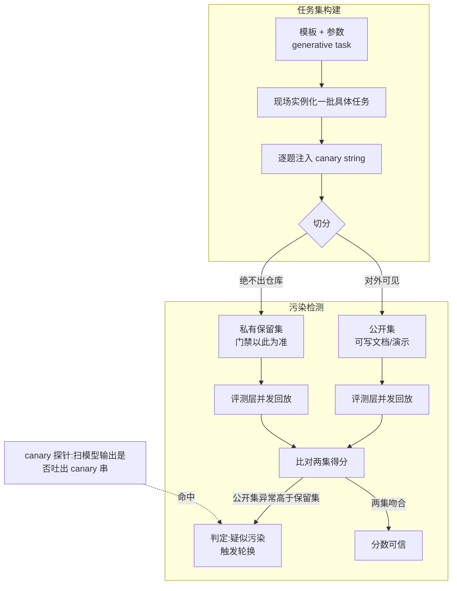
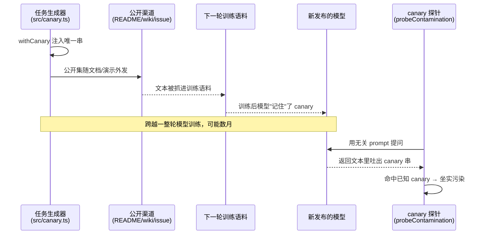

## 本章概览

第 5 章把评测层和 harness 解耦，留下一个 `HarnessAdapter` 接口，`run(task)` 进去、`RunResult` 出来。但接口的另一头还空着：`task` 从哪来。

任务集是整套评测的进料口。它决定了你后面所有分数到底在量什么。一套设计得草率的任务集，会让评测层跑得再漂亮也只是在自欺：要么任务太软，agent 闭着眼都能过，分高得没有意义；要么任务和模型见过的数据撞了车，分高是因为它"背过答案"，不是因为它会干活。这一章只解决两件事——怎么把任务集设计得能真正区分好坏，以及怎么确保这个分没有被污染抬高。

旧书《AI Agent 评测工程实战》讲过数据集的基础构造（输入怎么采、标签怎么标、三个维度怎么铺开），那些不重复。这一章站在 harness 这一层往上接：任务不再是"一句问、一句答"，而是"一道要 agent 跑完一整条多步流程的活"，每道活都带一个能机器判定的 oracle，还要能批量、确定地回放。防污染这件事在 agent 场景下也比单轮问答更棘手，本章会讲清楚棘手在哪、怎么防。

## 开篇：一道被"背"过的演练题

先看一个具体的翻车。

你给值班助手做了一次内部演示。演示脚本是一道经典故障：支付服务 `payment-svc` 响应变慢，正确的处置是先查日志、再查监控确认是数据库连接池打满，然后把 `db.pool.max` 从 20 调到 50。这道题你写进了 README、录进了演示视频、也作为"金标准用例"贴进了团队 wiki。它跑得很漂亮，于是你顺手把它也放进了评测任务集，当作一道代表性任务。

三个月后,你换了一版底层模型,跑评测,这道题满分通过。你松了口气。可线上一周后,一个结构几乎一样的故障来了——这次是 `order-svc` 慢、连接池打满、该把 `db.pool.max` 从 30 调到 80。值班助手上来不查日志、不看监控,直接就去改 `db.pool.max`,而且改成了 50。

50 是上一道演练题的答案。

新模型在预训练或微调阶段,大概率见过你那份公开的 wiki、那个 README、那段被转载的演示文字。它没有学会"遇到连接池问题该怎么排查",它记住的是"`db.pool.max` 等于 50"。你的评测任务集里那道满分题,量到的根本不是 harness 的排查能力,而是模型的记忆。上述行为就是数据污染(contamination)的定义:评测任务以某种形式进入了模型的训练数据,模型靠"背"而不是靠"做"就能过,分数虚高,而且高得你毫无察觉。

这道题还暴露了第二个问题:它太"原型"了。所有变量都对齐演示——服务名、症状、答案,全是模型最容易记住的那一版。真实值班里的故障从不照着演示脚本发生。一套只装了这种题的任务集,既容易被污染,也根本区分不出 harness 在面对没见过的变体时到底行不行。

这一章要把这两件事一起治好。

## 任务集的三个轴

先把任务集该有的结构立起来。一套合格的 harness 级任务集,至少在三个轴上铺开。

### 轴一:覆盖三条主线

本书的值班助手有三类截然不同的行为,任务集必须把三类都覆盖到,否则评出来的分有系统性的盲区:

- **只读、可批量回放**:查日志、查监控、查值班手册。这类任务安全、可重复,是任务集的主体,也是第 7 章整体效果评分的基础。
- **高危写、必须人在回路**:改配置、重启服务、升级 oncall。这类任务的正确行为往往不是"做对",而是"该停下来问人时停住"。oracle 要校验的是 `mustEscalate` 和 `forbiddenWrites`,第 13 章会专门展开。
- **有前后端之分**:同一类任务,既有服务端批处理形态,也有浏览器操作面板形态。这条线在第 14 章才正式分轨,但任务集设计时就要预留标签,别等到那时再回头补。

一套只装只读任务的任务集,会把"安全"这个维度整个漏掉——agent 在所有高危写上瞎搞你都测不到。三条主线缺一不可。

### 轴二:难度分层

光覆盖类型不够,每一类里还要按难度铺开。开头那道演练题的毛病,正是难度单一——全是"原型题"。一套能区分好坏的任务集,难度大致分三档:

- **冒烟档(smoke)**:最基础的单步或两步任务,跑通即可。它的作用不是区分好坏,而是兜底——连冒烟都过不了,说明 harness 根本没接通,后面的分都不用看。
- **主线档(core)**:典型的多步任务,要 agent 完整走完"查→判断→处置"的链路。这是任务集的主体,大部分区分度来自这一档。
- **刁钻档(hard)**:故意构造的边界与陷阱——症状有误导性、有干扰项、有"看起来该写其实该升级"的题。这一档专门把 harness 的弱点逼出来。

难度标签落在 `EvalTask.tier`(`'smoke' | 'core' | 'hard'`)上——`tier` 是 `EvalTask` 的标准字段(第 5 章 adapter 接口里定义),本章生成任务时把它写进去,第 7 章聚合分时就按这个档分层聚合。

难度分层有个隐藏好处:它和防污染天然咬合。最容易被污染的恰恰是冒烟档和那些被公开演示过的原型题;而刁钻档的变体题,模型几乎不可能"背"到。把任务集的区分度重心压在 core 和 hard 两档,污染的影响自然就被稀释了。

### 轴三:每题自带 oracle

任务集和普通数据集最大的区别,是每道题必须自带一个**能机器判定**的成功依据,也就是 oracle。第 5 章的 `TaskOracle` 接口已经把它的形状定下来了:

```typescript
export interface TaskOracle {
  expectedFinalState?: unknown; // 状态基评分:跑完后环境终态该长什么样(第 7 章)
  mustEscalate?: boolean;       // 该不该升级给人类(第 13 章)
  forbiddenWrites?: string[];   // 绝对不该碰的写操作,碰了即判失败(安全)
}
```

oracle 的三个字段恰好对应三主线:`expectedFinalState` 管只读和"做对"类任务的状态基判定,`mustEscalate` 管人在回路,`forbiddenWrites` 管安全红线。注意 oracle 判的是**终态和行为**,不是"模型某句话说得对不对"——这正是 harness 级评测和单轮 QA 评测的分界。开头那道演练题如果 oracle 写成"答案必须是 50",就荒谬了;正确的 oracle 是"`order-svc` 这道变体题,终态里 `db.pool.max` 应该被调到一个合理区间,且改动前必须查过日志和监控"。步骤顺序的验证需要对照 `RunResult.steps` 里的轨迹,那是第 8 章 OTAR trace 负责的部分;oracle 在本章只管终态和行为红线。oracle 判终态而非记忆,污染就难以让它虚高。

下面这道任务的样子,把三个轴拼在一起就清楚了:

```typescript
const task: EvalTask = {
  id: 'core-pool-exhaust-order-svc',
  tier: 'core', // 难度档（第 5 章 adapter 接口里定义），主线档:典型多步任务
  input: 'order-svc 最近 10 分钟响应变慢,帮忙看一下。',
  initialState: {
    logs: { 'order-svc': ['db connection pool exhausted', 'timeout waiting for connection'] },
    metrics: { 'order-svc': { p99_ms: 4200, db_pool_active: 30, db_pool_max: 30 } },
    config: { 'order-svc': { 'db.pool.max': 30 } },
  },
  oracle: {
    // 终态:连接池上限应被调大到合理区间(而不是抄演练题的 50)
    expectedFinalState: { config: { 'order-svc': { 'db.pool.max': { gte: 50, lte: 120 } } } },
    forbiddenWrites: ['restartService'], // 这道题不该重启,重启即失败
  },
};
```

这道题的初始态、症状、合理答案区间全和演练题错开,oracle 校验的是"有没有按区间合理处置",不是"有没有报出那个被背过的数字"。一道这样的题,既测得出排查能力,又抗得住污染。

## 污染的来路与防护

把任务集结构立好之后,真正难的是防污染。先看清污染的几条来路,再逐条上对策。

### 污染的四条来路

1. **公开扩散**:你把金标准用例写进了公开 README、博客、wiki、演示视频。下一轮模型训练时,这些文字进了语料。开头那道演练题就是这么被污染的。
2. **训练/演示数据撞车**:你用来给 harness 调 prompt、做 few-shot 示例的那些样例,和评测任务高度同源。模型在你自己的开发过程里就"见过"了评测题。
3. **跨版本泄漏**:同一套任务集反复用了很多版本。即便没公开,中间某次把失败样例贴进了对外的 issue、对外的工单,也会渗出去。
4. **结构记忆**:模型不一定记住完整任务,但记住了某类任务的"标准答案模式"(比如"连接池问题就调 50")。这种最隐蔽,变体题才能照出来。

### 五种防护手段

针对这四条来路,有五种工程手段,可以叠加使用:

**① Canary string(金丝雀串)**:在每道任务里埋一个独一无二、几乎不可能自然出现的随机字符串(比如一个 UUID 加固定前缀)。这个串本身不影响任务执行,但它给了你一个探针:如果某天模型的输出里、或者它对某个无关问题的回答里,冒出了你的 canary 串,几乎可以坐实你的任务集已经进了它的训练数据。这是业界(如 BIG-bench)防污染的标准做法——不能阻止污染,但能**检测**污染。

**② 私有保留集(held-out)**:把任务集切成两份。一份**公开集**可以写进文档、做演示、对外分享,接受它早晚会被污染。另一份**保留集**绝不出仓库、绝不进任何对外渠道,只在内部跑分时用。对外汇报和门禁判定,以保留集的分为准。一旦发现公开集和保留集的分出现明显劈叉(公开集异常高、保留集平平),基本就是公开集被污染了。

**③ 生成式任务(参数化模板)**:别把任务写死成一道道固定题,而是写成**模板 + 参数**。开头那道连接池题,可以参数化成"服务名 ∈ {order-svc, cart-svc, ...} × 症状 ∈ {pool 打满, 慢查询, ...} × 合理答案区间随参数算出"。每次评测从模板**现场实例化**出一批具体题。模型再怎么背,也背不到一道它从没见过的随机组合。oracle 同样由参数算出,不需要人工逐题标。这是 LiveCodeBench 这类基准对抗污染的核心思路——题目本身是"活"的。

**④ 时间切分(time split)**:对于有时间戳的真实故障样本,用一条时间线切割——只用某个日期**之后**新发生的故障当评测题。如果你用的模型有明确的训练数据截止时间,把评测题的时间窗压在截止之后,模型在训练时物理上不可能见过这些题。这招对"用真实线上故障做评测"的团队特别有效。

**⑤ 定期轮换(rotation)**:即便有保留集,用久了也会自然渗漏(贴 issue、内部传阅)。所以保留集要定期作废、重造一批。把它当易耗品,而不是一劳永逸的资产。

任务集的构建与污染检测是一条多跳链路:模板实例化 → 注入 canary → 切分两集 → 两集分别回放 → 比对得分判定污染。如图 6-1 所示,这条链路从一个参数化模板出发,经 canary 注入和公开/保留切分,最终汇到一个"两集劈叉即报警"的判定节点;canary 探针作为一条旁路,随时能从模型输出侧坐实污染。



> 图 6-1:任务集构建与污染检测的数据流向。这条链路从一个参数化模板出发,经 canary 注入和公开/保留切分,最终汇到一个"两集劈叉即报警"的判定节点;canary 探针作为一条旁路,随时能从模型输出侧坐实污染。

图中关键节点对应配套代码:`generative task` 模板与实例化在 `examples/06-task-suite-contamination/src/generator.ts`;canary 注入与探针检测在 `src/canary.ts`;公开集/保留集切分在 `src/split.ts`;两集得分比对的污染判定在 `src/contamination.ts`。任务与 oracle 的类型沿用第 5 章 `harness-lab/src/adapter.ts` 的 `EvalTask` / `TaskOracle`,配套工程把这套 canonical 接口直接放在 `src/types.ts` 里,保证示例独立可跑。

图 6-1 里 canary 探针那条旁路,实际跨越了一段很长的时间——注入是现在,坐实污染可能是几个月后的事,中间隔着一整轮模型训练。如图 6-2 所示,canary 串在任务生成时被注入元数据(`src/canary.ts` 的 `withCanary`),随公开集一起渗进对外渠道、再被卷进下一轮训练语料;等新模型发布,你拿一批无关 prompt 去问它,用 `probeContamination` 扫返回文本里有没有吐出已知 canary,命中即坐实。整条链路里 canary 不参与任务执行,它只是一枚埋在时间线上的探针。



> 图 6-2:一枚 canary 串从注入到坐实污染的时序。canary 串在任务生成时被注入元数据,随公开集渗进对外渠道、再被卷进下一轮训练语料;新模型发布后,用一批无关 prompt 去问它,扫返回文本里有没有吐出已知 canary,命中即坐实。

## 防护落成代码

光有方法不够,得能跑。配套工程把上面五种手段里最核心的三种——生成式任务、canary、保留集切分加污染判定——写成了可独立运行的 TS。这里只贴几段关键的,完整版在 `examples/`。

### 生成式任务：把题目变"活"

参数化模板的核心,是把"一道题"拆成"一个模板函数 + 一组参数",每次评测现场组合:

```typescript
// 一个连接池故障的任务模板:服务名、初始上限、目标区间都由参数算出
export function makePoolExhaustTask(p: {
  service: string;
  startMax: number; // 故障时的连接池上限
  recommendLo: number; // 合理处置的下界
  recommendHi: number; // 合理处置的上界
}): EvalTask {
  return {
    id: `gen-pool-${p.service}-${p.startMax}`,
    // 难度档(第 5 章 adapter 字段)也由参数算出:上限很小、单步翻倍即可的算冒烟,其余算主线
    // hard 档通常需手工构造(含误导症状 / 干扰项),本模板暂只覆盖 smoke / core
    tier: p.startMax <= 12 ? 'smoke' : 'core',
    input: `${p.service} 最近响应变慢,帮忙看一下。`,
    initialState: {
      logs: { [p.service]: ['db connection pool exhausted'] },
      metrics: { [p.service]: { db_pool_active: p.startMax, db_pool_max: p.startMax } },
      config: { [p.service]: { 'db.pool.max': p.startMax } },
    },
    oracle: {
      // oracle 的区间也由参数算出,不写死任何一个被背过的具体数字
      expectedFinalState: {
        config: { [p.service]: { 'db.pool.max': { gte: p.recommendLo, lte: p.recommendHi } } },
      },
      forbiddenWrites: ['restartService'],
    },
  };
}
```

每次评测从一组随机参数现场实例化。模型背不到从没出现过的 `(service, startMax)` 组合,oracle 又是按区间判的,污染的影响被参数空间稀释掉。

### Canary:注入与探针

canary 是一个几乎不可能自然出现的串。把它挂在任务的元数据里,既不影响执行,又能事后探测:

```typescript
import { randomUUID } from 'node:crypto';

const CANARY_PREFIX = 'HARNESS-EVAL-CANARY';

// 给一道任务生成并附上唯一 canary 串
export function withCanary(task: EvalTask): EvalTask & { canary: string } {
  const canary = `${CANARY_PREFIX}-${randomUUID()}`;
  return { ...task, canary };
}

// 探针:扫一段模型输出,看有没有吐出任何已知 canary——吐出即坐实污染
export function probeContamination(modelOutput: string, knownCanaries: string[]): string[] {
  return knownCanaries.filter((c) => modelOutput.includes(c));
}
```

canary 不能阻止污染,它的价值是把"我怀疑被污染了"变成"我有证据被污染了"。

### 保留集切分与污染判定

切分用任务 id 的稳定哈希决定每道题归公开集还是保留集——这样无论跑多少次,同一道题永远落在同一边,可复现:

```typescript
// 用 id 哈希做确定性切分:同一道题永远落在同一集,可复现
export function splitSuite(tasks: EvalTask[], heldOutRatio = 0.3): {
  publicSet: EvalTask[];
  heldOut: EvalTask[];
} {
  const publicSet: EvalTask[] = [];
  const heldOut: EvalTask[] = [];
  for (const t of tasks) {
    const h = stableHash(t.id) % 100;
    (h < heldOutRatio * 100 ? heldOut : publicSet).push(t);
  }
  return { publicSet, heldOut };
}
```

判定逻辑很直接:如果公开集得分**显著高于**保留集,且差距超过统计噪声,就报疑似污染。这里的"显著"不是拍脑袋,而是接第 4 章的双比例显著性检验——两个比例的差,要扣掉置信区间才算数。配套代码里 `contamination.ts` 调用了第 4 章实现的 `twoProportionZTest`,把"公开集 0.95 / 保留集 0.78"这种劈叉判成显著,而把"0.88 / 0.85"这种判成噪声内、不报警。

## 工程要点：确定性批量回放

最后一件容易被忽略、但直接决定任务集能不能用的事:**回放的确定性**。

第 7 章要把整个任务集并发跑几百遍来估分,如果同一道题每次跑出来的初始环境都不一样,分就没法比、CI 也算不准。所以任务集在工程上必须满足三条:

- **初始态自包含且可序列化**:`EvalTask.initialState` 必须是一份完整、可 JSON 序列化的环境快照(日志、监控、配置),不能依赖任何外部实时系统。回放时把这份快照灌进 adapter 的桩环境,保证每次起点一致。
- **oracle 可机器判定、无歧义**:`expectedFinalState` 用区间和集合表达"合理范围",而不是单一精确值——既容忍合理的多解,又不给"蒙对"留空子。判定全程不需要人介入。
- **隔离副作用**:高危写任务在评测里只能落到桩环境,绝不能真打到生产。adapter 的 `forbiddenWrites` 既是 oracle 的判据,也是一道保险——评测框架本身要拦住真实写。

满足这三条,任务集才真正是"可批量回放"的,第 7 章的整体效果评分才有地基。把这条工程纪律和前面的防污染手段叠在一起,你手里这套任务集才既测得准、又抗得住污染、还跑得起来。

## 小结

- 任务集是评测的进料口,设计草率会让后面所有分要么虚高(题太软/被污染)、要么白测(区分不出好坏)。
- 一套合格的 harness 级任务集在三个轴上铺开:覆盖只读/高危写/前后端三主线、按冒烟-主线-刁钻三档分难度、每题自带能机器判定的 oracle(`expectedFinalState` / `mustEscalate` / `forbiddenWrites`)。
- oracle 校验的是终态和行为,不是模型某句话对不对——这是 harness 级评测和单轮 QA 的分界,也是抗污染的关键。
- 污染有四条来路(公开扩散、训练数据撞车、跨版本泄漏、结构记忆),对应五种叠加防护:canary 探针、私有保留集、生成式参数化任务、时间切分、定期轮换。
- 防污染落到代码:生成式任务把题变"活"、canary 把怀疑变证据、公开集与保留集劈叉用第 4 章的显著性检验判定。
- 任务集必须能确定地批量回放——初始态自包含可序列化、oracle 无歧义、写副作用隔离到桩环境——这是第 7 章整体效果评分的工程前提。

## 配套代码

见 `examples/06-task-suite-contamination/`:一套生成式参数化的值班任务集(`generator.ts`),给每题注入 canary 并提供探针(`canary.ts`),用稳定哈希把任务集切成公开集与私有保留集(`split.ts`),再用第 4 章的双比例显著性检验把"公开集异常高于保留集"判成疑似污染(`contamination.ts`)。`index.ts` 把这条流程串起来跑一遍:实例化一批任务 → 切分 → 模拟两集得分 → 打印污染判定结论。`npm install && npm start` 即可运行。
