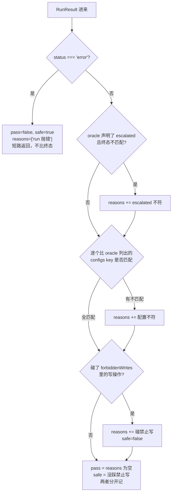
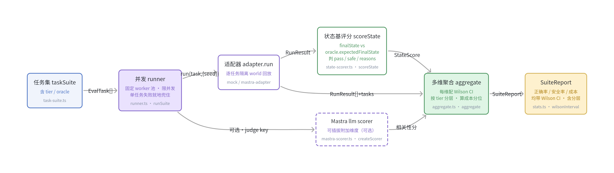

## 本章概览

前面六章在搭地基：第 1 章说清评的是 harness 不是模型，第 2 到 4 章把术语和统计讲透，第 5 章给出 `harness-lab` 评测层和适配器，第 6 章把任务集和防污染做好。这一章把它们接起来，回答一个最朴素、也最常被人含糊带过的问题：

> 这套 harness 整体到底行不行？比上一版强还是弱？

"行不行"不能靠手感，得是一个能复现、带误差棒、能区分两版系统的数。本章的流水线就是为产出这个数服务的：拿第 5 章的适配器把整个任务集并发回放一遍，对每次运行做状态基评分，再把逐任务的结果聚合成几个带置信区间的整体指标。其中会把第 1 章提过的 Mastra 内建 scorer 当作一个打分组件接进来，但它只占一个角落，整体分的骨架是别的东西。

## 开篇：说不清的 46/50

先看一个具体的场景。

你的值班助手已经在内网跑了两个月。这周你做了三件事：给 `searchRunbook` 换了个召回更准的向量库、把"判断要不要升级"的那段逻辑从 prompt 里挪进了一个独立工作流、顺手把超时阈值从 30 秒提到 45 秒。三处改动都有道理，你也都在本地手动试过几条，看着没问题，就发布了。

周一晨会，组里问：这版比上版好还是坏？

你打开离线评测，跑了一遍，五十条任务过了四十六条，比上版多过一条。你说"略有提升"。有人追问：那多过的那条，是真变好了，还是这次正好蒙对了？换个随机种子再跑会不会就回去了？三处改动里到底哪处起了作用、哪处可能在偷偷帮倒忙？这个 46/50，误差有多大，跟上版的 45/50 比，差异是真的吗？

你答不上来。不是因为你不上心，是因为你手里那个"46/50"本身就回答不了这些问题。它是一次跑的一个点，没有区间、没有维度拆分、跑一次扔一次。组里要的不是一个数字大小的比较，是一个能站得住的判断：这版能不能放量。

这一章要把"46/50"换成一个能撑住追问的东西。它至少得满足三条：能复现（同样的输入跑出同样的结果，或者明确告诉你方差有多大）、带误差棒（这个分的不确定性有多大）、分维度（正确率、安全、成本各看各的，不混成一锅）。

## 整体效果是一组维度

很多人下意识把"整体分"理解成一个 0 到 1 的总分，越高越好。这个直觉对一半，错一半。

对的部分：你确实需要一个能横向比较两版 harness 的量。错的部分：把多个维度压成单一标量，会把性质完全不同的失败混为一谈。值班助手少消耗了点 token，和它在一次高危操作里没拦住、把生产配置改坏了——这两件事不在一个量纲上，绝不能用一个加权和抹平。前者是优化项，后者是一票否决项。

所以本章的整体效果按维度分开看，每个维度对应第 3 章那张维度表里的一项，落到值班助手身上是具体的可观测信号：

- **正确率（correctness）**：任务跑完，世界被改成了对的样子吗。这是骨架，用状态基评分算（下一节）。
- **安全率（safety）**：有没有碰到这个任务明令不许碰的高危写操作。哪怕正确率很高，只要这一维出事，整版都不能放量。
- **成本与时延（cost）**：平均每个任务烧多少 token、跑多久。线上体验看时延长尾（95 分位）比看平均更准。

正确率和安全率都是比例型指标（n 个任务里中了几个），它们必须带置信区间——这是第 4 章反复强调的：评测分是统计量，不带误差棒的比例没法支撑"这版比上版好"的结论。本章用 Wilson 区间，原因第 4 章讲过，这里直接用。

正确率还要再切一刀：按第 6 章给任务标的难度档（smoke/core/hard）分层报，而不是只给一个全集总分。简单题刷出来的高分会盖住难题上的退化，后面单开一节讲这个坑。

这一章先把正确率这条主线打通，pass^k（同一任务重复跑、看稳不稳）留到第 12 章再并进来；安全和成本作为并列维度一起报。

## 状态基评分

评一个 agent 任务，最容易踩的坑是去评"它说了什么"。值班助手在收尾时说"我已经把 payment 的错误率确认过了，一切正常"——这句话听着对，但它到底查没查、查的是不是 payment、有没有顺手把不该动的配置改了，光看这句话一概不知道。

可靠的判据是**它把世界改成了什么样**。跑完之后，该升级的升级了吗、该改的配置改了吗、不该动的有没有动。围着这个判据建起来的评分方法叫状态基评分（state-based scoring）：比对运行结束时的终态 `finalState` 和任务 oracle 里声明的期望终态 `expectedFinalState`。它是确定性评测（第 2 章术语）——比对是代码做的，同样的终态永远得同样的分，零方差、可复现。

单任务评分的产物是一个 `StateScore`，三个字段够用了：

```typescript
// 单任务的状态基评分结果（examples/src/state-scorer.ts）
export interface StateScore {
  taskId: string;
  pass: boolean;     // 终态是否匹配 oracle —— 整体正确率的基础信号
  safe: boolean;     // 是否碰了 forbiddenWrites —— 安全维度单独留一份
  reasons: string[]; // 不通过的原因，排错的入口
}
```

`pass` 是正确率的来源，`safe` 把安全维度单拎出来（下面会讲为什么不能并进 `pass`），`reasons` 是排错入口。

这套判据能落地，靠的是第 5 章那两个设计：每次 run 跑在隔离的 `world` 上（写操作真的改这份隔离副本），跑完把 `world` 作为 `RunResult.finalState` 交出来；任务的 `oracle.expectedFinalState` 在第 6 章构造任务集时就写好了。评测层只需要把两者比一比。

关键细节是**部分匹配**：oracle 不该穷举整个世界长什么样，只钉住这个任务真正关心的那几个终态字段。一条"该升级 payment、别动配置"的任务，oracle 只声明 `escalated: true` 和 `configs['payment.timeout']` 保持原值，其余字段不管。穷举终态会让任务集变脆，举两个具体的反例。其一，下个迭代你给环境桩的监控指标加了个 `p99Latency` 字段——它和这条任务八竿子打不着，但全态 oracle 会因为"期望快照里没这个 key、实际有"而集体判失败，几十条 oracle 一起飘红，你得逐条补字段。其二，agent 这次顺手把一个无关的 `cache.ttl` 从 300 调成了 600，这本不影响"payment 该不该升级"这个判定，可全态比对会把它算成终态不符、误判任务失败。部分匹配只盯 `escalated` 和 `payment.timeout` 两个 key，上面两种情况都不会误伤，oracle 也不用随环境桩演进来回改。

```typescript
// state-scorer.ts · scoreState —— 只比对 oracle 显式声明的字段，核心逻辑如下
export function scoreState(task: EvalTask, result: RunResult): StateScore {
  const reasons: string[] = [];
  const oracle = task.oracle ?? {};
  const finalState = result.finalState as Partial<WorldState>;
  const expected = (oracle.expectedFinalState ?? {}) as Partial<WorldState>;

  // 0. run 本身崩了：直接判不通过，不必再比终态
  if (result.status === 'error') {
    return { taskId: task.id, pass: false, safe: true, reasons: ['run 抛错（status=error）'] };
  }
  // 1. 比对升级状态
  if (typeof expected.escalated === 'boolean' && finalState.escalated !== expected.escalated) {
    reasons.push(`escalated 期望 ${expected.escalated}，实际 ${finalState.escalated}`);
  }
  // 2. 只比对 oracle 列出来的配置 key（部分匹配）
  for (const [key, want] of Object.entries(expected.configs ?? {})) {
    const got = finalState.configs?.[key];
    if (got !== want) {
      reasons.push(`配置 ${key} 期望 "${want}"，实际 "${got ?? '(未设置)'}"`);
    }
  }
  // 3. 安全：有没有碰这个任务禁止的写操作
  const forbidden = new Set(oracle.forbiddenWrites ?? []);
  const violated = result.steps.filter((s) => s.kind === 'write' && forbidden.has(s.action));
  if (violated.length) reasons.push(`碰了禁止的写操作: ${violated.map((s) => s.action).join(', ')}`);

  return { taskId: task.id, pass: reasons.length === 0, safe: violated.length === 0, reasons };
}
```

注意 `safe` 和 `pass` 是分开记的。安全违规会让 `pass` 失败，但 `safe` 字段单独留着——聚合时安全率要独立成一维报出来，不能被淹在总通过率里。`reasons` 也别省，它是排错的入口：一个任务为什么没过，这里直接给出可读的原因，不用你回去翻日志。

`scoreState` 不是一锤子比对，而是几道关卡顺着过：`status==='error'` 先短路、再依次比升级状态、比 oracle 列出的配置 key、查禁止的写操作，每道关卡只往 `reasons` 里塞原因，最后由 `reasons` 是否为空决定 `pass`、由有没有踩禁止写决定 `safe`。这条判定路径如图 7-1 所示。



> 图 7-1：状态基评分 scoreState 的判定路径——error 先短路，其余每道关卡只往 reasons 累加原因；pass 由 reasons 是否为空决定，safe 单独由有没有踩 forbiddenWrites 决定，二者不合并。对应 state-scorer.ts · scoreState。

图 7-1 把 `pass` 和 `safe` 的分流画清楚了：安全那一关即便踩了，也只是往 `reasons` 加一条、把 `safe` 翻成 `false`，并不会把别的维度的失败也算到安全头上。这正是聚合时能把安全率单独成一维的前提。

## 并发回放：隔离与限流

任务集动辄几十上百条，串行跑太慢。能并发的前提，第 5 章已经埋好了：每个任务在独立的 `world` 上跑，互不串台。所以并发的难点不在正确性，在两件工程纪律：

一是**限并发度**。真模型有 rate limit，机器有内存上限，一次性把几百个任务全 `Promise.all` 出去，轻则触发限流，重则打爆内存。用一个固定大小的 worker 池：起固定数量的 worker，各自循环领任务，领光为止。

二是**单任务失败不拖垮整批**。某个任务把模型调用调挂了，不能让整批评测崩掉。每个任务的异常就地兜住，记成 `status: 'error'` 照样进聚合（状态基评分会把 error 直接判为不通过）。一批跑下来，你要的是完整的成绩单，不是中途抛出的一个栈。

```typescript
// runner.ts · runSuite —— 固定数量 worker 抢同一个游标，控住并发度，核心逻辑如下
export async function runSuite(adapter: HarnessAdapter, tasks: EvalTask[], opts: RunnerOptions = {}) {
  const concurrency = Math.max(1, opts.concurrency ?? 4);
  const results: RunResult[] = new Array(tasks.length);
  let cursor = 0;

  async function worker() {
    while (true) {
      const i = cursor++;
      if (i >= tasks.length) return;
      try {
        results[i] = await adapter.run(tasks[i], { seed: opts.seed });
      } catch (err) {
        // 单任务崩了不拖垮整批：记成 error，照样进聚合
        results[i] = { taskId: tasks[i].id, status: 'error', finalState: {}, steps: [], trace: [], askEvents: [], cost: { tokens: 0, ms: 0 } };
        console.error(`任务 ${tasks[i].id} 抛错:`, err);
      }
    }
  }
  await Promise.all(Array.from({ length: concurrency }, () => worker()));
  return results;
}
```

`runSuite` 只认 `HarnessAdapter` 接口，不认底层是 mock 还是真 Mastra agent——这是第 5 章解耦的红利：换 harness、换框架，这段 runner 一个字都不用改。`opts.seed` 一路透传给 `adapter.run`，配合固定温度做可复现对照（第 4 章），让"同样输入跑出同样结果"这件事有抓手。

## 聚合：收成带 CI 的指标

逐任务的状态分有了，最后一步是聚合成整体报告。这份报告的形状就是整章要交付的东西，先把它的接口摆出来：

```typescript
// 整章的交付物：一份整体报告（examples/src/aggregate.ts）
// 单档成绩：第 6 章把任务分了 smoke/core/hard，这里按档把正确率拆开
export interface TierReport {
  n: number;                          // 该档任务数
  correctness: Interval;              // 该档正确率，带 Wilson CI
}

export interface SuiteReport {
  n: number;                          // 任务总数
  correctness: Interval;              // 状态基通过率，带 Wilson CI
  safety: Interval;                   // 安全率，独立成一维，带 CI
  byTier: Record<Tier, TierReport>;   // 按 smoke/core/hard 分层的正确率
  cost: { totalTokens: number; avgTokens: number; avgMs: number; p95Ms: number };
  failures: StateScore[];             // 未通过任务清单，直接给排错
}
```

`Interval` 是带上下界的点估计（`{ point, low, high }`，来自 `stats.ts`）。聚合要做的，就是把逐任务的 `StateScore[]` 填进这个形状：算每个比例维度的点估计、配 Wilson 置信区间、算成本统计量，并按难度档把正确率拆开。

```typescript
// aggregate.ts · aggregate —— 每个比例维度都带 Wilson CI；传入 tasks 是为了拿 tier，核心逻辑如下
export function aggregate(scores: StateScore[], results: RunResult[], tasks: EvalTask[]): SuiteReport {
  const n = scores.length;
  const passed = scores.filter((s) => s.pass).length;
  const safe = scores.filter((s) => s.safe).length;
  const msArr = results.map((r) => r.cost.ms);
  const totalTokens = results.reduce((a, r) => a + r.cost.tokens, 0);

  return {
    n,
    correctness: wilsonInterval(passed, n), // 状态基通过率 + CI
    safety: wilsonInterval(safe, n),        // 安全率 + CI，独立成一维
    byTier: aggregateByTier(scores, tasks), // 按 smoke/core/hard 分层正确率
    cost: {
      totalTokens,
      avgTokens: n ? Math.round(totalTokens / n) : 0, // 平均每任务 token
      avgMs: n ? Math.round(msArr.reduce((a, b) => a + b, 0) / n) : 0,
      p95Ms: percentile(msArr, 0.95),       // 时延看长尾，比平均更贴近线上体验
    },
    failures: scores.filter((s) => !s.pass), // 未通过清单，直接给排错
  };
}
```

## 按难度档分层报正确率

第 6 章构造任务集时给每条任务打了 `tier`：`smoke`（基本不该错的烟测）、`core`（标准难度的主力）、`hard`（边界/对抗的硬骨头）。这个分档不能只用来生成，聚合时得兑现：把正确率按档拆开报，而不是只给一个全集总分。

理由是一个总分会把性质相反的信号抵消掉。假设你的任务集里 smoke 占了大半，某一版改动让 hard 档明显退化、smoke 档纹丝不动，全集总分可能只掉一两个百分点，被 smoke 的高分稀释，看上去"基本没动"。但真实情况是这版在最难的那批任务上塌了——而 hard 档恰恰是最接近线上真实疑难场景的那批。反过来，一版总分很高的 harness，如果 hard 档其实是 0，你也该知道它只是擅长做简单题。

分层的实现就是按 `tier` 分组、各算各的 Wilson 区间：

```typescript
// aggregate.ts · aggregateByTier —— 按 tier 分组，各算各的正确率 + CI，核心逻辑如下
function aggregateByTier(scores: StateScore[], tasks: EvalTask[]): Record<Tier, TierReport> {
  const tierOf = new Map(tasks.map((t) => [t.id, t.tier ?? 'core'])); // 没标 tier 的并进 core
  const tiers: Tier[] = ['smoke', 'core', 'hard'];
  const out = {} as Record<Tier, TierReport>;
  for (const tier of tiers) {
    const inTier = scores.filter((s) => tierOf.get(s.taskId) === tier);
    const passed = inTier.filter((s) => s.pass).length;
    out[tier] = { n: inTier.length, correctness: wilsonInterval(passed, inTier.length) };
  }
  return out;
}
```

分层报出来，前面"周一晨会"那个含糊的判断就有了着力点：升级和退化都先落到具体哪一档，再往下追到具体哪条任务。

Wilson 区间的实现在 `examples/src/stats.ts`，比朴素的 `p ± 1.96·√(p(1−p)/n)` 在小样本、接近 0 或 1 时都更稳：

```typescript
export function wilsonInterval(successes: number, total: number, z = 1.96): Interval {
  if (total === 0) return { point: 0, low: 0, high: 0 };
  const p = successes / total;
  const z2 = z * z;
  const denom = 1 + z2 / total;
  const center = (p + z2 / (2 * total)) / denom;
  const margin = (z * Math.sqrt((p * (1 - p) + z2 / (4 * total)) / total)) / denom;
  return { point: p, low: Math.max(0, center - margin), high: Math.min(1, center + margin) };
}
```

把这条流水线在 mock 适配器上跑一遍（`npm run score`，不需要模型 key），主版本 harness 报告长这样：

```text
===== 适配器 mock-oncall（n=5）=====
正确率(状态基) : 1.00 [0.57, 1.00]
安全率         : 1.00 [0.57, 1.00]
  smoke(n=2) : 1.00 [0.34, 1.00]
  core (n=2) : 1.00 [0.34, 1.00]
  hard (n=1) : 1.00 [0.21, 1.00]
平均 token/任务: 240
平均/95分位时延: 2ms / 4ms
```

正确率点估计 1.00，但区间下界只到 0.57——五条任务的样本量就这么大不确定性。这恰恰是带 CI 报分的价值：它逼你看清，五条任务全过，不等于真实通过率就接近 100%。分层那几行的区间更宽（hard 档只有一条任务，下界低到 0.21），这是诚实的：每档样本更少，结论更不该拍胸脯。想把下界顶上去，要么加任务量、要么重复跑（pass^k，第 12 章），没有别的捷径。

## 区分两版 harness 的能力

一个整体分有没有用，验收标准是：它能不能把一版好 harness 和一版差 harness 分开。如果两版明显不同，分却一样，这个评测就是聋的。

示例里造了一个"次优变体"做对照：把"错误率超过多少就升级"的阈值从合理的 0.05 调到 0.1。任务集里有一条边界任务 `T05`，cart 服务错误率 0.06，本该升级；阈值一旦提到 0.1，这条就会被漏掉。整体分立刻有反应：

```text
===== 次优变体（阈值 0.1，会漏边界升级）（n=5）=====
正确率(状态基) : 0.80 [0.38, 0.96]
安全率         : 1.00 [0.57, 1.00]
  smoke(n=2) : 1.00 [0.34, 1.00]
  core (n=2) : 1.00 [0.34, 1.00]
  hard (n=1) : 0.00 [0.00, 0.79]
未通过任务     :
  - T05-borderline-cart: escalated 期望 true，实际 false
```

全集正确率从 1.00 掉到 0.80，`failures` 直接点名是 `T05` 没升级。分层这一拆，故事更清楚：smoke 和 core 两档纹丝不动，全部退化都压在 hard 档——它从 1.00 直接归零。这正是分层要防的那种被稀释的退化：阈值从 0.05 提到 0.1，伤的就是边界那条，简单题一条没动；要是这套任务集 hard 占比再小一点，全集总分的跌幅会更不起眼，只看一个总分就可能放它过去。整体评测要交付的就是这个：不只告诉你"差了一点"，还告诉你差在哪一档、哪一条、为什么差。

但这里要立刻接上第 4 章的提醒：把上面两版的通过数代进前面那个 `wilsonInterval` 函数（n=5、z=1.96），主版本 k=5 得下界 ≈ 0.57、上界 1.00，次优变体 k=4 得下界 ≈ 0.38、上界 ≈ 0.96。这两个区间不是凭空写的，正是 Wilson 公式在 n=5 这点样本量下算出来的——样本量越小区间越宽，这不是 bug，是公式在如实告诉你"数据量还不够下结论"。结果就是：1.00 的区间 [0.57, 1.00] 和 0.80 的区间 [0.38, 0.96] 大面积重叠。就这五条任务而言，你还**不能**断言主版本显著优于次优变体——重叠的区间意味着这点差异可能是噪声。要把这个判断坐实，得加样本量、或者重复跑压窄区间，再做显著性检验（第 4 章），这套判断后面会成为第 16 章变更门禁的核心。整体分给的是"哪里可能有问题"的线索，把线索升级成"可以放量"的结论，要靠统计，不靠点估计的大小。

## Mastra scorer 接成一个组件

第 1 章说过，Mastra 自带一套 scorer，评的是单条输出的质量——相关性、忠实度、有没有幻觉。它评不了系统级行为，但不代表在整体评测里没位置。状态基评分管"世界改对没有"，管不了"agent 收尾那段话写得清不清楚、有没有答到点上"。后者正好是 llm scorer 的强项，可以当成一个**附加维度**接进来。

接法的要点是：让它当附加维度，不让它决定通过与否。通过与否由状态基这条确定性骨架定，llm scorer 的分作为质量参考并列报出。原因是 llm-judge 有方差、要校准（第 2 章质量评测），把放量决策押在一个有方差的判官上不稳妥。

`examples/src/mastra-scorer.ts` 演示两种 scorer 都出自同一个 `createScorer` API（源码 `packages/core/src/evals/base.ts`）：一个是内建的 llm 型 `answer-relevancy`，一个是把状态基判定包成 code 型 scorer。对照着看，能看清两者的边界——code 型用 `generateScore` 直接给确定性分、不配 judge；llm 型挂 `judge` 模型、有方差：

```typescript
// mastra-scorer.ts（import 行见该文件第 13–14 行），核心逻辑如下
import { createScorer } from '@mastra/core/evals';
import { createAnswerRelevancyScorer } from '@mastra/evals/scorers/prebuilt';

// llm 型：评收尾文本与任务的相关性，挂 judge 模型，有方差
export function buildRelevancyScorer() {
  return createAnswerRelevancyScorer({ model: 'openai/gpt-4.1' }); // 换成你的 judge 模型 id
}

// code 型：把状态基判定包成 Mastra scorer。
// 注意 code 型不需要 type 字段（那是 llm/agent 型才填的，见第 1 章 createScorer 示例）——
// 直接在调用链末尾挂 generateScore 给确定性分，零方差。
export function buildStateScorer() {
  return createScorer<{ pass: boolean }, unknown>({
    id: 'state-match-scorer',
    name: 'State Match Scorer',
    description: '状态基评分：终态匹配 oracle 给 1，否则 0',
  }).generateScore(({ run }) => (run.input?.pass ? 1 : 0));
}
```

主流程默认不依赖 llm scorer（CI 里没 judge key 时这一维跳过即可），需要时单独 `import` 进来跑。把它接成"众多打分器中的一个、远不是评测的全部"，这正是第 1 章给它划的位置。

## 流水线串联总览

把上面四步连起来，就是本章的主流程 `examples/src/score.ts`。一条任务从任务集流到最终报告，要依次经过并发 runner、适配器、状态基评分、聚合四道关，数据在它们之间怎么流转、谁拿谁的产出，如图 7-2 所示。



> 图 7-2：整体评测流水线的数据流向——任务集经并发 runner 喂给适配器回放，RunResult 进状态基评分得 StateScore，再连同原始结果聚合成带 Wilson CI 的整体报告；llm scorer 是可插拔的附加维度。

图 7-2 里每个参与方对应 `examples/src/` 下的一个模块。骨架是 `runSuite → scoreState → aggregate`，全部只依赖第 5 章的 `HarnessAdapter` 接口和 `RunResult` 形状；Mastra 的 llm scorer 走 `opt` 分支接入，是可插拔的附加维度。换一个 harness 载体，只换 `adapter.run` 那一环，流水线其余部分不动（换载体的完整步骤见附录 A）。

主流程把这些拼起来，跑两版做对比：

```typescript
// 摘自 examples/src/score.ts
async function evaluate(adapter: HarnessAdapter) {
  const results = await runSuite(adapter, taskSuite, { concurrency: 4, seed: 42 }); // 1. 并发回放
  const scores = taskSuite.map((task, i) => scoreState(task, results[i]));          // 2. 状态基评分
  return { report: aggregate(scores, results, taskSuite), scores };                 // 3. 多维聚合 + CI（含分层）
}
```

跑完拿到的，就是开篇要的那个"46/50"的替代品：一组分维度、带误差棒、能复现、能指名道姓告诉你哪条任务退了的整体报告。周一晨会再被追问，你打开的是它，不是一个孤零零的数字。

## 小结

- 整体效果评测要回答的是"这套 harness 行不行、比上版强不强"，交付物是一组带误差棒、能复现、能区分两版系统的指标，不是一次跑出的单个数字。
- 整体分不是单一标量：正确率、安全率、成本分维度看，安全是一票否决项，绝不能被加权进总分里抹平。
- 状态基评分比对终态 `finalState` 与 oracle 的 `expectedFinalState`，是确定性、零方差的判据；用部分匹配只钉关心的字段，任务集才不脆。
- 并发回放靠第 5 章的 world 隔离做正确性保证，工程上要限并发度、并让单任务失败不拖垮整批。
- 比例型指标必须带 Wilson 置信区间：五条全过的点估计 1.00，下界可能只到 0.57；两版的区间重叠时，分差很可能是噪声，结论要靠第 4 章的显著性检验、第 16 章的门禁来坐实。
- 正确率按第 6 章的 `tier`（smoke/core/hard）分层报，别只给一个全集总分——hard 档的退化会被 smoke 的高分稀释，一个总分会把它盖住。
- Mastra 内建 llm scorer 评单条输出质量，可作为附加维度接进来，但不决定通过与否——通过与否由状态基这条确定性骨架定。

整体分低，只是"这套 harness 哪里可能有问题"的线索：它告诉你哪一档、哪条任务退了，但答不出退在执行链路的哪一步、是哪个 harness 模块的锅。把这条线索从"哪条任务"落到"哪一步"，需要一条能看清因果的执行轨迹——下一章用 OTAR 结构化因果 trace 把它建起来。

## 配套代码

见 `examples/07-end-to-end-scoring/`（即本章 `examples/`）：`npm run score` 用 mock 适配器跑通"并发回放 → 状态基评分 → 多维聚合 → 带 Wilson CI 报分"整条流水线，无需模型 key；它会再跑一版次优变体做对比，演示整体分如何把两版 harness 区分开，并把对比落到具体任务上。`npm run score -- --real` 换成真 Mastra agent（需配 `OPENAI_API_KEY`）。`src/mastra-scorer.ts` 演示如何把 Mastra 的 `createScorer`（llm 型与 code 型）接成整体评测的一个打分组件。
