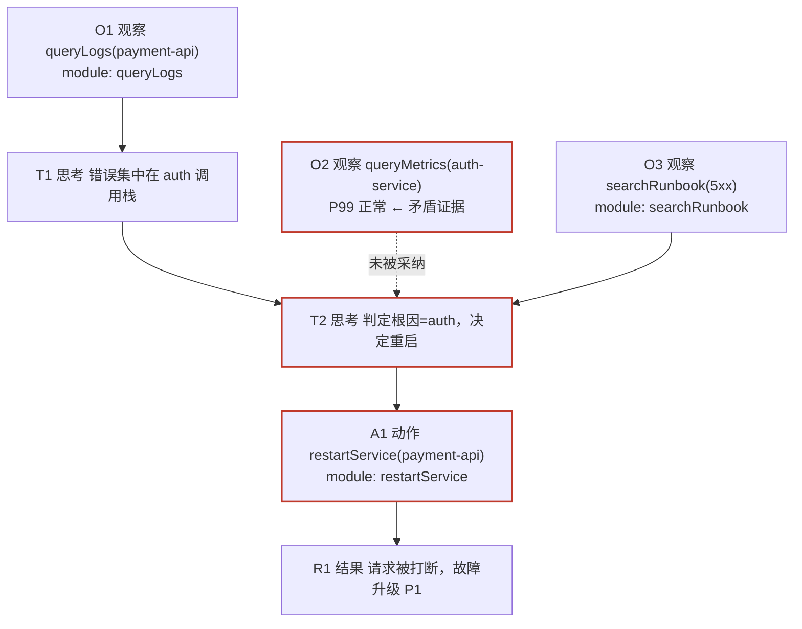
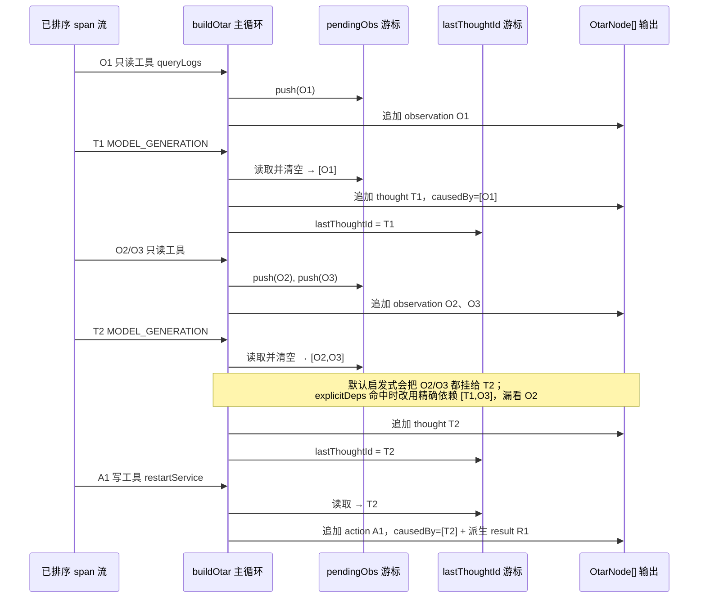
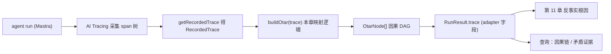

## 本章概览

第 7 章给了你一个分：这套 harness 在任务集上整体行不行。分低的时候，第 7 章只告诉你"低"，告诉不了你"为什么低"。这一章补上后半句——把一次失败从一坨日志变成一张能查的因果图，让你能指着某个节点说"病在这里"。

具体做两件事：一是用 Mastra 的 AI Tracing 把一次 run 的执行轨迹采下来；二是把那堆 span 规整成一种统一的因果结构，叫 OTAR——**O**bservation（观察）/ **T**hought（思考）/ **A**ction（动作）/ **R**esult（结果），节点之间用 `causedBy` 连成一张有向无环图（DAG）。这张图是第 11 章反事实根因定位的地基：要在 trace 上"换一步重跑看终态翻不翻转"，前提是你先有一张能定位到"哪一步"的图。

先说清楚边界：OTAR 是本书提出的一种整理范式，不是 Mastra 或某个标准里现成的东西。Mastra 给的是 span 树，OTAR 是你在 span 树之上再叠一层因果语义。这层为什么值得叠，下一节用一次值班故障讲明白。

## 开篇：日志全在，因果全无

凌晨三点，值班助手处理一条告警：`payment-api` 的 5xx 错误率突然飙高。它的任务是查清原因、必要时升级给人。十分钟后，它给出结论：「已确认是上游 `auth-service` 超时导致，无需人工介入，已自动重启 `payment-api`。」结果错误率没降，反而因为这次重启把正在处理的请求全断了，故障从 P2 升成 P1。

你被叫起来复盘。手里有什么？一份 stdout 日志，几百行，长这样：

```text
[03:12:01] tool queryLogs called: service=payment-api
[03:12:02] tool queryLogs returned: 1873 lines
[03:12:03] model output: 错误集中在 auth 调用栈
[03:12:05] tool queryMetrics called: service=auth-service
[03:12:06] tool queryMetrics returned: {...}
[03:12:08] model output: auth-service P99 latency 正常
[03:12:09] tool searchRunbook called: query=payment-api 5xx
[03:12:11] tool searchRunbook returned: 3 docs
[03:12:14] model output: 决定重启 payment-api
[03:12:15] tool restartService called: service=payment-api
```

每一行都在，但你想问的问题，这份日志一个都答不了：

- 它"决定重启"那一步，**依据**是哪几步的输出？是 `queryLogs` 的日志，还是 `searchRunbook` 那三篇文档，还是它自己上一句话？
- 它说 `auth-service` 是根因——可 `queryMetrics` 明明返回了"P99 正常"。这条**矛盾的观察**它看到了没有？是看到了忽略，还是召回时根本没进上下文？
- 如果把"决定重启"那一步**拿掉**，它会不会改去升级？

这三个问题有一个共同点：问的都不是"某一步对不对"，而是**步与步之间的依赖关系**。扁平日志按时间排成一条线，把这层关系彻底压平了——时间上相邻的两行，可能毫无因果；真正有因果的两步，可能隔着八行。靠肉眼在时间线上猜因果，猜十次错三次，复盘就是这么慢的。

要回答这三个问题，日志得满足两个条件：第一，每一步的**输入来自哪几步**要被显式记下来（因果，不是时序）；第二，"观察"和"动作"要分开标记——重启是个有副作用的动作，读日志是个无副作用的观察，评测和归因时这两类的待遇完全不同。OTAR 就是为满足这两个条件设计的结构。

## Mastra AI Tracing 的 span 树

在自己造结构之前，先看 Mastra 已经采了什么。它的 AI Tracing 在 `packages/core/src/observability/`，把一次 agent 执行记成一棵 **span 树**：根 span 是整个 agent run，往下挂着模型生成、工具调用、工作流步骤、记忆操作等子 span。每类 span 有自己的类型，定义在 `packages/core/src/observability/types/tracing.ts` 的 `SpanType` 枚举里，和值班助手相关的几类是：

```typescript
// 摘自 packages/core/src/observability/types/tracing.ts 的 SpanType 枚举
export enum SpanType {
  AGENT_RUN = 'agent_run',               // 一次 agent 执行的根 span
  MODEL_GENERATION = 'model_generation', // 一次模型生成（含 tool 选择、reasoning）
  TOOL_CALL = 'tool_call',               // 一次工具执行：input / output / 是否成功
  WORKFLOW_STEP = 'workflow_step',       // 工作流的一步
  MEMORY_OPERATION = 'memory_operation', // 记忆召回 / 保存
  // ……还有 RAG、MCP、processor 等，这里只列值班助手用得到的
}
```

跑完之后，可以按 trace id 把整条 trace 捞回来做离线分析。`tracing.ts` 里定义了 `RecordedTrace`——一次执行的完整记录，既能按树遍历（`rootSpan`），也能按扁平数组遍历（`spans`）：

```typescript
// 摘自 packages/core/src/observability/types/tracing.ts，已简化注释
export interface RecordedTrace {
  readonly traceId: string;
  readonly rootSpan: AnyRecordedSpan;             // 树形入口
  readonly spans: ReadonlyArray<AnyRecordedSpan>; // 扁平数组，遍历方便
  getSpan(spanId: string): AnyRecordedSpan | null;
}
```

每个 span（`ExportedSpan` / `RecordedSpan`）带着这些你后面会用到的字段：`id`、`parentSpanId`（父节点）、`type`（哪类 span）、`input`、`output`、`startTime`、`errorInfo`。其中 `startTime` 在 Mastra 里是 `Date` 对象，本章示例为省事用的是 epoch 毫秒数（`number`），真实接入时按时间排序前先 `span.startTime.getTime()` 转成毫秒。捞 trace 的入口是 `mastra.observability.getRecordedTrace({ traceId })`（接口在 `packages/core/src/observability/types/core.ts`）。

这里要单独交代一下 OtelBridge，免得你以后接外部链路时绕弯路。OtelBridge（`@mastra/otel-bridge` 包的 `OtelBridge` 类）是把 Mastra AI Tracing 的 span 桥接到标准 OpenTelemetry 系统的组件：它给每个 Mastra 操作生成真正的 OTEL span，按 GenAI 语义约定导出，让 Jaeger / Tempo / DataDog 这类后端能收到同一条 trace。本章做的是离线 OTAR 整理，吃的是 `getRecordedTrace` 捞回来的 `RecordedTrace`，跟 OtelBridge 没有依赖关系——不接 OTEL 也能跑。但两者并不互斥：如果你的团队已经在用 Jaeger / Tempo / DataDog 收 OTEL，完全可以在同一条 trace 上一边走 OtelBridge 实时导出给监控系统、一边用 `getRecordedTrace` 离线整理成 OTAR 做复盘，两条路不冲突。挂载入口就一行——在 Mastra 的 observability 配置里把 `new OtelBridge()` 塞进 `bridge` 字段（`new Mastra({ observability: new Observability({ configs: { default: { serviceName, bridge: new OtelBridge() } } }) })`），剩下的 span 转换它自己做。后面的离线整理只认 `RecordedTrace`，接不接 OtelBridge 对本章逻辑没有任何影响。

Mastra 这棵 span 树已经解决了一半问题：它带了 `parentSpanId`，所以**结构**是有的，不是扁平的。但它的父子关系是**执行嵌套**关系——"这个 tool_call 发生在那个 agent_run 内部"——不是**因果**关系。"重启这一步的依据是哪几次观察"，span 树里没有直接答案。OTAR 要补的，就是从执行嵌套到因果依赖这一层。

## OTAR：四类节点 + 因果边

OTAR 把一次 run 的每一步归到四类节点之一：

- **Observation（观察）**：agent 从环境拿到的信息，无副作用。值班助手里，`queryLogs`、`queryMetrics`、`searchRunbook` 的返回都是观察。记忆召回也是观察——它决定了模型这一步能看到什么。
- **Thought（思考）**：模型的一次推理输出。它"认为"根因是 `auth-service`、它"决定"重启——这些判断都是 Thought。Thought 是因果图里最该盯住的节点，因为错误的动作几乎总是从一个错误的 Thought 长出来的。
- **Action（动作）**：有副作用、会改变环境状态的操作。`restartService`、`patchConfig`、`escalateOncall` 都是 Action。评测和归因里，Action 是"案发现场"。
- **Result（结果）**：一次 Action 执行后的回执——成功失败、返回了什么、环境变成了什么样。

四类节点用 `causedBy` 连起来：`causedBy` 装的是**上游节点的 id**，表示"这个节点是在那些节点的基础上产生的"。这条边是因果方向，不是时间方向。结构定义全书统一（在第 5 章 adapter 里就声明了，这里复用同一个 `OtarNode`，不另起炉灶）：

```typescript
// 全书统一结构，见 harness-lab/src/adapter.ts
export interface OtarNode {
  id: string;
  kind: 'observation' | 'thought' | 'action' | 'result';
  content: unknown;
  causedBy: string[]; // 上游节点 id，构成因果链
  module?: string;    // 由哪个 harness 模块产生（归因用）
  ts: number;
}
```

注意 `module` 字段：它记的是"这个节点由哪个 harness 模块产生"——`queryLogs` 工具、记忆召回、某个工作流步骤。第 9 到 11 章做模块归因和反事实根因，靠的就是这个字段：要算"关掉记忆掉多少分""哪个模块在拖后腿"，前提是 trace 里的每个节点都标了出身。

把上一节那次重启故障整理成 OTAR，如图 8-1 所示：



> 图 8-1：一次"误重启"故障的 OTAR 因果 DAG。节点类型对应 Mastra `SpanType`（`TOOL_CALL`→O/A、`MODEL_GENERATION`→T、tool 的 output→R），`causedBy` 边由本章的整理逻辑从 span 的 `parentSpanId` 和时序推断得到（实现见 `examples/08-otar-trace/src/build-otar.ts`）。红框是病灶候选：T2 在 O2（"P99 正常"这条与"auth 是根因"矛盾的证据）摆在面前时仍判定根因是 auth——`O2 -.未被采纳.-> T2` 这条虚线，就是扁平日志永远画不出、而 OTAR 一眼能看到的东西。

有了这张图，开头那三个问题立刻有了着落：A1（重启）的依据顺着 `causedBy` 回溯到 T2，T2 又连到 O1/O3，而 O2 这条矛盾证据虽然时间上在 T2 之前发生，因果上却没被采纳（虚线）——这正是病根。"拿掉 T2 会怎样"则是第 11 章的活：在这张 DAG 上对 T2 做干预重跑。OTAR 的价值不在它画得好看，而在它把"按时间排的一条线"变成"按依赖连的一张图"，让"哪一步""依据是什么""矛盾在哪"这些问题第一次变得可查询。

## 从 span 树到 OTAR：映射规则

把 Mastra 的 `RecordedTrace` 转成 `OtarNode[]`，核心是三步：给每个 span 定类型、连因果边、标模块。

**第一步，定 kind。** 按 span 的 `type` 映射：

| Mastra `SpanType` | OTAR kind | 依据 |
|---|---|---|
| `TOOL_CALL`（只读工具） | observation | `queryLogs`/`queryMetrics`/`searchRunbook`，无副作用 |
| `TOOL_CALL`（写工具） | action | `restartService`/`patchConfig`/`escalateOncall`，有副作用 |
| `MEMORY_OPERATION`（recall） | observation | 召回也是"拿到信息" |
| `MODEL_GENERATION` | thought | 模型的推理/决策输出 |
| 工具的 `output`（成功/失败） | result | 从 Action 节点的 output 派生 |

只读和写工具都映射成 `TOOL_CALL`，靠什么区分 observation 和 action？靠你在 harness 侧维护的一张写操作清单（值班助手里就是 `restartService`/`patchConfig`/`escalateOncall` 这三个）。这张清单本来就该存在——第 13 章判断"该不该升级"、安全评测判断"碰没碰禁止的写操作"，用的是同一张清单。

表里没有 `WORKFLOW_STEP`，这是有意的。`workflow_step` span 的映射策略留给第 13 章——高危写操作的工作流步骤要和 suspend / resume 事件一起整理才有意义，单独拆成节点会画出一张缺了暂停/恢复语义的残缺 DAG。本章示例只跑只读 + 普通工具调用的 trace，`buildOtar` 对 `workflow_step` 一律静默跳过（见 `build-otar.ts` 末尾"其余类型这里不展开"那行注释）。所以你拿自己的 trace 来跑、DAG 里少了 workflow 步骤，不是 bug——第 13 章会把这块映射补齐。

**第二步，连 causedBy。** 这是整个映射里最不能含糊的一步，因为因果边的质量直接决定第 11 章能不能定位准。Mastra span 自带的 `parentSpanId` 给的是执行嵌套，不够；本章用一条务实的规则补上：

> 一个 Thought 节点的 `causedBy`，是它**之前、且尚未被后续 Thought "消费"过**的所有 Observation 节点；一个 Action 节点的 `causedBy`，是触发它的那个 Thought；一个 Result 节点的 `causedBy`，是产生它的那个 Action。

直白说就是：模型这一次推理，依据的是上一次推理之后、到这次推理之前新拿到的那些观察。一次值班 run 通常十几到几十个 span，按时序扫一遍是线性开销，这条规则在这个量级上几乎零成本，真正的成本在它的准确率而非性能。这条规则不完美——它假设"新观察喂给最近一次推理"，真实里模型可能引用更早的观察。本章把它实现成默认规则，同时把"哪些观察喂给了哪次思考"做成可覆盖的：如果你的 harness 能从模型的 tool-call 参数里拿到更精确的引用关系（Mastra 的 `MODEL_GENERATION` span 的 input 里有完整消息历史），就用精确的覆盖默认推断。诚实标注：默认规则是启发式，不是真值，第 11 章会讲它的误差怎么影响反事实定位。

**第三步，标 module。** span 的 `entityId` / 工具 id 就是模块标识，直接落到 `OtarNode.module`。`queryLogs` 这个工具调用产生的 observation，`module` 就是 `'queryLogs'`。

三步合起来，就是 `examples/08-otar-trace/src/build-otar.ts` 里的 `buildOtar(trace)`。它吃一个 `RecordedTrace` 形状的对象，吐一个 `OtarNode[]`，正好填进第 5 章 adapter 里定义的 `RunResult.trace: OtarNode[]` 字段。

第二步的 `causedBy` 连边怎么落到代码里，光看规则不够直观——它靠两个游标在一次按时序的遍历里完成。如图 8-2 所示，`buildOtar` 把按 `startTime` 排好序的 span 逐个喂进循环：遇到只读工具就把节点 id 压进 `pendingObs`（积攒"还没被采纳的观察"）；遇到 `MODEL_GENERATION` 就把当前 `pendingObs` 整批挂成这个 thought 的 `causedBy`，然后清空 `pendingObs`、把自己记成 `lastThoughtId`；遇到写工具就用 `lastThoughtId` 当 action 的依据，再派生一个 result 节点。这两个游标就是"新观察喂给最近一次思考"这条启发式规则在代码里的全部状态。



> 图 8-2：`buildOtar` 用两个游标在一次时序遍历里连 `causedBy` 边的过程（实现见 `examples/08-otar-trace/src/build-otar.ts` 的主循环）。`pendingObs` 攒"尚未被思考采纳的观察"，每次 thought 把它整批消费并清零；`lastThoughtId` 记最近一次思考，供写工具的 action 节点回指。图中 T2 那一步是默认启发式（挂 O2/O3）和 `explicitDeps` 覆盖（精确挂 `[T1, O3]`、漏看 O2）两条路径的分叉点。

### 升级 adapter 里的 trace 字段

这里要把第 5 章的现状交代准，别让你以为因果 DAG 那时候就建好了。第 5 章的 `MastraOncallAdapter` 在 `run()` 结束时填 `trace` 字段，调的是 `recorder.toOtar()`——一个由 `StepRecorder` 的工具事件直接拼出来的**最简 OTAR**：每个被记下的工具调用对应一个节点，`causedBy` 只是机械地挂在前一个节点后面。它够第 5 章把骨架跑通，但它不分只读/写工具、不识别 Thought、更没有"矛盾证据没被采纳"这种因果语义——本质上还是把时间线换了个壳，扁平日志的毛病一个没治。

第 8 章要做的，就是把这个 `trace` 字段的来源从 `recorder.toOtar()` 换成本章的 `buildOtar`，让它吃 AI Tracing 真正采下来的 span 树：

```typescript
// 第 5 章 run() 里的最简版本（工具事件驱动，无因果语义）：
//   trace: recorder.toOtar(),

// 第 8 章升级成 AI Tracing 驱动的 buildOtar：
const recorded = await mastra.observability.getRecordedTrace({ traceId });
// getRecordedTrace 返回 RecordedTrace | null，捞不到时（traceId 写错、采集没开、trace 还没落库）是 null，
// 直接传给 buildOtar 会在读 recorded.spans 时抛 TypeError，先判空：
if (!recorded) throw new Error(`trace not found: ${traceId}`);
// 这是 run() 返回的 RunResult 对象字面量里的 trace 字段，类型仍是 OtarNode[]：
trace: buildOtar(recorded, { writeTools: ['restartService', 'patchConfig', 'escalateOncall'] }),
```

升级只动 adapter 这一处：`RunResult.trace` 的类型 `OtarNode[]` 不变，所以第 9–11 章读这个字段的代码一行不用改，拿到的因果质量却从"机械时序"提到了"有 O/T/A/R 语义、写操作清单区分、矛盾证据可查"。换句话说，第 5 章占了位、第 8 章把内容做实——这正是 adapter 把脏活收口在一处的好处。

整条链路如图 8-3 所示：



> 图 8-3：从一次 run 到可查询因果图的链路。`A→B→C` 由 Mastra AI Tracing 提供（`packages/core/src/observability/`）；`D` 是本章的 `buildOtar`（`examples/08-otar-trace/src/build-otar.ts`）；`F` 复用第 5 章 adapter 的 `RunResult.trace` 字段（`harness-lab/src/adapter.ts`）。

## 因果链与矛盾证据查询

DAG 建好只是中间产物，能查才有用。例子里给了两个最常用的查询，都是几行图遍历，但它们正是复盘时你真正要按的两个按钮。

**查因果链（causal chain）：** 给定一个动作节点，顺着 `causedBy` 一路回溯到根，把"它为什么会发生"这条链拉直。复盘"为什么重启"时，对 A1 调一次就行：

```typescript
// 摘自 examples/08-otar-trace/src/query.ts
// 从某个节点出发，沿 causedBy 反向回溯，输出完整因果链（拓扑序）
export function causalChain(nodes: OtarNode[], targetId: string): OtarNode[] {
  const byId = new Map(nodes.map((n) => [n.id, n]));
  const chain: OtarNode[] = [];
  const seen = new Set<string>();
  const walk = (id: string) => {
    if (seen.has(id)) return; // DAG 可能多路径汇聚，去重
    seen.add(id);
    const node = byId.get(id);
    if (!node) return;
    for (const up of node.causedBy) walk(up); // 先回溯上游，保证拓扑序
    chain.push(node);
  };
  walk(targetId);
  return chain;
}
```

对 A1 跑一遍，得到 `O1 → T1 → O3 → T2 → A1`：重启这一步，是从"日志集中在 auth"（O1/T1）和三篇 runbook（O3）推出"根因是 auth"（T2），再决定重启的。链里没有 O2——那条"P99 正常"的矛盾证据，根本没进这条因果链。这就引出第二个查询。

**查矛盾证据（unconsumed observation）：** 找出那些"产生了、但没被任何后续 Thought 采纳进 `causedBy`"的 Observation 节点。它们是被模型漏看或忽略的信息，是误判最高发的来源：

```typescript
// 摘自 examples/08-otar-trace/src/query.ts
// 找出没有被任何 thought 节点的 causedBy 引用过的 observation
export function unconsumedObservations(nodes: OtarNode[]): OtarNode[] {
  const consumed = new Set<string>();
  for (const n of nodes) {
    if (n.kind === 'thought') n.causedBy.forEach((id) => consumed.add(id));
  }
  return nodes.filter((n) => n.kind === 'observation' && !consumed.has(n.id));
}
```

对这条 trace 跑，O2 跳出来。一行输出，就把"模型在 P99 正常的证据摆在面前时仍判定 auth 是根因"这个病根钉死了——不用你在几百行日志里逐行找矛盾。这两个查询合起来，就是把第 7 章那个"分低"的结论，下钻到"低在 T2 误判、证据是它漏看了 O2"的具体步骤。

需要再次说明边界：`unconsumedObservations` 找出来的是"按本章启发式因果规则没被采纳"的观察，不等于"模型客观上没看到"。模型可能看到了 O2 却推理错了，这种情况 O2 会进 `causedBy`、不会被这个查询逮到。要分清"没看到"和"看到了想错了"，得看 T2 这个 Thought 节点的 `content`（模型的实际输出文本）——例子里把它打出来供你判断。这条界限第 11 章会接着收紧。

## 小结

- 扁平日志按时间排，把"步与步之间的因果依赖"压平了；复盘真正要问的"哪一步、依据是什么、矛盾在哪"，扁平日志答不了。
- OTAR 把一次 run 的每步归为四类——Observation / Thought / Action / Result，用 `causedBy` 连成因果 DAG。它是本书提出的整理范式，不是 Mastra 现成的东西。
- Mastra 的 AI Tracing（`packages/core/src/observability/`）采的是 span 树，自带 `parentSpanId` 的执行嵌套关系，但不带因果；OTAR 在 span 树之上叠一层因果语义。
- 映射三步：按 `SpanType` + 写操作清单定 kind；用"新观察喂给最近一次思考"的启发式规则连 `causedBy`（默认规则，可被精确引用覆盖，是启发式不是真值）；用工具 id 标 `module`。
- 两个查询——因果链回溯、矛盾证据检测——把第 7 章"分低"的结论下钻到具体病灶步，也为第 11 章在 DAG 上做反事实干预打好地基。

## 配套代码

见 `examples/08-otar-trace/`：把一条"误重启"故障 trace（用 Mastra `RecordedTrace` 的形状构造，无需真实 API key 即可运行）喂给 `buildOtar` 生成 OTAR DAG，再跑 `causalChain` 和 `unconsumedObservations` 两个查询，亲眼看到 A1 的因果链里漏掉了矛盾证据 O2。`src/build-otar.ts` 是映射逻辑，`src/query.ts` 是查询，`src/run.ts` 串起来打印结果。`npm i && npm start` 即可跑通。
