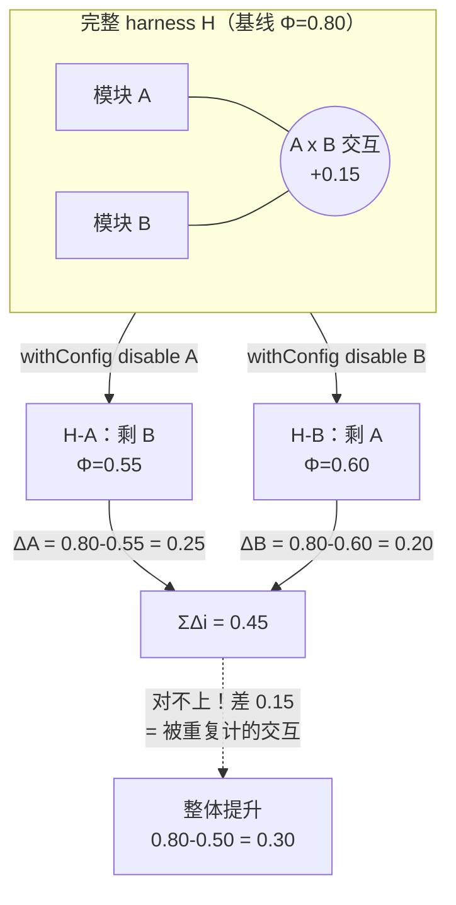
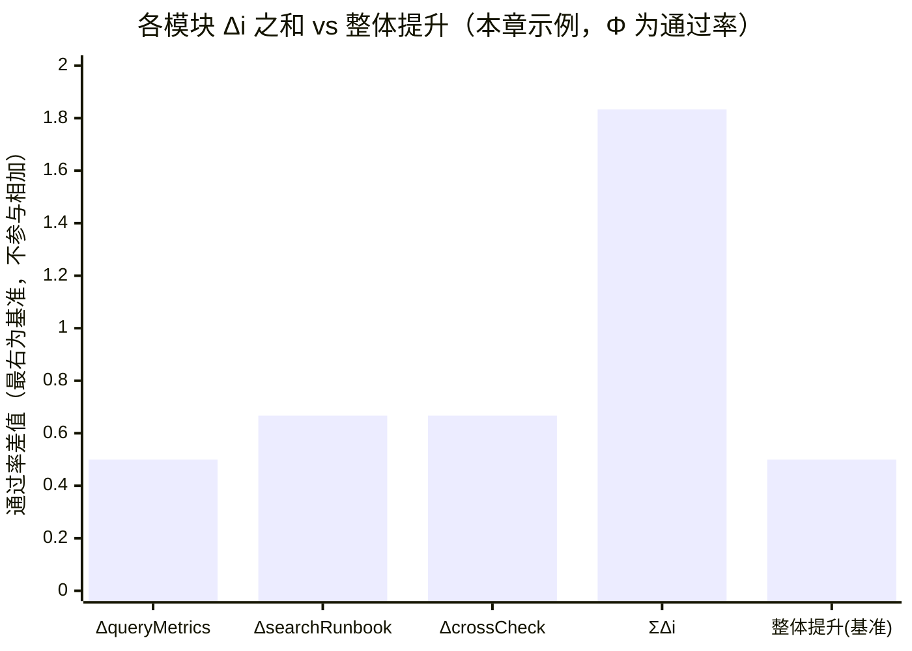
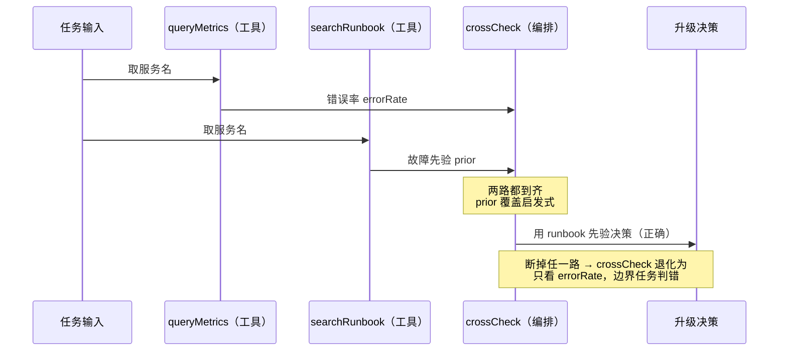

## 本章概览

你已经能给一套 harness 量出整体效果分（第 7 章），也能把一次失败拆成结构化的因果 trace（第 8 章）。接下来是每个做 harness 的人迟早会问的一个问题：这一身装备里，哪一件真在干活，哪一件是占着位置的累赘。

回答这个问题最朴素的办法是消融——把某个模块关掉，重跑评测集，看分掉了多少。掉得多的，说明它在扛事；几乎不掉的，说明它可有可无。这一步谁都会做，难的是接下来那件事：你关掉记忆，分掉 5 个点；关掉某个工具，分掉 3 个点；关掉一段编排，分掉 2 个点。你顺手把它们加起来——10 个点——准备汇报"这三个模块合起来贡献了 10 个点"。然后你把三个一起关掉，发现整体只掉了 7 个点。

10 和 7 对不上。不是你算错了，是模块的贡献本来就不能相加。这一章讲清楚为什么不能加、这件事在工程上意味着什么，以及当你被逼着要给每个模块一个能写进汇报的数字时，消融差值能给到哪、给不到哪——后者把你引向第 10 章的 Shapley。

## 开篇：砍掉"只值 2 个点"的工具

先看一个会真实发生的场景。

你的 DevOps 值班助手上线几个月，工具箱越堆越满：查日志、查监控、查值班手册（runbook），还有一段把这三者的查询结果交叉比对、生成处置建议的编排逻辑。某个季度做技术债清理，你盯上了 `searchRunbook` 这个工具——它对接的知识库维护成本高，召回质量也一般。你想知道砍掉它划不划算，于是做了一次干净的消融：保留其他所有模块，单独关掉 `searchRunbook`，把回归评测集重跑一遍。

结果很漂亮：整体通过率从 0.82 掉到 0.80，只掉了 2 个点。你判断这个工具贡献微薄，砍。

砍完上线，线上故障定位的通过率塌了一大截，远不止 2 个点。复盘才看明白：`searchRunbook` 单独看确实只贡献 2 个点，但它和那段交叉比对编排是配对工作的——编排逻辑里有一条路径，是"先查 runbook 拿到已知故障模式，再拿日志去匹配"。你做消融时编排还在，它会自动改走"只靠日志和监控硬猜"的退化路径，硬猜在评测集这批不算刁钻的任务上居然也能蒙对大半，所以分只掉了 2 个点。可线上那些真正棘手的任务，正是要靠 runbook 给的先验才定得位。`searchRunbook` 的真实价值，大半藏在它和编排的配合里，而你那次单模块消融，恰好把这部分价值算到了编排头上。

这次翻车的根子，不是消融做得不干净，恰恰是做得太干净了——你把一个模块从一个互相咬合的系统里单独拎出来量，量到的是它"在其他模块都还在"这个特定前提下的边际价值，不是它的全部价值。下面把这件事讲到能让你以后看见任何一组消融数字都先警惕一下。

## 消融实验：定义与最朴素做法

先把术语钉死。**消融实验（ablation）**，就是关掉 harness 里的某个模块 i，重跑同一套评测集，对比整体效果指标掉了多少。这个差值就是模块 i 的**消融贡献**：

> Δi = Φ(H) − Φ(H − i)

其中 Φ 是你在第 7 章定义的整体效果指标（比如状态基评分的通过率），H 是完整 harness，H − i 是关掉模块 i 之后的 harness。Δi 为正，说明关掉它分会掉，它在帮忙；Δi 接近零，说明它在不在无所谓；Δi 为负——是的，会出现负数——说明关掉它分反而涨了，这个模块在拖后腿。

工程上怎么"关掉一个模块"，第 5 章的 adapter 已经给好了钩子。`HarnessAdapter.withConfig` 接受一个 `HarnessConfigPatch`，里面的 `disable` 列出要关掉的模块 id，返回一个新的 adapter 变体。评测层完全不需要知道底层是怎么把这个模块摘掉的——是删了工具、改了 instructions 还是绕过了一段编排——它只管拿到变体、跑评测集、读 `RunResult`：

```typescript
// 完整 harness 跑出基线分
const baseline = await scoreSuite(adapter, tasks);

// 关掉 searchRunbook，跑出消融变体的分
const ablated = await scoreSuite(adapter.withConfig({ disable: ['searchRunbook'] }), tasks);

// 这个工具的消融贡献
const deltaRunbook = baseline.score - ablated.score;
```

这就是消融的全部机械动作：`withConfig({ disable })` 造变体，重跑，相减。它简单、直接、谁都能做。问题从你想把多个 Δi 拼在一起的那一刻开始。

## Δi 为什么不可加

把消融贡献加起来，背后藏着一个没说出口的假设：每个模块独立地往整体分上加了自己那一份，互不干涉。这个假设在 harness 里几乎从不成立，因为模块之间会交互。

用一个最小的例子把交互讲透。设想 harness 里只有两个模块 A 和 B，整体效果 Φ 由它们共同决定。把四种开关组合的分都跑出来：

| 组合 | A | B | Φ |
|---|---|---|---|
| 都关 | 关 | 关 | 0.50 |
| 只开 A | 开 | 关 | 0.60 |
| 只开 B | 关 | 开 | 0.55 |
| 都开 | 开 | 开 | 0.80 |

现在在"都开"这个完整 harness 上做单模块消融：

- 关掉 A（剩 B）：Φ 从 0.80 掉到 0.55，ΔA = 0.25
- 关掉 B（剩 A）：Φ 从 0.80 掉到 0.60，ΔB = 0.20

ΔA + ΔB = 0.45。可整体相对"都关"的提升只有 0.80 − 0.50 = 0.30。0.45 和 0.30 差了 0.15，这 0.15 就是 A 和 B 的**交互效应**：它们配合起来产生的、任何一方单独都给不出的那部分价值。单模块消融会把这 0.15 重复算进 A 和 B 各自的账上——量 A 时它在，量 B 时它也在，于是被算了两遍。

交互可以是正的（1 + 1 > 2，互补），也可以是负的（1 + 1 < 2，冗余）。冗余更隐蔽也更常见：两个模块各自都能独立把某类任务做对，留一个就够。这时单独关掉任何一个，分都几乎不掉（另一个顶上了），你会得出"两个都没用"的结论；可要是两个一起关，分就塌了。本章开头的 `searchRunbook` 翻车，本质上就是它和编排之间存在这种"配对才生效"的正交互，被单模块消融拆散了。

这不是构造出来的极端案例，是任何带冗余的系统都会出现的现象，几行代码就能复现。设想 harness 有记忆、工具、middleware 三个能力部分重叠的模块，给它写一个带冗余惩罚的效用函数（每两个模块同时在场，因为能力重叠扣掉一点）。单模块单独测的增益是 +5.6、+3.3、+2.2 个百分点，相加应该是 +11.1；可三个一起上，两两之间的冗余被扣了三次，整合结果只剩 +7.2——少掉的约 3.9 个点，是三者之间的冗余。本章示例 `examples/09-ablation-additivity/` 把这个效用函数写成了可跑的 `src/non-additive.ts`，你可以自己改冗余系数看缺口怎么变。结论很硬：**消融差值 Δi 不可加，ΣΔi 一般不等于整体相对空 harness 的提升。** 谁把消融数字拿去相加做汇报，谁就在系统性地高估或低估。

单模块消融怎么从完整 harness 一路算到"对不上"，如图 9-1 所示。



> 图 9-1：单模块消融的数据流向——从完整 harness H 出发，经两次 `withConfig disable` 造出 H−A / H−B 两个变体，各自重跑评测集算出 ΔA / ΔB，相加得 ΣΔi=0.45，与真实整体提升 0.30 对不上，缺口正是被重复计的交互效应。

图中 `withConfig disable` 对应第 5 章 adapter 的 `HarnessAdapter.withConfig`（`examples/05-eval-layer-adapter/src/adapter.ts`）；交互效应那个虚线缺口，正是单模块消融量不到、要靠第 10 章 Shapley 才能公平分摊的部分。

图 9-1 说清了"怎么算出对不上"，但缺口本身有多大、ΣΔi 是怎么超过整体提升的，用条形图看一眼最直接，如图 9-2 所示。它把本章示例（三模块咬合的值班 harness）跑出来的各 Δi、它们的和、以及整体提升摆在一起——前三根之和明显高过最右那根，高出的部分就是被重复计的交互。图里的 `crossCheck` 是为了演示正交互、本章在值班助手基础上额外加的一段编排步骤（把 metrics 与 runbook 交叉比对再决策），不是贯穿全书的标准工具；贯穿载体里的工具仍是 `queryLogs` / `queryMetrics` / `searchRunbook` 那一套（见第 5 章 adapter）。Φ 取 0 到 1 的通过率，Δi 是通过率的差值。



> 图 9-2：各模块 Δi 之和 vs 整体提升（本章示例，Φ 为通过率）。前三根是逐个消融测出的单模块 Δi，第四根 `ΣΔi` 是它们的和（1.833）。最右"整体提升(基准)"是全开 Φ=1.000 减全关 Φ=0.500 的真实差（0.500），它是整体提升基准、只供前四根对照，本身不参与相加。先解释一个一眼看上去像错的地方：`ΣΔi=1.833` 超过了通过率的上限 1.0，单看会以为算错了。没有。Δi 是两个 Φ 相减，本身可以大于 1。关键在 `searchRunbook` 和 `crossCheck` 是配对工作的——只关掉其中一个，crossCheck 拿到 runbook 先验却没法比对、或者有比对逻辑却没先验可比，决策退化成"只看错误率"的启发式，整体 Φ 反而跌到 0.333，比全关的空 harness（0.500）还低。这是正交互的极端情形：互补模块被拆开，孤立一个反而给决策加噪声。于是单个 Δi=1.000−0.333=0.667，两个加起来 1.333，再叠上 `queryMetrics` 那 0.500，ΣΔi 就冲到了 1.833，远高于整体提升 0.500。1.833 与 0.500 之间 1.333 的落差，是这对正交互被重复计进了两个 Δi 里。这五个数都由 `examples/09-ablation-additivity/src/run-ablation.ts` 直接跑出（运行结果见示例 README），随评测集构成会有波动，但 ΣΔi 远高于整体提升这个形态稳定成立。

本章这个例子里 ΣΔi 高过整体提升，是因为正交互（互补）占了主导。反过来也成立：要是系统里以冗余为主——两个模块各能独立把同一批任务做对，留一个就够——那么单独关掉任何一个分都几乎不掉，ΣΔi 会**低于**整体提升。所以 ΣΔi 既可能虚高也可能虚低，方向取决于哪种交互占主导，不可加只是说"它和整体提升对不上"，不保证朝哪边对不上。第 10 章会拿一个冗余主导的反方向例子，看 Shapley 在那种情况下怎么把功劳分得比消融差值更合理。

## 把消融做对：组合消融与交互

知道了不可加，消融这件事还能不能做？能，只是要换个做法和读法。

**第一，单模块消融照做，但只把 Δi 当"边际价值"读，别当"全部价值"读。** Δi 回答的是一个有明确前提的问题："在其他模块都还在的情况下，再砍掉 i 会损失多少。"这个问题本身极有用——它直接对应"现在这套系统里，砍掉 i 划不划算"的决策。本章开头的翻车，不在于算了 Δi，而在于把这个带前提的边际值，当成了 i 脱离系统也成立的固有价值。

**第二，想看见交互，就得跑组合消融。** 单模块消融只跑 H 和 H−i 两个点，看不见交互；要量 A 和 B 的交互，至少得把"都开/只开A/只开B/都关"四个组合都跑出来，用上一节那个二阶差分算交互项。模块多了，组合数是 2 的 n 次方，全跑不现实——这正是第 10 章要用蒙特卡洛采样近似 Shapley 的原因。但在模块只有两三个、你真正想搞清楚某一对是互补还是冗余时，把这几个组合老老实实跑全，是最直接可靠的办法。

**第三，每个 Δi 都要带置信区间，否则分不清"真没用"和"被噪声淹了"。** 第 4 章讲过，评测分是统计量。Δi 是两个统计量相减，它的不确定性比单个分更大。一个 Δi = 0.02 的模块，到底是真没用，还是它的贡献被评测噪声盖住了？不带误差棒根本判断不了。砍模块是不可逆的工程决策，下手前至少要确认这个 Δi 的置信区间不跨过零。本章示例里每个 Δi 都配了基于 Wilson 区间的误差棒（第 4 章的 `wilsonInterval`）。

把这三条合起来，消融的正确姿势是：单模块消融给边际决策、组合消融看交互、所有差值带 CI。它能可靠回答的是"现在这套系统里砍掉 i 值不值"，回答不了的是"把整体功劳公平分给每个模块各几分"——后者是个分账问题，下一章交给 Shapley。

这套区分不是学术讲究，它直接决定你在真实工程决策里会不会做错判断，几个常见场景都会撞上它。最典型的是被逼着汇报模块 ROI：产品经理拿着账单问你，"`searchRunbook` 接的那个知识库每月维护成本好几万，你们的消融显示它只贡献 2 个点，留它干嘛？"如果你顺着 2 这个数字回答"是不太值"，你就把边际值当成了固有价值，重蹈本章开头的瘦身翻车——那 2 个点是"其他模块都在时再砍它的损失"，不是它脱离系统后的全部贡献。正确的回应是：单模块的 Δi 不能直接当某模块"值不值留"的依据，要回答"砍掉它系统会差多少"，得跑一次把它和与它配对的 `crossCheck` 一起关掉的组合消融，看真实塌多少；想给它一个能写进 ROI 表、可加可比的独立贡献分，那是第 10 章 Shapley 的活，别用消融差值硬凑。同理，砍模块做 TCO 决策、给两版候选 harness 做 A/B 归因性能差异，凡是要把"整体差距"摊到"单个模块"头上的场合，都得先问一句：我手里这个 Δi，是边际值还是固有值？

## 配套示例：当面看 Δi 对不上

光看表格容易觉得"不可加"是个理论洁癖。本章示例造一个模块之间真有交互的 mini 值班 harness，让你亲眼看着 ΣΔi 和整体提升对不上。

示例沿用第 5 章的 adapter 接口和 world 状态，不依赖外部模型 key——用一段确定性脚本代替模型决策，这样消融结果完全可复现，方便你反复跑。开篇那个值班助手有四类操作，示例为了把交互效应露在明面上，砍掉了 `queryLogs`：它是个独立的只读工具，和那段交叉比对编排没有任何配对关系，消融它只是平移基线，对"不可加"这件事不增加信息。剩下三个模块则是层层咬合的：

- `queryMetrics`（工具）：查错误率，是触发后续动作的入口；
- `searchRunbook`（工具）：查已知故障模式，给出"该不该升级"的先验；
- `crossCheck`（编排）：把 metrics 和 runbook 的结果交叉比对再决策——它单独存在时无事可做，必须和前两个工具配合才生效。

`crossCheck` 和 `searchRunbook` 之间被刻意设计成正交互：runbook 给的先验只有经过 crossCheck 才会真正影响决策。三个模块在一次 run 里的数据流向如图 9-3 所示——错误率从 `queryMetrics` 流到 `crossCheck`，故障先验从 `searchRunbook` 流到 `crossCheck`，只有两路都到齐，crossCheck 才用先验覆盖"只看错误率"的启发式，得出正确决策。任一路断掉，crossCheck 就退化成只看 metrics。



> 图 9-3：`queryMetrics → crossCheck` 与 `searchRunbook → crossCheck` 两路数据汇合决策的时序，对应 `examples/09-ablation-additivity/src/interacting-adapter.ts` 的 `run()`。两路缺一，crossCheck 走 `metric-only` 分支，这就是单独消融 runbook 或 crossCheck 都会大幅掉分（各 Δ=0.667）的来源。

于是单独消融 `searchRunbook` 时，crossCheck 退化成只看 metrics，决策准确率明显下滑（各 Δ=0.667）；单独消融 `crossCheck` 时，runbook 的先验拿到了也用不上，同样大幅下滑；两个一起在时，它们配合能把一批"光看 metrics 会误判"的任务做对。核心计算只有几行：

```typescript
// 完整 harness 的基线分
const full = await scoreSuite(adapter, tasks);

// 三次单模块消融，各自的 Δi
const modules = ['queryMetrics', 'searchRunbook', 'crossCheck'];
const deltas: Record<string, number> = {};
for (const id of modules) {
  const ablated = await scoreSuite(adapter.withConfig({ disable: [id] }), tasks);
  deltas[id] = full.score - ablated.score; // Δi = Φ(H) − Φ(H−i)
}

// 把三个 Δi 加起来，和"整体相对空 harness 的提升"对比
const sumDelta = Object.values(deltas).reduce((a, b) => a + b, 0);
const empty = await scoreSuite(adapter.withConfig({ disable: modules }), tasks);
const wholeGain = full.score - empty.score;

console.log('ΣΔi =', sumDelta.toFixed(3)); // 各模块消融贡献之和
console.log('整体提升 =', wholeGain.toFixed(3)); // 全开 vs 全关
// 两者对不上，差额就是被单模块消融漏掉 / 重复计的交互效应
```

跑出来 `ΣΔi` 明显大于 `整体提升`，差额就是模块间交互被单模块消融重复计的部分（这里三个模块层层咬合，缺口里既有 `searchRunbook × crossCheck` 这对正交互，也有 `queryMetrics` 作为入口的门控效应）。示例还会把"都开/只开各一个/都关"的全组合分都打出来，用二阶差分把 `searchRunbook × crossCheck` 这一对交互的数值单独抠出来，并给每个 Δi 配 Wilson 误差棒。怎么跑见 `examples/09-ablation-additivity/README.md`。

## 小结

- 消融实验就是关掉模块 i 重跑评测集，看整体效果掉多少：Δi = Φ(H) − Φ(H − i)。工程上用第 5 章 adapter 的 `withConfig({ disable })` 造变体即可。
- 各模块的 Δi 不可加：ΣΔi 一般不等于整体相对空 harness 的提升，差额是模块间的交互效应（互补为正、冗余为负），单模块消融会把它重复计或漏计。
- Δi 是"在其他模块都还在的前提下，再砍掉 i 的边际损失"，它能回答"现在砍 i 划不划算"，不能当成 i 脱离系统也成立的固有价值——本章开头的瘦身翻车就栽在这个混淆上。
- 想看见交互就得跑组合消融（至少四个开关组合），用二阶差分把交互项抠出来；模块一多组合爆炸，这正是第 10 章用 Shapley 近似的动因。
- 每个 Δi 都要带置信区间（第 4 章 Wilson），下手砍模块前先确认它的误差棒不跨过零，别把噪声当结论。
- "公平地把整体功劳分给每个模块各几分"是消融答不了的分账问题，留给第 10 章的 Shapley 值。

## 配套代码

见 `examples/09-ablation-additivity/`：一个模块间真有交互的 mini 值班 harness（复用第 5 章 adapter 与 world），对三个模块逐个消融算 Δi，当面演示 ΣΔi ≠ 整体提升；再跑全组合消融，用二阶差分抠出 `searchRunbook × crossCheck` 的交互值，每个 Δi 都带 Wilson 误差棒。不依赖外部模型 key，可反复复现。
