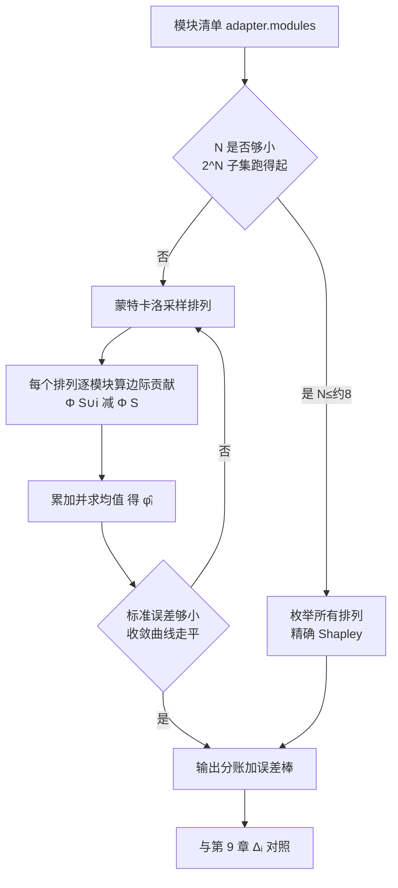
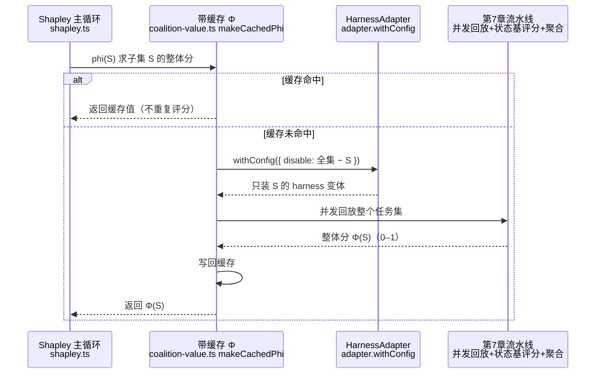

## 开篇：一笔分不平的账

季度复盘会上，你被要求回答一个看起来很简单的问题：值班助手这套 harness，下个季度的预算该往哪儿投。

它现在挂着五样东西：查日志的 `queryLogs`、查监控的 `queryMetrics`、查值班手册的 `searchRunbook`、一段约束高危写操作的 instructions、还有一个让它在动手前先复述改动的 reflection 步骤。每一样都有人维护，每一样都要算成本。手册那套向量库每月要烧检索费，reflection 步骤让每个任务多一轮模型调用，token 账单肉眼可见地涨。有人提议把手册砍了省钱，有人说 reflection 才是冗余该砍，吵不出结果。

你按第 9 章的法子做了消融：逐个关掉模块，看整体分掉多少。结果是 queryMetrics 单独贡献 +6 个百分点、instructions +5、reflection +4、queryLogs +2、手册也 +2。五个数你都信，是真跑出来的。但把这套消融差值全加起来是 +19，而你把所有模块从无到有装齐、整体分实际涨了 +21——单消融的和对不上从空配到满配的真实提升，差了 2 个百分点。

于是分账没法分。单消融的和既不等于整体提升，每个模块的数又只在"其余模块全在场"这一个背景下成立。可一旦要砍，砍掉哪个、省下的预算算谁的、剩下的模块贡献会怎么变，单消融的数一个都答不上来。更要命的是它会误导：手册的单消融只有 +2，看着最该砍，但这恰恰是因为它和 reflection 功能冗余、在满配下被对方盖住了——真把 reflection 也砍了，手册的价值立刻回来。单消融这把尺子，量不出这种"换个背景就翻盘"的关系。

这里 `searchRunbook` 的低 Δ 和第 9 章那次翻车是两种不同的机制，别混。第 9 章里手册 Δ 低，是因为它和编排**互补**，消融时编排自动改走退化路径、把协同一并破坏，价值被算到了编排头上，所以那一章 ΣΔ 会**高于**整体。本章里手册 Δ 低，是因为它和 reflection **冗余**——满配下两个防错模块互相替补，补上手册的边际收益小，没有被破坏的正交协同。冗余在这套配置里占主导，于是本章 ΣΔ（+19）**低于**整体提升（+21）。互补让 ΣΔ 偏高、冗余让 ΣΔ 偏低，两种交互把和往相反方向拽，方向取决于哪一种占主导。

这一章要解决的就是这笔账：怎么给每个模块一个**公平**、**可加**、能拿去做预算决策的贡献分。答案是合作博弈论里一个有六十多年历史的工具——Shapley 值。它正好就是为"几个人合伙做一件事、怎么公平分钱"这个问题设计的，搬到 harness 上，"人"换成"模块"，"分的钱"换成"整体效果分"。

第 9 章把消融讲到了"各 Δᵢ 不可加、且会朝两个方向系统性失真"这一步，但它给的尺子只能告诉你各模块孤立的边际价值，给不出一笔加得平的账。本章接着往上走，落三件事。

第一件，把 Shapley 值的"遍历所有加入顺序求平均"讲到能直接写成代码，并说明它凭哪四条公理唯一确定、为什么天然可加。

第二件，用第 7 章的整体分 Φ 当 coalition value、第 5 章的 `adapter.withConfig` 构造子集，把它真正跑在五个模块上，再用蒙特卡洛近似扛住模块变多后的组合爆炸。

第三件，把 Shapley φ 和第 9 章的单消融 Δ 摆在一张表里对照，给出一套读法，把开头那个"先砍手册"的错误结论纠正回来。前沿的 ShapleyFlow / AgentSHAP 作为延伸标注清楚来源，不当成熟定论。

本章假设你已经读过第 9 章，知道单模块贡献 **Δi = Φ(H) − Φ(H−i)**、知道各 Δi 不可加、也知道这是模块间交互效应造成的。剩下的问题只有一个：既然不可加，那到底该怎么加。

## 消融差值为何不可加

先把第 9 章那个"不可加"用一句话钉死，因为它是整章的起点。

记 Φ(S) 为只装了模块集合 S 时这套 harness 的整体效果分（用第 7 章那套状态基评分 + Wilson CI 跑出来的数）。装满五个模块是 Φ(全集)，一个不装是 Φ(∅)。第 9 章定义的单模块消融贡献，是从满配出发关掉模块 i：

> Δi = Φ(全集) − Φ(全集 − i)

这个数衡量的是"在其余四个模块都在的前提下，再加上 i 值多少"。问题在于"在其余模块都在的前提下"这个限定。手册和 reflection 在功能上有重叠：手册让模型查到处置流程，reflection 让模型复述确认，两者都在帮模型少犯错。当另一个已经在场时，第二个补上去的边际收益就小——这就是冗余。反过来，instructions 和 reflection 可能互补：instructions 划出"哪些是高危写"，reflection 把这条规则真正执行到每一步，两个一起装的收益大于各自单独装之和。

消融差值 Δi 只测了一个特定背景——"其余全部在场"——下的边际贡献。模块换个背景，边际贡献就变，于是 Δi 会朝两个方向系统性失真：

- **冗余模块被低估**。手册在满配下测，reflection 正盖着它，补上手册的边际收益小，Δ 低。但在"reflection 缺席"的背景里，手册独自扛起防错，边际收益大。单消融只看到前一个背景，把手册的功记少了。
- **互补模块被高估**。从满配里拿掉 instructions，不光丢了它自己的增益，还顺带毁掉了它和 reflection 的协同，Δ 偏大。可在"reflection 缺席"的背景里，这份协同本就不存在，instructions 的边际收益没那么高。单消融只看满配那一个背景，把 instructions 的功记多了。

无论高估还是低估，根子都是同一个：Δi 锁死在"其余全部在场"这一个背景上。Shapley 值的思路是不要只看一个背景，把模块在**所有可能背景**下的边际贡献做加权平均。

## Shapley 值：遍历所有加入顺序

设想这五个模块不是一次性装齐的，而是一个一个加进去，加入顺序随机。每个模块加入的那一刻，它给整体分带来的提升，就是它在"当前已有模块"这个背景下的边际贡献。同一个模块，在不同的加入顺序里，面对的背景不同，边际贡献也不同。把它在**所有加入顺序**下的边际贡献求平均，得到的就是这个模块的 Shapley 值。

写成式子，模块 i 的 Shapley 值是：

> φᵢ = (在所有排列上)平均( Φ(i 之前已加入的集合 ∪ {i}) − Φ(i 之前已加入的集合) )

举个三模块的小例子，模块为 {A, B, C}，全排列有 6 种。看模块 A 在每种顺序里加入时的边际贡献：

| 加入顺序 | A 加入时的背景 | A 的边际贡献 |
|---|---|---|
| A B C | ∅ | Φ(A) − Φ(∅) |
| A C B | ∅ | Φ(A) − Φ(∅) |
| B A C | {B} | Φ(AB) − Φ(B) |
| B C A | {B,C} | Φ(ABC) − Φ(BC) |
| C A B | {C} | Φ(AC) − Φ(C) |
| C B A | {B,C} | Φ(ABC) − Φ(BC) |

φ_A 就是右边这一列六项的平均。注意 A 在"空背景"下的边际贡献被算了两次（A B C 和 A C B 这两种顺序里，A 都是第一个加入的），这正是 Shapley 加权的来源：同一个集合背景出现的次数不同，权重就不同。把它整理成对子集 S 求和的闭式，是教科书里那个带阶乘的公式；工程上你不需要背公式，按"遍历所有排列、累加边际贡献、求平均"来实现，代码和直觉完全对得上。

Shapley 值不是随便挑的平均方式。合作博弈论证明了，满足下面四条公理的分配方案**唯一存在**，就是 Shapley 值：

- **有效性**：所有模块的 φᵢ 加起来，正好等于 Φ(全集) − Φ(∅)。整体效果被完整、不多不少地分配给各模块，这正是预算分账要的可加性。
- **对称性**：两个模块如果在任何背景下贡献都一样，它们的 Shapley 值相等。
- **空模块**：一个加进来对任何背景都不产生增益的模块，Shapley 值为 0。
- **可加性**：如果整体效果是两个独立指标之和，每个模块的 Shapley 值也是它在两个指标上 Shapley 值之和。

第一条"有效性"直接解决了开头那笔分不平的账：Shapley 值天然满足 Σφᵢ = Φ(全集) − Φ(∅)，给每个模块的功记得不多不少，加起来正好是整体的提升。冗余的模块会被自动调低（因为它在"功能伙伴在场"的那些顺序里边际贡献小，拉低了平均），互补的模块会被自动调高。

## 组合爆炸与蒙特卡洛近似

代价是计算量。要算 Shapley 值，你得知道 Φ 在**每一个**模块子集上的取值。N 个模块有 2ᴺ 个子集，遍历所有排列是 N! 项。而每算一次 Φ(S)，意味着用 withConfig 关掉 S 之外的模块、把整个任务集并发回放一遍、跑状态基评分——这是第 7 章那套完整流水线，一次几十上百个任务，不便宜。

五个模块还扛得住：2⁵ = 32 个子集，每个子集跑一遍 Φ，精确 Shapley 值能直接算。模块数一旦上到十几个，2ᴺ 就爆了，精确计算不现实。

这时候用蒙特卡洛近似。回到"随机加入顺序"那个直觉：与其遍历全部 N! 种排列，不如随机采样一批排列，在每个采样到的排列上算各模块的边际贡献，最后求平均。这是 Shapley 值的一个无偏估计——采样的排列越多，估计越接近真值，且能用标准误差给出它的收敛程度。精确与近似两条路在哪里分岔、近似怎么靠标准误差判收敛，如图 10-1 所示。



**图 10-1：Shapley 分账的精确／近似分岔流程**。模块数 N 决定走枚举（精确）还是蒙特卡洛采样（近似）；近似分支用标准误差判收敛，两条路最后都汇到与第 9 章 Δᵢ 的对照。

图 10-1 里每个算 Φ(S) 的方框，展开就是一条从评测层打到具体 harness 再回来的多跳链路，如图 10-2 所示：Shapley 主循环要一个分，`coalition-value.ts` 的带缓存 `phi` 先查缓存，没命中才用 `adapter.withConfig` 关掉 S 之外的模块构造变体，交给第 7 章流水线并发回放整个任务集、状态基评分、聚合成一个整体分，回填缓存再返回。模块清单来自 `adapter.modules()`（第 5 章 `HarnessAdapter` 接口）。



**图 10-2：单次 Φ(S) 取值的数据流向**。同一个子集 S 在不同排列里反复出现，缓存命中直接返回、绕开右侧整条评分链路。缓存是这里的关键工程点：Φ(S) 算过一次就该缓存，否则蒙特卡洛省下来的钱会被重复评分吃光。

下面是近似的核心循环，完整可运行版本在 `examples/10-shapley-attribution/`：

```typescript
// 蒙特卡洛 Shapley：随机采样排列，累加每个模块的边际贡献
// phi 是一个带缓存的 coalition value 函数：phi(集合) → 整体效果分
export async function monteCarloShapley(
  modules: string[],
  phi: (coalition: Set<string>) => Promise<number>,
  samples: number,
): Promise<Record<string, number>> {
  const sum: Record<string, number> = Object.fromEntries(modules.map((m) => [m, 0]));

  for (let s = 0; s < samples; s++) {
    const order = shuffle(modules); // 一个随机加入顺序
    const coalition = new Set<string>();
    let prev = await phi(coalition); // Φ(∅)，会命中缓存
    for (const m of order) {
      coalition.add(m);
      const curr = await phi(coalition); // 加入 m 之后的整体分
      sum[m] += curr - prev; // m 在这个背景下的边际贡献
      prev = curr;
    }
  }
  // 采样均值就是 Shapley 值的无偏估计
  return Object.fromEntries(modules.map((m) => [m, sum[m] / samples]));
}
```

把它跑在五个模块上，同时用枚举法算精确值做对照，你会看到两件事：一是蒙特卡洛估计随采样数增加向精确值收敛；二是 Σφᵢ 始终约等于 Φ(全集) − Φ(∅)（精确法严格相等，近似法在误差范围内相等）。开头那笔分不平的账，到这里平了。

## 分账结果与单消融对照

把五个模块的精确 Shapley 值和第 9 章的单消融 Δ 摆在一起对照，差异立刻显形（数字来自配套示例的确定性桩，方便你复现）：

| 模块 | 单消融 Δᵢ | Shapley φᵢ | 读法 |
|---|---|---|---|
| queryMetrics | +0.060 | +0.060 | 两者相等：它独立，不进任何冗余/互补对，背景对它没影响 |
| queryLogs | +0.020 | +0.020 | 两者相等：它独立，不进任何冗余/互补对、增益较低，背景对它没影响 |
| searchRunbook | +0.020 | +0.040 | Δ 低于 φ：与 reflection 冗余，满配下被盖住，单消融低估了它 |
| instructions | +0.050 | +0.040 | Δ 高于 φ：与 reflection 互补，满配下连协同一起拿掉，单消融高估了它 |
| reflection | +0.040 | +0.050 | Δ 低于 φ：净冗余（与手册冗余 − 与指令互补），单消融略低估 |
| **合计** | **+0.190** | **+0.210** | ΣΔ 缺 0.02 对不上整体；Σφ 严格等于 Φ(全集)−Φ(∅) |

这张表的数字由配套示例确定性跑出，可以直接复现，下面这套读法对任何 Φ 都成立：

- **两列相等的模块**（queryMetrics、queryLogs）不进任何交互对，贡献和背景无关，消融和 Shapley 必然一致。
- **Δ 低于 φ 的模块**（searchRunbook、reflection）有**冗余**：满配下被功能伙伴盖住，单消融测到的边际贡献偏小，**低估**了它真实的独当一面价值。
- **Δ 高于 φ 的模块**（instructions）有**互补**：满配下消融把它和伙伴的协同一并毁掉，单消融**高估**了它单独的贡献。

落到开头那个预算决策：单看消融，手册的 Δ 只有 +0.02，是最不起眼、看着最该砍的一个。但 Shapley 把它抬到 +0.04，因为它和 reflection 冗余——满配下 reflection 盖着它，一旦 reflection 出问题或被砍，手册立刻顶上。换句话说，手册和 reflection 是一对可互相替补的防错模块，留一个就够，但不能两个都砍。真正独立、消融和 Shapley 都撑得住、动不得的是 queryMetrics。这才是能拿去汇报的分账，而单消融差值会把你导向"先砍手册"这个错误结论。

## 前沿探索：ShapleyFlow 与 AgentSHAP

Shapley 值本身是 1953 年的成熟数学，把它用在机器学习特征归因（SHAP）也有多年积累。但**把它系统地用在 agent / harness 的模块归因上，是 2026 年才热起来的方向，目前主要见于单篇 preprint，多为作者自报结果、尚未被独立大规模复现**。引用时按"前沿探索"对待，不当成熟定论。

- **ShapleyFlow**：把 agent 内部的 planning / reasoning / action / reflection 这些环节当作合作博弈的玩家，用 Shapley 值在它们之间分配最终任务成败的贡献。它的着眼点在 agent 的**内部认知环节**。
- **AgentSHAP**：把视角放在**工具层**，且强调模型无关——把 agent 当黑盒，只在"给/不给某个工具"这个维度上做 Shapley 分账。它和本章示例的口径最接近：本章的模块（工具、instruction、reflection）正是这种黑盒外部视角，不依赖打开模型内部。

两者共同的工程难点都是本章讲的组合爆炸，解法也都是蒙特卡洛采样。它们之外，传统 SHAP 库（如 Python 的 `shap`）的采样、收敛判定思路是可直接借鉴的成熟工程实践——本章示例的标准误差收敛判定就来自这套。完整的来源标注与可信度说明集中在附录 B。

本章的立场是：方法论（Shapley 公平分配）是站得住的成熟数学；把它套在 harness 模块上、用第 7 章的 Φ 当 coalition value，是本书给你的一套可运行落地，配套示例让你能自己复现，而不是只读论文里的结论。

## Shapley 的适用边界

公平分账有它的代价和适用边界，省得你拿着锤子看什么都像钉子。

- **模块数少且只为排个序**：三四个模块、只想知道谁最该留，第 9 章的单消融通常够用，Shapley 的额外计算不划算。Shapley 的价值在"可加分账"和"暴露冗余/互补"，不在排序本身。
- **Φ 噪声大、样本不足**：Shapley 值是 Φ 的多次差分累加，Φ 本身的方差会被放大。如果第 7 章的整体分 Wilson 区间还很宽，先把样本量加够（第 4 章），否则你算的是噪声的 Shapley 值。
- **模块边界没切干净**：Shapley 要求模块能被独立开关。如果两个模块在代码里耦合到没法单独 disable，`withConfig` 关不掉，coalition value 就取不到，归因无从谈起。模块边界清晰是前提。
- **决策不需要可加性**：如果你只是想定位"这一次失败是哪一步坏的"，那是第 11 章反事实根因的活，单 trace 级、不需要遍历所有子集。Shapley 是系统级、跨任务集的统计归因，两者别混用。

## 小结

- 单消融差值 Δᵢ 只测了"其余模块全在场"这一个背景下的边际贡献，对冗余模块低估、对互补模块高估（双重记功），所以各 Δᵢ 加起来不等于整体提升，分账分不平。
- Shapley 值把模块在**所有加入顺序**下的边际贡献求平均，由有效性、对称性、空模块、可加性四条公理唯一确定，天然满足 Σφᵢ = Φ(全集) − Φ(∅)，是可直接用于预算分账的"可加"贡献分。
- coalition value Φ(S) 复用第 7 章的并发回放 + 状态基评分；构造 S 用第 5 章 `adapter.withConfig` 关掉 S 之外的模块，模块清单来自 `adapter.modules()`。
- N 小（≤8）时遍历所有排列（共 N! 种）算精确值，缓存确保实际只计算 2^N 个不同子集；N 大用蒙特卡洛采样排列做无偏近似，靠标准误差判定收敛，并务必缓存 Φ(S) 否则重复评分会吃掉省下的算力。
- 对照表的读法：两列接近 = 贡献稳定；φ 高于 Δ = 该模块有冗余（满配下被伙伴盖住，单消融低估了它）；Δ 高于 φ = 该模块有互补（单消融把协同一并拿掉，高估了它的纯贡献）。
- ShapleyFlow / AgentSHAP 是 2026 年把 Shapley 搬上 agent 的前沿探索（preprint、未独立复现，见附录 B）；Shapley 数学本身成熟，本章给的是可复现的 harness 落地。

## 配套代码

见 `examples/10-shapley-attribution/`：基于第 5 章 `HarnessAdapter` 接口，对五个模块同时算**精确 Shapley 值**（枚举子集）和**蒙特卡洛近似**，打印分账表、与第 9 章单消融 Δ 的对照、以及近似随采样数增加向精确值收敛的曲线。coalition value 用一段确定性桩实现（内含可配置的冗余/互补关系），不依赖模型 key 即可跑通；正文还给出把桩换成真实 Mastra adapter（接第 7 章 Φ）的最小改法。
