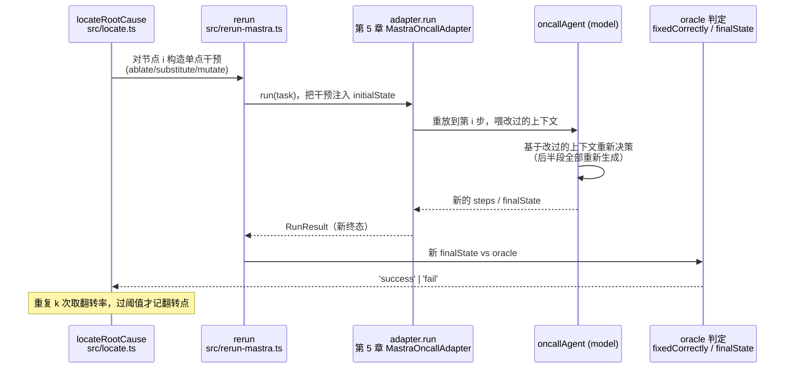
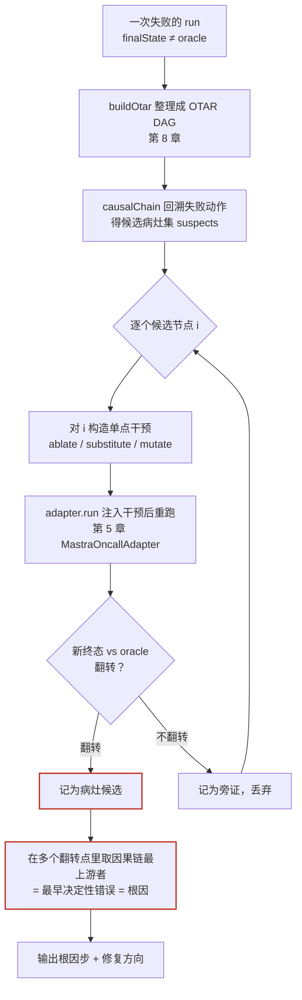

## 本章概览

第 8 章把一次失败从扁平日志整理成了一张 OTAR 因果图，你能指着某个节点说"我怀疑病在这里"。但"怀疑"不等于"定位"。一条十几步的 trace 里，看上去可疑的节点常常不止一个：一次召回漏了关键文档、一次推理下了草率结论、一次工具返回了过期数据——哪一个才是真正的病灶？哪一个只是陪跑的旁证？

这一章给"怀疑"一个能证伪的判据。方法很直接：在 OTAR 图上对某个可疑节点做**干预**——把它换一个走法，或者干脆拿掉——然后重跑，看终态会不会从失败翻转成成功。会翻转的，才是病灶；不会翻转的，再可疑也只是旁证。这套方法叫**反事实根因定位**（counterfactual root cause analysis）。

它和第 9 章的消融是两件事，开篇要先把这条界划清，否则后面全乱。第 9 章消融问的是**系统级**问题：把"记忆"这个模块在整个任务集上关掉，整体分掉多少。它评的是模块的统计贡献，跑的是几百条任务。本章问的是**单 trace 级**问题：就这一次失败，是哪一步、换个走法就不会错。它不关心模块在统计上贡献几分，只关心这一条 trace 上的病灶在哪。一个是流行病学（这种病在人群里和什么因素相关），一个是临床诊断（这个病人这次发病的病灶在哪）。下面用一个具体的值班故障把这件事跑起来。

## 开篇：查对服务改错字段

值班助手接到告警：`order-api` 的请求延迟 P99 冲到 2 秒以上，远超 800ms 的阈值。它的任务是查清原因并修复。这次它没有像第 8 章那样乱重启，整个链路看上去都很合理：

1. 查 `order-api` 的日志，发现大量"数据库连接等待"的告警；
2. 查 `order-db` 的监控，看到连接池使用率 100%、活跃连接数顶到了配置上限 `max_connections=50`；
3. 查值班手册，搜到一篇《连接池打满的应急处理》，里面写着"临时调大连接池上限可缓解"；
4. 推理：连接池打满了，按手册调大上限；
5. 执行 `patchConfig`，把 `order-db` 的 `max_connections` 从 50 改成 200。

改完之后延迟没降，反而 `order-db` 因为连接数暴涨、内存被打爆，直接 OOM 重启，故障从延迟告警升级成了数据库宕机。

你来复盘。把这次 run 跑过第 8 章的 `buildOtar`，得到一张干净的因果图，每一步都有据可查——它确实是顺着"日志→监控→手册→推理→动作"一路推下来的，没有第 8 章那种"摆着矛盾证据不看"的明显破绽。这恰恰是难点：**这次失败没有一个一眼可见的病灶**。链路自洽，每一步单看都对，可终态是错的。

凭肉眼，你能列出好几个嫌疑：

- 是第 1 步查日志查岔了方向吗（也许真正的瓶颈不在连接池）？
- 是第 3 步搜到的那篇手册有问题吗（它的建议在这个场景下是错的）？
- 是第 4 步的推理草率吗（没意识到调大连接池会让 DB 内存爆掉）？
- 还是第 5 步执行时参数给得太激进（改成 200 太猛，改成 80 也许就没事）？

四个嫌疑，肉眼分不出主次。你可以凭经验拍一个，但拍错了就白改一轮。反事实定位要做的，是把这四个嫌疑逐个拎出来做一次"如果当时不这样会怎样"的实验，用终态是否翻转给每个嫌疑一个客观裁决。

## 反事实：换一步重跑的实验

反事实推理的核心是一句反事实条件句：**如果当时第 i 步不是这么走的，结果会不会不一样？** 哲学上这话很玄，但在 harness 评测里它有一个朴素到近乎粗暴的落地方式——真的把第 i 步改掉，然后真的重跑一遍，看终态。

能这么干，靠的是第 5 章 adapter 那个被反复强调的性质：**值班助手的只读任务可批量回放**。环境是带桩的（日志、监控、手册、配置都是 `initialState` 里的确定性数据），同一个 `EvalTask` 喂进去，除了模型本身的温度抖动，整条 trace 是可复现的。可复现，才谈得上"控制变量"——只动第 i 步，其余不动，重跑，对比终态。这是做实验的前提，线上不可回放的真实流量根本没法这么干。

一次干预由两部分定义：**动哪个节点**、**怎么动**。怎么动有三种基本干预：

- **删除（ablate）**：把这一步从执行里拿掉，让 agent 仿佛没经过这一步。比如拿掉第 3 步搜手册，看它在没有那篇误导性手册的情况下会不会改去做别的。
- **替换（substitute）**：把这一步的输出换成一个"理想"或"对照"值。比如把第 2 步监控的返回，从"连接池 100%"换成"连接池正常、慢查询飙升"，看 agent 会不会改去查慢 SQL。
- **改参（mutate）**：保留这一步，只改它的参数。比如第 5 步还是 `patchConfig`，但把 `max_connections` 从 200 改成 80。

定义干预之后，重跑这一次任务，拿到新 trace 的终态，和 oracle 比：原来失败、干预后成功，就叫这次干预**翻转**了结果。一个节点，只要存在某种对它的单点干预能让终态翻转，它就是**病灶候选**。

```typescript
// 一次反事实干预的定义（完整版见 examples/11-counterfactual-rca/src/intervention.ts）
export interface Intervention {
  targetId: string;                              // 动 OTAR 图里的哪个节点
  kind: 'ablate' | 'substitute' | 'mutate';     // 怎么动
  // substitute 用：把该节点的输出替换成这个值
  substituteContent?: unknown;
  // mutate 用：改这一步动作的参数
  mutateArgs?: Record<string, unknown>;
}

// 一次干预重跑的结果
export interface CounterfactualResult {
  intervention: Intervention;
  originalStatus: 'success' | 'fail';
  newStatus: 'success' | 'fail';
  flipped: boolean;                              // 是否从 fail 翻成 success
}
```

这里有个绕不开的工程问题：干预了第 i 步，第 i 步之后的整条 trace 都得**重新生成**，不能照搬原来的后半段。原因是后半段本来就是基于"第 i 步原本的输出"长出来的，把第 i 步改了，agent 后面的推理和动作都会随之改变。所以"重跑"必须是从干预点往后真重跑一遍 agent，让模型基于改过的上下文重新决策——这正是 adapter 的 `run()` 干的事，只不过 `initialState` 里注入了对第 i 步的干预。

一次干预从构造到拿到翻转裁决，数据要流经定位器、重跑器、adapter、模型、oracle 五方，如图 11-2 所示。注意第 i 步之后的 trace 是模型在被改过的环境里**重新生成**的，不是把原 trace 后半段接上去。



> 图 11-2：一次单点干预重跑的数据流向。干预由 `src/locate.ts` 的 `locateRootCause` 发起，经 `rerun`（真版 `src/rerun-mastra.ts`、桩版 `src/rerun-stub.ts`）注入 `initialState`，由第 5 章 `MastraOncallAdapter` 的 `run()` 重放到干预点并让模型重新决策，新 `finalState` 交 oracle 判终态。整条链对每个候选重复 k 次，过阈值才记翻转点。

## 用因果链剪枝干预候选

不能对每个节点都做三种干预暴力重跑——一条 30 个节点的 trace，光删除干预就要重跑 30 次，乘上替换和改参，再乘上模型抖动要重复几次，开销会失控。第 8 章那张 OTAR 图正好用来剪枝：**只对失败动作的因果链上的节点做干预**。

复盘要解释的是"为什么会做出这个错误的终态动作"。那个错误动作（这次是 `patchConfig(max_connections=200)`）顺着 `causedBy` 回溯出来的因果链，就是所有可能的病灶所在——不在这条链上的节点，对最终那个错误动作没有因果影响，干预它们纯属浪费算力。直接复用第 8 章的 `causalChain`：

```typescript
import { causalChain } from '../../08-otar-trace/examples/src/query.js';
// 对失败动作 A1 回溯，得到它的整条因果依赖链
const suspects = causalChain(otarNodes, failingActionId);
// suspects = [O1 查日志, T1, O2 查监控, O3 搜手册, T2 推理]（A1 是失败动作本身，完整版里会被过滤，不作为干预候选）
```

这段 `import` 写的是第 8 章原始路径，方便你看清依赖关系；实际示例工程为了能独立 `npm i && npm start`，就近放了一份 `causalChain` 副本，见 `src/otar.ts`（字段与语义和第 8 章一字不差）。

回溯出来的 `suspects` 就是候选病灶集。对每个候选选一种合适的干预：Observation 节点适合替换（换一个对照输出）或删除；Thought 节点适合替换（换一个对照结论）；Action 节点适合改参或删除。这样把"对全图盲目暴力"收敛成"对因果链上每个节点做一两种有针对性的干预"，重跑次数从几十次压到十次以内。

整条定位流程串起来如图 11-1 所示：



> 图 11-1：反事实根因定位流程。`buildOtar` / `causalChain` 复用第 8 章（`examples/08-otar-trace/src/`）；`adapter.run` 注入干预重跑复用第 5 章 `MastraOncallAdapter`（`harness-lab/src/mastra-adapter.ts`，第 5 章 examples/）；`Intervention` 构造与翻转判定在本章 `examples/11-counterfactual-rca/src/`。红框两节点是本章产出：所有翻转点、以及其中最上游的根因步。

## 多个翻转点中的根因

跑完一轮，你常会发现**不止一个**节点的干预能让终态翻转。这次故障里：

- 删掉第 3 步那篇误导手册（O3），agent 没了"调大连接池"的依据，改去查了慢查询，定位到一条全表扫描的 SQL——**翻转**；
- 把第 4 步推理（T2）的结论替换成"应先排查慢查询而非扩容"，agent 改去查 SQL——**翻转**；
- 把第 5 步动作（A1，也就是失败动作本身）的参数从 200 改成 80，DB 没 OOM，延迟虽没根治但没酿成宕机——**部分翻转**（没升级成 P1，但延迟告警仍在，不算干净翻转）。

定位算法只把"干净翻转"（终态从失败变成功）的节点记作翻转点，A1 这种部分翻转、以及失败动作自身都不计入候选——于是这次落下两个翻转点 O3、T2。到底哪个是根因？这里要引入一个判据，来自 2026 年的反事实归因工作 **CHIEF**（标注为前沿探索，下一节展开它的可信度）。它的定义干净利落：

> 在一条失败 trace 上，一个步骤是**决定性错误**（decisive error），当且仅当只反事实地纠正这一步、其余不动，就能让结果反败为胜。一条 trace 上**最早的**那个决定性错误，就是根因。

"最早"在 OTAR 图上有精确含义——因果链上最靠上游的那个翻转点。为什么取最上游？因为下游的翻转点往往是上游错误的延续：A1 改参能翻转，是因为 T2 已经把方向带歪了，A1 只是在错误方向上踩得太猛；而 O3（误导手册）是这一切的源头，它一错，后面顺着它推的每一步都跟着错。修下游（把 A1 改温柔点）只治标——下次换个数据，agent 照样会顺着 O3 那篇手册再栽一次；修上游（把 O3 那篇手册修正或下架）才治本。

所以在多个翻转点里，**取因果链最上游者**作为根因。本例中 O3（那篇在"连接池打满"场景下给出错误建议的手册）是最早决定性错误，它就是根因。复盘结论不再是含糊的"agent 判断失误"，而是可执行的"《连接池打满的应急处理》这篇手册的建议在 `order-db` 这类内存敏感实例上是错的，需要修正或加前置条件"。

要注意一个反直觉的点：根因不一定是那个**看起来最像凶手**的步骤。直觉上最该背锅的是 A1（它直接把 DB 改爆了），但 A1 只是执行者。反事实实验把"谁动手了"和"谁该负责"分开：A1 干预只是部分翻转、不计入候选，O3 才是干净翻转的最上游决定性错误。肉眼复盘很难做出这种区分，它往往停在"谁动手了"。

## CHIEF 判据与方法边界

上一节的"最早决定性错误 = 根因"来自 CHIEF（2026 年 arXiv preprint，调研依据见附录 B）。说清它的身份：这是一篇较新的单篇 preprint，作者自报了方法和效果，本书写作时**没有被独立大规模复现**。本章把它的核心判据（决定性错误、最早决定性错误）拿来用，是因为它的逻辑站得住、也能用最小代码自己验证一遍；但你不该把它当成"业界已验证的成熟定论"，而该当成"一个有道理、值得在你自己数据上试的判据"。`examples/11-counterfactual-rca/` 里就是这个判据的最小可运行复现，你可以拿自己的 trace 跑，自己判断它准不准。

除了来源的成熟度，方法本身也有几条硬边界，写进正文是因为不交代清楚会让人误用：

**第一，重跑有噪声，翻转要多次确认。** 模型有温度，干预后重跑一次翻转、再跑一次没翻转，是常事。所以"翻转"不能只看一次。本章的做法是对每个干预重复跑 `k` 次（默认 5 次），用"翻转率"代替"是否翻转"——翻转率超过阈值（比如 0.6）才算这个节点能翻转。这等于把第 12 章 pass^k 的稳定性思路（第 12 章详述）提前用在了反事实实验上：单次结果不可信，要重复采样。代价是重跑次数乘以 `k`，定位贵了，但结论稳了。

**第二，因果链的边是启发式推断的，链错了定位就错。** 第 8 章交代过，`causedBy` 默认用"新观察喂给最近一次思考"的启发式规则连边，不是真值。如果某个真正影响了决策的早期观察，因为这条规则没被连进因果链，本章就不会对它做干预，根因可能漏掉。缓解办法是第 8 章提过的：能从模型 tool-call 参数拿到精确引用时，用精确引用覆盖启发式，把因果链连准。链越准，定位越可信。

**第三，单点干预假设"病灶是单一步骤"。** 反事实定位默认存在某个单一步骤、改它就能翻转。但有些失败是多步耦合的——任何单独一步改了都不翻转，得两步一起改才行。这类失败，单点干预全部判"不翻转"，会得出"没有根因"的结论。遇到这种情况，要么上多点干预，要么承认这次失败是系统性的、回到第 9–10 章的模块级归因去看。多点干预的代价不可忽视：对因果链上 n 个节点枚举全部子集是 O(2^n)，n 稍大就跑不动。一个务实的折中是只试**因果链上相邻两步**的组合（O(n) 量级），它能覆盖最常见的"上下游两步连环错"，又不至于组合爆炸——更高阶的耦合再交给模块级归因。本章的实现会在"所有单点干预都不翻转"时显式报告这种情况，而不是假装定位成功。

**第四，它定位的是"病灶步"，不是"修复方案"。** 反事实告诉你"改 O3 就能翻转"，但具体怎么改那篇手册、改成什么，它不负责。从"病灶步"到"具体修复"再到"修复后会不会引入新回归"，是第 16 章 change manifest 防劣化闭环的事——反事实定位是那条闭环的上游输入。

## 最小复现：枚举干预定位翻转点

把上面的方法落成可跑的代码，核心是一个 `locateRootCause` 函数。它吃一条失败 trace 的 OTAR、失败动作 id、和一个能重跑的 adapter，吐出所有翻转点和其中的根因步。逻辑就是前面那张流程图：

下面摘录里的 `import` 同样写第 8 章原始路径；实际示例工程就近放了副本，见 `src/otar.ts`。

```typescript
// 摘自 examples/11-counterfactual-rca/src/locate.ts，已简化
import { causalChain } from '../../08-otar-trace/examples/src/query.js';

export async function locateRootCause(
  otar: OtarNode[],
  failingActionId: string,
  rerun: (intv: Intervention) => Promise<'success' | 'fail'>, // 注入干预重跑，返回新终态
  opts: { repeats?: number; flipThreshold?: number } = {},
): Promise<{ flips: OtarNode[]; rootCause: OtarNode | null }> {
  const repeats = opts.repeats ?? 5;          // 每个干预重复跑几次，对抗噪声
  const flipThreshold = opts.flipThreshold ?? 0.6;

  // 只对失败动作的因果链上的节点做干预（用第 8 章 causalChain 剪枝）
  const chain = causalChain(otar, failingActionId);
  // 失败动作本身不算病灶候选；完整版还过滤 kind==='result'（result 节点由 action 派生），见 locate.ts
  const suspects = chain.filter((n) => n.id !== failingActionId);

  const flips: OtarNode[] = [];
  for (const node of suspects) {
    const intv = planIntervention(node);       // 按节点类型选 ablate/substitute/mutate
    // 重复 repeats 次，统计翻转率
    let flippedTimes = 0;
    for (let i = 0; i < repeats; i++) {
      if ((await rerun(intv)) === 'success') flippedTimes++;
    }
    if (flippedTimes / repeats >= flipThreshold) flips.push(node);
  }

  // 多个翻转点里取因果链最上游者 = 最早决定性错误 = 根因（CHIEF 判据，前沿探索）
  // causalChain 返回的是拓扑序，最上游者排在最前
  const order = new Map(chain.map((n, i) => [n.id, i]));
  const rootCause =
    flips.length === 0
      ? null // 没有单点翻转：可能是多步耦合失败，见正文「方法边界」第三条
      : flips.sort((a, b) => order.get(a.id)! - order.get(b.id)!)[0];

  return { flips, rootCause };
}
```

`planIntervention` 按节点类型挑干预方式（Observation 换对照输出、Thought 换对照结论、Action 改参），`rerun` 把干预注入 `initialState` 后调 `adapter.run`、再用 oracle 判终态。例子里给了两套 `rerun`：一套是**确定性桩**版（不需要 API key），一套是**真 adapter** 版（接第 5 章 `MastraOncallAdapter`，跑真模型，需要 API key）。

两者的关键区别要先说清，否则会误解"控制变量"这件事：桩版**不真正调 adapter、也不跑 agent**，而是查一张固定规则表（`FLIP_TARGETS`）直接返回"这个干预目标会不会让 agent 改对方向"——它模拟的是翻转行为本身，目的是让你看清定位算法的骨架、不被真模型抖动干扰。只有真版（`rerun-mastra.ts`）才是对每个干预真正重新跑一次 agent、由模型基于改过的上下文重新决策。先用桩版理解流程，再切真版看真实抖动。

跑确定性桩版，输出会是这样：

```text
候选病灶（失败动作 patchConfig 的因果链）：O1 → T1 → O2 → O3 → T2
逐个单点干预重跑（每个重复 5 次）：
  O1 查日志       substitute  翻转率 0/5  → 旁证
  T1 推理         substitute  翻转率 0/5  → 旁证
  O2 查监控       substitute  翻转率 0/5  → 旁证
  O3 搜手册       substitute  翻转率 5/5  → 翻转点
  T2 推理         substitute  翻转率 3/5  → 翻转点
翻转点 2 个；取因果链最上游者：O3（搜手册）
根因 = O3：《连接池打满的应急处理》在内存敏感实例上给出错误建议
修复方向：修正该手册或为其加前置条件（→ 第 16 章 change manifest）
```

注意 O2（查监控）虽然在因果链上、看着可疑，干预后却不翻转——连接池确实是满的，这是一条真实但非病根的观察。反事实实验把这种"真但无辜"的旁证和真正的病灶 O3 干净利落地分开了。

反事实根因定位的产出落到这里：不是一句"agent 判断失误"，而是一个能挂工单、能写进 change manifest 的具体病灶——哪一步、为什么、往哪改。

## 小结

- 反事实根因定位是**单 trace 级**的临床诊断（这次失败病灶在哪一步），区别于第 9 章**系统级**的消融（某模块在任务集上贡献几分）；前者跑一条 trace，后者跑整个任务集。
- 方法的判据能证伪：对 OTAR 因果链上的可疑节点做单点干预（删除 / 替换 / 改参），注入 `initialState` 后用 adapter 重跑，终态从失败翻转成成功的节点才是病灶，不翻转的再可疑也是旁证。
- 用第 8 章的 `causalChain` 对失败动作回溯剪枝，只干预因果链上的节点，把重跑次数从几十次压到十次内；多个翻转点时取**因果链最上游者**为根因（CHIEF 的"最早决定性错误"判据，标注为前沿探索、未独立复现）。
- 根因不一定是看起来最像凶手的那一步：直接把 DB 改爆的 `patchConfig` 只是执行者，真正的根因是上游那篇给错建议的手册——反事实把"谁动手"和"谁负责"分开了。
- 四条硬边界：重跑有噪声须重复 k 次取翻转率；因果链是启发式推断、链错则定位错；单点干预对多步耦合失败会判"无根因"、须显式报告；它只定位病灶步，从病灶到修复与防回归是第 16 章的事。

## 配套代码

见 `examples/11-counterfactual-rca/`：给定一条"查对服务、改错字段"的失败 trace（用第 8 章 OTAR 形状构造，无需 API key 即可跑），`src/locate.ts` 实现 `locateRootCause`——用 `causalChain` 剪枝、对因果链上每个节点枚举单点干预、重复 k 次取翻转率、取最上游翻转点为根因。`src/intervention.ts` 定义三种干预与 `planIntervention`，`src/rerun-stub.ts` 是确定性桩重跑器（理解算法用），`src/rerun-mastra.ts` 接第 5 章 `MastraOncallAdapter` 跑真模型（需 API key），`src/run.ts` 串起来打印定位结果。`npm i && npm start` 跑桩版，`npm run start:mastra` 跑真版。
