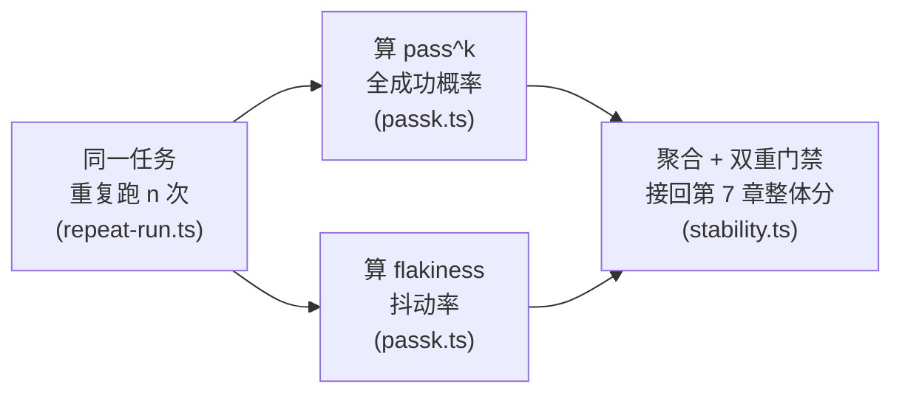
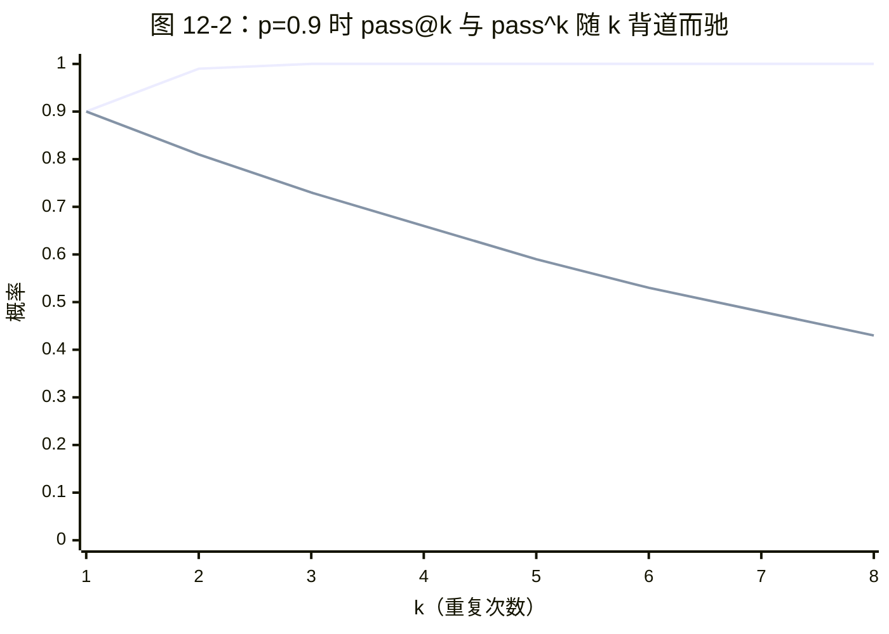

## 本章概览

第 7 章给值班助手量出了一个整体效果分：把任务集并发回放一遍，比对终态，聚合成一个带 Wilson 置信区间的通过率。那个分有个隐含前提——每个任务只跑一次。这一章要拆掉这个前提。

agent 不是纯函数。同一条指令、同一个环境初始态，跑两次可以一次成功一次失败。如果你的报分只跑一次，它衡量的其实是"这套 harness 这一次碰巧表现如何"，而不是"它有多可靠"。这一章讲怎么把"可靠性"量出来：pass@k 和 pass^k 的区别、怎么估计、flakiness（抖动）怎么定义和定位、抖动从哪来，以及怎么把 pass^k 接回第 7 章那个整体分，让它从"碰巧的一次"变成"经得起重复的一致表现"。

整章的动线就三步：把同一任务重复跑、从重复结果里算出两类可靠性数字、再用这两个数字做门禁。如图 12-1 所示。



图 12-1：本章动线——同一任务重复跑 n 次，从重复结果分别算出 pass^k（可靠性下界）和 flakiness（抖动率），再用这两个数字做双重门禁接回第 7 章整体分。三个阶段分别落在 `examples/12-passk-flakiness/` 的 `repeat-run.ts`、`passk.ts`、`stability.ts`。后面"抖动从哪来"一节还有一张更细的归因数据流图（图 12-3）。

## 开篇：跑一次就放行的变更

值班助手处理支付服务告警时，原来的流程是一律升级给人。你想让它聪明点：查完监控发现错误率超阈值，先去知识库 `searchRunbook` 翻一眼对应服务的处置手册，手册里写得清楚的常见故障就自己重启，拿不准的再升级给人，省得动不动半夜把人叫醒。改动不大，方向也对。

回归任务集跑完，三十条任务全过，整体分还涨了。你发布。

上线第三天，凌晨两点，值班群里有人 @你：助手把一个该升级的故障自己重启了，重启没解决，又重启，来回三次才有人发现不对劲手动接管。你把那条线上 trace 拉下来，对着回归集里**一模一样**的那条任务重跑——过了。再跑——过了。跑到第六次，复现了：这一次，`searchRunbook` 返回的手册片段里，"先尝试重启"那句排在"若 5 分钟未恢复则升级"前面，模型读到前半句就动手了，没读完后半句。而前几次，召回片段的顺序恰好把"升级"那句排在前面，模型就升级了。

召回结果的顺序，在你的检索实现里没有强制排序——底层向量库对分数相同的片段返回顺序不稳定。这个不确定性每次跑都掷一次骰子，大概六分之一的概率掷到"先重启"那一面。你的回归集跑一次，六次里有五次会让它过去；CI 绿灯，问题溜进生产，再在凌晨两点掷中那六分之一。

这一章要回答的就是：怎么在离线就把这种"跑一次大概率过、但并不可靠"的任务揪出来，并且给它一个数。

## pass@k 与 pass^k：能力上界 vs 可靠性下界

先把两个长得像、意思相反的指标分清楚。它们都跑 k 次，但问的问题正相反。

- **pass@k**：k 次里**至少一次**成功的概率。它衡量的是能力上界——"这套系统有没有可能做对"。代码生成评测常用它：让模型生成 k 个候选，只要有一个能通过测试就算赢，因为你可以让人或编译器从 k 个里挑对的那个。
- **pass^k**：k 次**全部**成功的概率。它衡量的是可靠性下界——"这套系统能不能稳定做对"。

对一个无人值守、自己动手改生产配置的值班助手，你要看的是 pass^k。线上没有人帮它从 k 次尝试里挑对的那一次，它每一次出手都得对。pass@k 高、pass^k 低的系统，意思是"它会做，但不一定每次都做对"——对自动化运维来说，这种系统比"老老实实每次都升级给人"还危险，因为它的成功会麻痹你。

这个区分不是本书发明的。把 pass^k 作为 agent 可靠性的核心指标，来自 Sierra 团队的 τ-bench 评测范式（《τ-bench: A Benchmark for Tool-Agent-User Interaction》，2024，后续有 τ²-bench、τ³-bench）。它的立场很直接：对话式 agent 区别于模型评测的地方，正在于"同一任务独立跑 k 次是否次次都成"，而不是"能不能做对一次"。本书第 7 章的整体分到这一章要补上的，就是这个维度。

两者随 k 的变化方向相反。设单次成功率为 p、且每次独立：

- pass@k = 1 − (1 − p)^k，随 k 单调**上升**，趋向 1；
- pass^k = p^k，随 k 单调**下降**，趋向 0。

p = 0.9 看起来是个不错的成功率。但 pass^5 = 0.9^5 ≈ 0.59——连续跑五次都对的概率只有六成。值班助手一晚上处理几十次告警，"九成对"意味着几乎必然会在某一次出手时错。单次成功率小数点后那点损耗，被 k 次连乘急剧放大。

把 p = 0.9 固定住，让 k 从 1 涨到 8，两条曲线背道而驰：pass@k 往上贴近 1（多给几次机会总能蒙对一次），pass^k 往下掉向 0（每多连乘一次都在扣分）。如图 12-2，上面那条贴着 1，下面那条一路下滑。



图 12-2：上面那条线是 pass@k = 1−(1−p)^k（随 k 上升、趋向 1），下面那条是 pass^k = p^k（随 k 下降、趋向 0）。两条曲线由 `examples/12-passk-flakiness/src/passk.ts` 的 `passAtK` / `passHatK` 直接算出（k=1..8、p=0.9），精确数值见下表。

| k          | 1    | 2    | 3    | 4    | 5    | 6    | 7    | 8    |
|------------|------|------|------|------|------|------|------|------|
| pass@k（升）| 0.90 | 0.99 | 1.00 | 1.00 | 1.00 | 1.00 | 1.00 | 1.00 |
| pass^k（降）| 0.90 | 0.81 | 0.73 | 0.66 | 0.59 | 0.53 | 0.48 | 0.43 |

同一个 p、同一组重复，两个指标给出截然相反的结论。无人值守的 harness 盯 pass^k 那条。

```typescript
// pass@k 与 pass^k 的解析形式（假设各次独立、单次成功率为 p）
export function passAtK(p: number, k: number): number {
  return 1 - Math.pow(1 - p, k); // 至少一次成功
}
export function passHatK(p: number, k: number): number {
  return Math.pow(p, k); // 全部成功
}
```

## 用重复采样估计 pass^k

上面的解析式假设你已经知道真实的 p，且各次独立。实际评测里 p 是未知的，你只能跑有限次去**估计**它。最朴素的做法：把同一个任务在固定环境初始态下重复跑 n 次（n 远大于你关心的 k），数成功了几次。

但这里有个坑：不要用 (成功次数 / n) 再去算 p^k。无偏的 pass^k 估计应该直接在你跑出的 n 次结果上做组合计数——n 次里有多少种"取 k 次"的组合是**全部成功**的。这正是 HumanEval 估计 pass@k 用的那个无偏估计量，pass^k 是它的对偶。

设 n 次中成功了 c 次，那么"随机取 k 次恰好全部成功"的概率，无偏估计为从 c 个成功里取 k 个、除以从 n 个里取 k 个：

pass^k ≈ C(c, k) / C(n, k)

c < k 时该值为 0（凑不出 k 个全成功的组合）。这个估计量比"先估 p 再 p^k"更稳，尤其在 n 不大、p 接近 1 时。

```typescript
// 从 n 次实跑结果（成功 c 次）无偏估计 pass^k：C(c,k) / C(n,k)
export function estimatePassHatK(successes: number, total: number, k: number): number {
  if (k > total) return NaN; // 跑的次数还不够 k 次，估不出来
  if (successes < k) return 0; // 成功数凑不出 k 个全成功的组合
  // 用比值连乘避免大数阶乘溢出：∏_{i=0..k-1} (c-i)/(n-i)
  let ratio = 1;
  for (let i = 0; i < k; i++) {
    ratio *= (successes - i) / (total - i);
  }
  return ratio;
}
```

要给 pass^k 配置信区间，别直接套 Wilson——Wilson 区间是给"n 次独立伯努利试验的成功比例"用的，而 pass^k 是这些试验上的一个非线性组合统计量。简单稳妥的办法是 bootstrap：对你跑出的 n 个 0/1 结果有放回重采样很多次，每次重新算一遍 pass^k，取重采样分布的 2.5% 和 97.5% 分位数当区间。配套代码里给了实现。

## flakiness：抖动的量化

pass^k 告诉你"全成功的概率有多低"，但它没直接告诉你一个任务**抖不抖**。一个 p = 0 的任务（次次失败）和一个 p = 1 的任务（次次成功）pass^k 一个是 0 一个是 1，但它们都**不抖**——结果完全可复现。真正麻烦的是 p 在中间的任务：时好时坏，你没法预测下一次。

flakiness（抖动率）就是用来量这个的。最直接的定义：在同一任务的 n 次重复里，结果不一致的程度。一个好用的标度是用伯努利方差归一化：

flakiness = 4 · p̂ · (1 − p̂)

p̂ 是 n 次里的成功比例。这个量在 p̂ = 0 或 1 时为 0（完全确定，不抖），在 p̂ = 0.5 时为 1（最抖，跟掷硬币一样）。乘 4 是为了把范围归一到 [0, 1]，读起来直观。

```typescript
// flakiness 抖动率：0 表示完全确定（次次同样结果），1 表示像掷硬币一样不可预测
export function flakiness(successes: number, total: number): number {
  if (total === 0) return 0;
  const p = successes / total;
  return 4 * p * (1 - p);
}
```

把 pass^k 和 flakiness 一起看，能给任务分出三类：

- **稳定通过**（p̂ ≈ 1，flakiness ≈ 0）：放心，这是你想要的。
- **稳定失败**（p̂ ≈ 0，flakiness ≈ 0）：是个确定性 bug，好定位、好修。
- **抖**（flakiness 高）：最危险的一类。它在 CI 里大概率给你绿灯，骗你发布，再在生产里偶发翻车。本章开头那个 `searchRunbook` 任务就落在这里——p̂ ≈ 0.83，flakiness ≈ 0.56。

评测报告里，第三类任务才是要单独捞出来盯着的。一个只看平均通过率的报告会把它们的损耗摊平到看不见：三十条任务里两条抖、各 0.83，平均下来整体分还是 0.99，绿得发亮。flakiness 这一列的作用，就是不让它们藏在平均值里。

## 抖动从哪来

要修抖动，先得知道随机性是从哪个口子漏进来的。在一个 harness 里，常见的源头有这么几类，按"好不好控制"从易到难排：

1. **采样温度**。模型解码本身带随机性，temperature > 0 时同一 prompt 每次输出可能不同。这是最容易想到、也最容易误以为是唯一来源的口子。评测回归集时通常把 temperature 设到 0 求可复现——但要知道，temperature 0 也不保证逐 token 确定（浮点累加顺序、批处理、后端实现都会引入微小差异），它只是大幅降低抖动，不是消除。
2. **工具返回的非确定性**。本章开头那个故障就在这——`searchRunbook` 底层向量库对同分片段返回顺序不稳，每次召回顺序不同，喂给模型的上下文就不同。查日志、查监控这类工具如果接的是真实系统，返回值本身就随时间变。**这类抖动跟模型温度无关，把 temperature 设成 0 也治不了它。**
3. **执行顺序与并发**。多个工具调用、子 agent、并发 step 之间如果有共享状态或竞态，调度顺序的微小差异会导致不同结果。第 9 章消融时如果发现关掉某个并发模块抖动就降了，多半是这一类。
4. **环境与外部依赖**。时间戳、随机 ID、限流、上游服务偶发超时。这类在离线 mock 环境里测不出来，要靠第 15 章的线上影子流量去暴露。

评 flakiness 的工程意义在于：它能帮你把抖动**归因**到上面某一类。做法是对照——固定其他变量、只改一个，看 flakiness 降不降。把 temperature 从默认值压到 0，flakiness 没动，说明抖动不在模型采样，往工具和环境上找。给 `searchRunbook` 的召回结果加一道确定性排序（按分数降序、分数相同按 id 字典序），重测，flakiness 归零，就锁定了第 2 类。配套代码用一个可注入抖动源的 mock adapter 演示这个对照过程，整个数据流如图 12-3 所示：从一个任务的 n 次重复出发，结果序列分三路喂给三个估计量，再由 flakiness 是否超限决定走稳定结论还是进归因对照。

```mermaid
flowchart TD
  T[同一任务 EvalTask<br/>固定 initialState] --> R[重复跑 n 次<br/>repeatRun]
  R --> A[(n 个 RunResult<br/>0/1 成功序列)]
  A --> P[estimatePassHatK<br/>C&#40;c,k&#41;/C&#40;n,k&#41;]
  A --> F[flakiness<br/>4·p·&#40;1-p&#41;]
  A --> B[bootstrap CI<br/>pass^k 置信区间]
  P --> C{flakiness 高?}
  F --> C
  C -- 否 --> OK[稳定: 通过/失败]
  C -- 是 --> S[抖动归因对照<br/>逐一压制随机源]
  S --> S1[temperature→0]
  S --> S2[工具返回确定排序]
  S --> S3[并发/顺序固定]
  S1 & S2 & S3 --> RE[重测 flakiness 降了?<br/>锁定来源]
```



图 12-3：抖动归因的数据流。图中节点对应 `examples/12-passk-flakiness/` 的模块：`repeatRun` 在 `src/repeat-run.ts`，`estimatePassHatK` / `flakiness` / `passAtK` / `passHatK` 在 `src/passk.ts`，bootstrap CI 在 `src/passk.ts` 的 `bootstrapPassHatKCI`，抖动注入与对照的 mock adapter 在 `src/flaky-adapter.ts`，整套跑起来在 `src/stability.ts`。`RunResult` 接口沿用第 5 章 `src/adapter.ts`。

## 接回第 7 章的整体分

第 7 章的整体分是"任务集里每个任务跑一次，成功比例 + Wilson CI"。把 pass^k 纳进来，要改两件事。

第一，**评测单元从"一次运行"变成"一个任务的 n 次重复"**。原来一个任务在分子上贡献 0 或 1，现在贡献的是这个任务的 pass^k 估计（一个 0 到 1 之间的数）。整体分变成所有任务 pass^k 的聚合——一个任务只要在重复里抖过，它对整体分的贡献就被打折，而不是凭运气的那一次蒙混过关。

第二，**报告要多一列 flakiness，并设一道门禁**。整体分聚合会把个别抖动任务的损耗摊薄，所以光看聚合分不够。实践中常用的门禁是双重的：整体 pass^k 不低于阈值（守住平均可靠性），**且**没有任何单个任务的 flakiness 超过上限（守住"不许有定时炸弹溜进生产"）。配套代码把一条抖动的 `searchRunbook` 任务（pass^5 ≈ 0.32、flakiness ≈ 0.56）和两条稳定的只读任务（pass^k = 1）放进同一任务集：整体可靠性分被摊到约 0.77，过了 0.7 的整体门禁；但 flakiness 门禁（上限 0.2）会把那条抖动任务单独拦下——这正是你要的。给召回加上确定排序后重测，那条任务变成 12/12、flakiness 归零、整体分升到 1.0 放行。第 16 章的防劣化闭环会把这道双重门禁正式接进 CI。

代价是成本。一个任务跑 n 次，回放开销是原来的 n 倍。务实的做法不是对全集都跑 n 次，而是分层：回归集里标记为"高危写"或"历史抖过"的任务跑高 n（比如 n = 10），只读、稳定的任务跑低 n 甚至 1 次。第 6 章构造任务集时给每题打的难度/风险标签，在这里正好用来决定重复次数。配套代码的 `stability.ts` 演示了按任务标签分配 n 的策略。

```typescript
// 把 pass^k 聚合成整体可靠性分，并按 flakiness 上限做门禁判定（摘录，完整见 stability.ts）
export function reliabilityGate(
  perTask: { taskId: string; passHatK: number; flakiness: number }[],
  opts: { minOverallPassHatK: number; maxFlakiness: number },
): { overall: number; pass: boolean; flakyTasks: string[] } {
  const overall =
    perTask.reduce((s, t) => s + t.passHatK, 0) / Math.max(1, perTask.length);
  // 揪出抖动超限的任务：它们即便没拉低平均分，也要单独拦下
  const flakyTasks = perTask.filter((t) => t.flakiness > opts.maxFlakiness).map((t) => t.taskId);
  const pass = overall >= opts.minOverallPassHatK && flakyTasks.length === 0;
  return { overall, pass, flakyTasks };
}
```

## 小结

- agent 不是纯函数，同一任务跑两次可以一次成一次败。只跑一次的报分量的是"这一次碰巧如何"，不是可靠性。
- pass@k（至少一次成功）衡量能力上界，乐观；pass^k（全部成功）衡量可靠性下界，悲观。无人值守、自己动手的 harness 要看 pass^k。p = 0.9 的系统 pass^5 只有约 0.59。
- 估 pass^k 用无偏组合估计 C(c, k) / C(n, k)，别用"先估 p 再 p^k"；配置信区间用 bootstrap，不要直接套 Wilson。
- flakiness = 4·p·(1−p) 把抖动量化到 [0, 1]：0 是完全确定，1 是像掷硬币。最危险的是 flakiness 高的任务——CI 给绿灯，生产偶发翻车。
- 抖动来源分采样温度、工具非确定返回、并发顺序、外部依赖四类；temperature 设 0 只能治第一类，工具返回顺序这类得靠确定性排序。
- 接回第 7 章整体分：评测单元从"一次运行"变"n 次重复的 pass^k"，门禁做成"整体 pass^k 达标 且 无单任务 flakiness 超限"双重判定，重复次数按任务风险标签分层。

可靠性守住了，但本章一直假设 agent 该自己做的事就该一次次稳稳做对。还有一类错和"稳不稳"无关：该停下来问人时它没停，不该打断时它瞎打断。下一章（第 13 章）把"该不该停下来问人"单独拎出来，建成一个能打分的二分类。

## 配套代码

见 `examples/12-passk-flakiness/`：

- `src/passk.ts`：`passAtK` / `passHatK` 解析式、`estimatePassHatK` 无偏组合估计、`flakiness` 抖动率、`bootstrapPassHatKCI` 置信区间。
- `src/repeat-run.ts`：把任意 `HarnessAdapter`（第 5 章接口）的同一任务重复跑 n 次，收集 0/1 成功序列。
- `src/flaky-adapter.ts`：一个可注入抖动源的 mock adapter，模拟"召回顺序不稳"导致的偶发失败，用来演示抖动归因对照。
- `src/stability.ts`：主入口。对任务集按风险标签分层重复，估每题 pass^k + flakiness + CI，做双重门禁判定，并打印稳定性分布。先 `npm i` 再 `npm run stability`。
