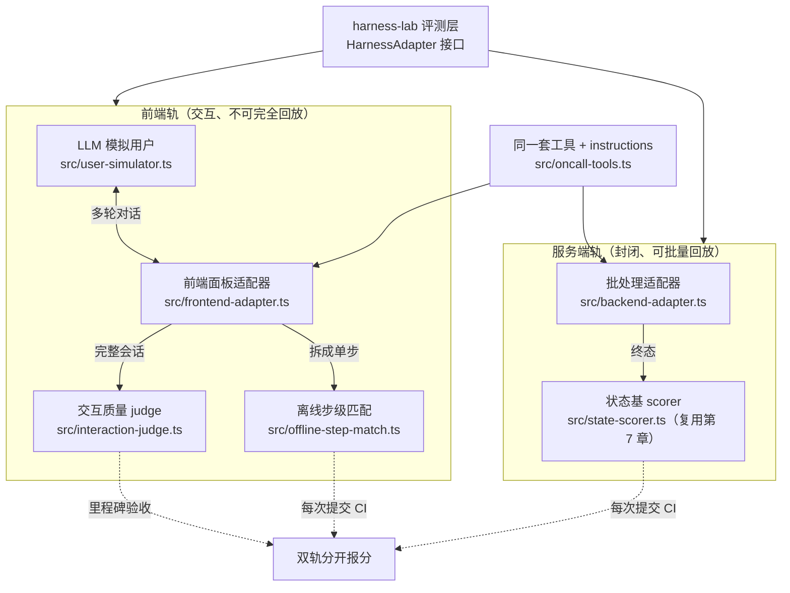
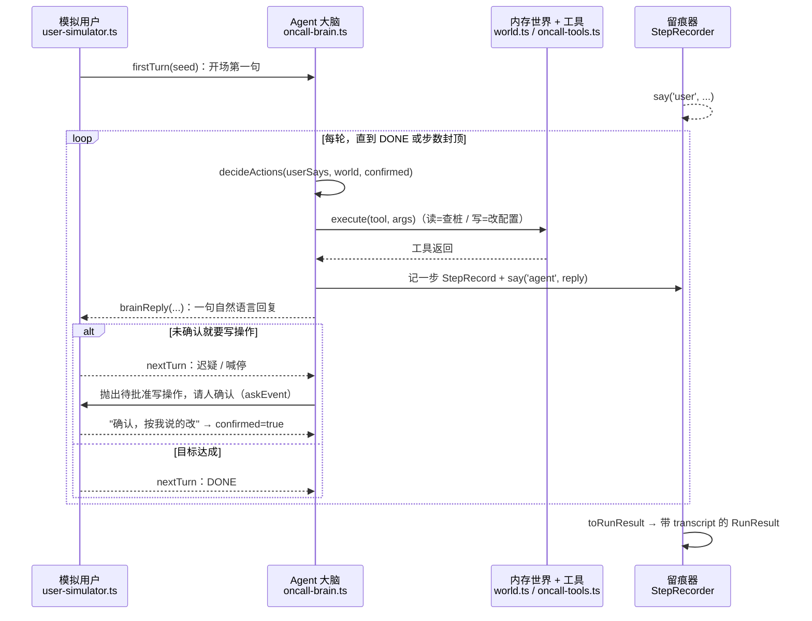

## 本章概览

同一个值班助手，你给它装了两副面孔。一副是服务端的批处理入口：告警进来，它查日志、查监控、按规则处置或升级，整条链路在后台跑完，不需要人盯着。另一副是值班同学在浏览器里打开的操作面板：一个对话框加几个按钮，人一句话一句话地跟它说"看下 payment 服务""把超时调回去""算了先别动"。

这两副面孔接的是同一套工具、同一份 instructions，可你会发现，能把服务端那套评明白的方法，搬到前端就处处卡壳。服务端的任务能攒成集子反复回放，前端的会话每次都长得不一样；服务端比对一个确定的终态就能判对错，前端的"对"还包括它问得对不对、答得清不清楚、有没有在该停的地方停下来等人点确认。一套评法打不了前后端两片天下。

这一章把这条分野讲清楚：哪些差异是本质的、哪些只是表象，前端那一轨到底难在哪，以及怎么用一个 LLM 模拟用户把"不可完全回放"的前端会话变成可以批量跑的评测。最后落到 `harness-lab` 上，给值班助手的两副面孔各接一条评测轨。

## 开篇：服务端测不到的前端 bug

先看一个服务端评测全绿、却只在前端翻车的例子。

值班助手有个 `patchConfig` 工具，改配置。服务端那条轨上，它被工作流包着：任何 `patchConfig` 调用都先挂起，等一个批准信号才落盘（第 13 章那套 suspend/resume）。批量回放几百条任务，凡是该升级的都升级了，终态比对全对，这一轨的分很漂亮。

前端面板是另一拨人写的。面板把 agent 的每一步动作渲染成卡片，写操作那张卡片上有个"确认执行"的按钮，等人点。某次迭代，前端为了让界面"反应快一点"，给按钮加了乐观更新——点下去先把卡片标成"已执行"，再发请求。问题是这个面板把"卡片已渲染"当成了"动作已提交"，于是 agent 抛出待批准的写操作后，面板有一瞬间会自动把它标记成已确认，把批准信号提前发了回去。人还没看清要改什么，配置已经落盘。

这个 bug 在服务端那条轨上一行代码都碰不到——服务端没有按钮、没有渲染、没有乐观更新，它走的是工作流的 suspend/resume，批准信号由测试桩按 oracle 给。前端的故障藏在"人、界面、agent 三者的交互时序"里，是一类服务端轨根本不产生的状态。你的评测集再全，只要它全是服务端任务，这类 bug 就永远测不到。

把这次故障和第 1 章那次（改一句 instructions 漏升级）摆一起看：那次是模型之外、harness 之内的耦合，服务端就能复现；这次更往外一层，落在 harness 和**人机交互界面**的耦合上。评测的对象边界又被推远了一格——你评的不只是 harness 和 model，还包括 harness 怎么和真人在一个界面上来回。

## 两条根因：可回放性与判定依据

把前后端的差异列全，很容易列成一张零碎的对照表。真正驱动评法不同的，其实只有两条根因，其余都是它们的衍生。

第一条根因是**可回放性**。服务端任务是封闭的：输入是一段告警或指令，环境是日志/监控/配置的桩，agent 跑完就结束，没有外部参与者在中途改变剧情。把初始态固定下来、seed 固定下来，同一条任务今天跑和明天跑应该走同一条路（抖动另说，第 12 章）。这种封闭性让任务可以攒成集子、可以并发、可以无限次回放——第 7 章整套并发回放就建立在这上面。

前端会话不封闭。中途有一个真人在打字，他下一句说什么，取决于 agent 上一句答了什么、面板上显示了什么。会话是 agent 和人**共同生成**的轨迹，你没法把人这一半固定下来回放——录一段真人的对话脚本回放，agent 行为稍有变化，脚本就对不上了（agent 这次没问那个问题，脚本里预设的回答就成了答非所问）。这是前端轨"不可完全回放"的根。

第二条根因是**判定依据**。服务端判对错，靠的是终态：配置最后是什么、该不该升级升没升、有没有碰禁止的写操作。这些是 `harness-lab` 里 `oracle` 已经定义好的字段（`expectedFinalState` / `mustEscalate` / `forbiddenWrites`），第 7 章的状态基 scorer 直接比对就行。终态是客观的、可代码判定的，零方差。

前端的"对"，一部分仍是终态（配置最后改没改对），另一部分却落在过程上：它问得清不清楚、有没有在人明确说"先别动"之后真的停手、面对模糊指令有没有反问而不是瞎猜。这些是交互质量，没有一个确定终态能装下，得靠 judge 打分或人审（确定性评测 vs 质量评测的分野，第 2 章），带方差、要校准。

这两条根因一拉开，其余差异就都是推论：前端因为不可回放，所以日常 CI 跑不动真实交互，得找代理指标；前端因为判定依据带过程质量，所以离不开 judge 和模拟用户。下面这张表把推论摊开，但记住底下只有那两条根：

| | 服务端轨 | 前端轨 |
|---|---|---|
| 可回放性 | 封闭、可批量回放 | 人在中途参与，不可完全回放 |
| 主判定依据 | 终态（`expectedFinalState`/`mustEscalate`） | 终态 + 交互过程质量 |
| 评测方法 | 状态基 scorer，确定性 | 模拟/真人用户 + judge，带方差 |
| 跑的频率 | 每次提交都跑（CI 主力） | 里程碑/发布前跑（贵、慢） |
| 快速代理指标 | 不需要，本身就快 | 离线步级匹配（环境无关） |
| 特有故障 | 工具副作用、编排分支 | 界面时序、误触、人机交互错配 |

> 这张分野的依据来自 OpenCUA（NeurIPS 2025）对 computer-use agent 的评测方法论：在线真实环境端到端贵但真实，离线步级匹配快但是代理，两者强相关，所以离线做日常 CI、在线做里程碑验收。OpenCUA 评的是 GUI/桌面操作，值班助手的前端面板是它的一个简化特例，但分轨的逻辑一致。出处与可信度集中在附录 B。

## 在线/离线双轨

既然前端的真实评测（真人或高保真模拟在真实面板上跑完整会话）又贵又慢，不可能每次提交都跑，就需要一条便宜的离线代理轨在 CI 里挡着。OpenCUA 那套**在线/离线双轨**正是为这个矛盾设计的，套到值班助手上是这样：

- **在线轨（里程碑）**：用 LLM 模拟用户，在前端面板形态上跑完整多轮会话，judge 评交互质量 + 比对终态。贵（每条会话多次模型调用）、慢、带方差，发布前或里程碑跑。
- **离线轨（日常 CI）**：把前端任务拆成一步步的"当前界面状态 → 期望的下一个动作"，每步用代理指标（步级匹配）判分，环境无关、不需要真跑面板。快、确定性强，每次提交都能跑。

离线步级匹配的关键设计，是允许**一步多个 gold action**。前端任务里"下一步该干什么"常常不唯一——用户说"看下 payment"，agent 先 `queryMetrics` 还是先 `queryLogs` 都算对。如果离线判定只认一个标准答案，会把大量合理的走法误判成错。OpenCUA 的 AgentNetBench 就是给每步标注多个可接受的 gold action，只要 agent 的动作命中其中之一就算对。这条代理指标和在线真实指标强相关，所以能在 CI 里当哨兵：离线分掉了，几乎一定意味着在线真实表现也退化了，值得拦下来人工跑一遍在线轨。

两轨的关系不是替代，是分工。离线轨守日常、防退化，便宜量大；在线轨做验收，贵但接近真实。整套双轨架构如图 14-1 所示。



> 图 14-1：值班助手双轨评测架构——前端轨（交互、不可完全回放）与服务端轨（封闭、可批量回放）共用 src/oncall-tools.ts，经同一个 HarnessAdapter 接口接入 harness-lab，判定与跑分节奏在 GATE 处分开。

图 14-1 里前端轨和服务端轨共用同一套工具与 instructions（`src/oncall-tools.ts`），区别只在适配器：服务端适配器封闭批跑，前端适配器要接一个会说话的对方。判定上，服务端走状态基 scorer（直接复用第 7 章），前端在线走 judge、离线走步级匹配。两轨都通过 `harness-lab` 的同一个 `HarnessAdapter` 接口接入——这是第 5 章定义那套接口能撑住前端形态的关键，下一节细看。

## LLM 模拟用户：让前端会话可批量评测

前端不可完全回放的根，是会话里有半个轨迹由真人即时生成。要让它能批量跑，就得把"真人"替换成一个可控、可复现的替身——LLM 模拟用户。这是 τ-bench（Sierra）的核心范式：一个 LLM 扮演用户，按一份角色设定（用户目标 + 人设）和 agent 多轮对话；agent 这边带工具和策略约束；会话结束后比对环境终态判成功，重复 k 次用 `pass^k` 衡量可靠性（第 12 章）。τ-bench 出处与可信度见附录 B。

这份"目标 + 人设"就是任务里的 `persona`。前端任务比服务端任务多带这一项，所以本章在第 5 章那个公共 `EvalTask` 之上扩展出一个 `FrontendEvalTask`：

```typescript
// 第 5 章的公共任务形状，前后端共用
export interface EvalTask {
  id: string;
  input: string;            // 服务端轨：初始指令；前端轨：模拟用户开场第一句
  tier?: 'smoke' | 'core' | 'hard';
  initialState?: unknown;   // 日志 / 监控 / 配置的桩
  oracle?: TaskOracle;      // 判定成功的依据
}

// 前端形态的任务：在公共 EvalTask 上多带一份模拟用户画像
export interface FrontendEvalTask extends EvalTask {
  persona: UserPersona;     // { goal; style }，前端轨必填
}
```

服务端轨用公共 `EvalTask` 就够，前端轨用扩展出来的 `FrontendEvalTask`——`persona` 只在前端轨出现，公共接口不被前端的需求污染。

模拟用户不是录播脚本。它拿到的是 persona 里的**目标**（"你想把 payment 服务的超时从 60s 调回 30s，但你不确定现在是多少"）和**人设**（"你说话简短、不主动给细节、agent 不问你就不说"），然后**根据 agent 的实时回复**决定下一句说什么。agent 这次问了"你要改哪个字段"，模拟用户就答；agent 没问直接改了，模拟用户可能就说"等等，你怎么不先确认一下"。因为它是即时生成而非回放，agent 行为变了它能跟着变，这才接得住"不可回放"的前端轨。

落到代码，模拟用户内部是一个 Mastra `Agent`（instructions 写人设和目标），外面包一层 `UserSimulator` 接口：评测层不直接拿 `Agent`，而是拿 `firstTurn` / `nextTurn` 两个方法，每轮把 agent 的最新回复喂进去、让它产出用户的下一句。包这一层是因为 Mastra `Agent` 只有 `generate` / `stream`，没有"按轮对话"的语义，对话历史得自己在包装层里维护：

```typescript
import type { UserSimulator } from './user-simulator';
import type { UserPersona } from './adapter'; // UserPersona 定义在 adapter.ts

// LLM 模拟用户：扮演一个值班同学，按目标和人设和 agent 多轮对话。
// 它不是录播脚本——下一句说什么取决于 agent 上一句答了什么。
// 注意：返回的是 UserSimulator 接口（firstTurn/nextTurn），不是裸 Agent。
// 完整实现见 examples/src/user-simulator.ts 的 buildRealUserSimulator。
export async function buildRealUserSimulator(persona: UserPersona): Promise<UserSimulator> {
  const { Agent } = await import('@mastra/core/agent');
  const agent = new Agent({
    id: 'simulated-oncall-user',
    name: 'simulated-oncall-user',
    instructions: [
      `你在扮演一个 DevOps 值班同学，正在和一个值班 agent 对话。`,
      `你的目标：${persona.goal}`,
      `你的风格：${persona.style}`,
      // 关键约束：不要把目标里的细节一次性倒给 agent，逼它该问就问
      `规则：一次只说一句话，简短。除非 agent 问，否则不主动交代细节。`,
      `如果 agent 在没和你确认的情况下就要执行写操作，表达迟疑或喊停。`,
      `当你的目标达成、或你认为对话该结束时，只回复一个词：DONE。`,
    ].join('\n'),
    model: 'openai/gpt-4.1', // 换成你实际在用的模型 id
  });

  const history: { role: 'user' | 'assistant'; content: string }[] = [];
  return {
    // 开场：拿初始引子产出用户第一句
    async firstTurn(seed: string) {
      const res = await agent.generate(`对话开始，引子是：「${seed}」。说出你的第一句话。`);
      history.push({ role: 'assistant', content: res.text });
      return res.text.trim();
    },
    // 后续：把 agent 这一轮的回复塞进历史，再让模拟用户接话
    async nextTurn(agentReply: string) {
      history.push({ role: 'user', content: `值班 agent 回复你：「${agentReply}」` });
      const res = await agent.generate(history as any);
      history.push({ role: 'assistant', content: res.text });
      return res.text.trim();
    },
  };
}
```

有了它，一条前端任务就能像服务端任务那样批量跑：固定 persona、固定初始环境、固定 seed，让模拟用户和 agent 跑完一轮会话，收一份 `RunResult`。它仍带方差（模拟用户本身是个 LLM），所以这一轨要跑多次看 `pass^k`，而不是像服务端那样一次定音。但它把前端轨从"必须排真人来逐条点按钮"变成了"用一份 persona 就能在 CI 之外定期无人值守跑"——前端会话第一次有了可批量、可复现的评测入口，这正是后面在线轨能挂上里程碑验收的前提。

模拟用户也有它的诚实边界：它替代的是"典型用户的典型行为"，替代不了真人的全部花样（手滑、误触、看不懂界面、跨标签页操作）。所以它评的是交互逻辑的正确性，评不到纯 UI 层的可用性问题——比如本章开头那个乐观更新的按钮 bug，模拟用户走的是消息通道、不点真实按钮，照样测不到。那类 bug 得靠真实面板上的端到端测试或真人评测兜底。把模拟用户定位成"在线轨里便宜一档的近似"，而不是真人的完全替身。

## 前端形态接入同一套 adapter

第 5 章那套 `HarnessAdapter` 接口是为服务端封闭任务设计的：`run(task)` 进去、`RunResult` 出来，一来一回。前端是多轮交互，中途要和模拟用户拉锯，怎么塞进这个"一来一回"的壳？

答案是把"和模拟用户的整轮对话"整个塞进 `run` 内部。对评测层来说，前端适配器的 `run` 依然是"喂一个 `EvalTask`、还一个 `RunResult`"，只不过它内部多了一个循环：调模拟用户拿用户的话 → 喂给 agent → agent 回复或抛出待批准的写操作 → 再回到模拟用户……直到模拟用户说 DONE 或步数封顶。对话的全过程被规整进 `RunResult` 的 `steps` 和 `trace`，终态进 `finalState`，agent 主动问人的事件进 `askEvents`。前端轨在公共 `RunResult` 上多带一个 `transcript: Turn[]`（整轮对话记录），在线 judge 从中取对话作为打分输入；服务端轨不交互，这个字段为空。除此之外，评测层拿到的 `RunResult` 形状和服务端一致，它分不出底层是封闭批跑还是多轮交互。前端这副新面孔接进来，评测层一行接口都不用改——adapter 解耦在这里把交互形态的复杂度按死在了适配器内部。

骨架里出现的几个辅助函数，名字看着像黑盒，职责其实很窄，先交代清楚：

- `createWorld(initialState)`：用任务的初始态拉起一个内存世界（配置、日志桩、监控桩），工具的读写都打在它身上，跑完它就是 `finalState`。
- `buildOncallTools(world, recorder)`：把第 3 章那套值班工具（`queryLogs` / `patchConfig` / `escalateOncall` 等）绑到这个世界上，每次调用顺手记进 `recorder`。
- `decideActions` / `brainReply`：agent 侧的大脑——前者据用户这句话和当前世界决定调哪些工具，后者把执行结果组织成一句自然语言回复。真实接前端时，这两个换成你面板背后真正的 agent 调用链。
- `recorder`（`StepRecorder`）：贯穿全程的留痕器，把每一步动作、每一轮对话、agent 主动问人的事件都收进去，最后一把 `toRunResult` 规整成标准 `RunResult`。

看清这几个角色，下面这段循环的主干就只剩"模拟用户和 agent 轮流说话"一件事：

```typescript
// 前端面板适配器：内部跑一轮"模拟用户 ↔ agent"对话，外部仍是标准的 run() → RunResult。
// 这里是去掉计时/留痕细节后的骨架，完整可运行实现见 examples/src/frontend-adapter.ts。
export class FrontendPanelAdapter implements HarnessAdapter {
  name = 'frontend-panel';

  // 接口签名沿用公共 EvalTask；前端轨实际传入的是带 persona 的 FrontendEvalTask
  async run(task: EvalTask): Promise<RunResult> {
    const t0 = Date.now();
    const world = createWorld(task.initialState);
    const recorder = new StepRecorder();
    const tools = buildOncallTools(world, recorder);
    const ctx = {} as never; // execute 第二参数（runtimeContext）桩环境用不到，传空对象
    const persona = (task as FrontendEvalTask).persona;
    const user = await makeSimulator(persona); // 默认 mock，USE_REAL_MODEL=1 时换真模型

    let confirmed = false; // 用户是否已对写操作明确点头（决定写操作能不能落盘）
    let userSays = await user.firstTurn(task.input);
    for (let turn = 0; turn < MAX_TURNS; turn++) {
      if (userSays.trim() === 'DONE') break; // 用户认为对话结束
      if (/确认，按我说的改/.test(userSays)) confirmed = true;
      // agent 侧：据这句话决定动作 → 执行工具 → 给出自然语言回复
      const actions = decideActions(userSays, world, this.cfg, confirmed);
      for (const a of actions) await tools[a.tool]?.execute(a.args, ctx);
      const reply = brainReply(actions, world);
      recorder.say('agent', reply);
      userSays = await user.nextTurn(reply); // 模拟用户据此产出下一句
    }
    // steps / trace / askEvents / finalState 全在交互过程里攒好了；
    // toRunResult 的第三个参数是耗时 ms，必填，缺了 cost.ms 会是 undefined。
    return recorder.toRunResult(task.id, world, Date.now() - t0);
  }
  // modules() / withConfig() 与服务端适配器同形，略
}
```

> Mastra 没有内建一个"前端面板适配器"现成类——这是 `harness-lab` 在 adapter 层自己拼出来的：`Agent`（`@mastra/core/agent`）负责 agent 侧，另一个 `Agent` 扮模拟用户，循环和规整逻辑写在适配器里。真实接前端时，agent 侧换成你浏览器面板背后真正调用的那条链路（可能经过一层 HTTP/WS），模拟用户那半保持不变。换载体的完整步骤见附录 A。

这段循环里消息的来回如图 14-2 所示：模拟用户开场 → agent 决定动作并打到世界上 → 回一句自然语言 → 模拟用户据此产出下一句，碰到未确认的写操作时拐进"喊停—确认"的岔路，直到模拟用户说 DONE。一轮跑完，留痕器把过程规整成一份带 `transcript` 的 `RunResult`。



> 图 14-2：前端轨一轮"模拟用户 ↔ agent"对话的消息时序——模拟用户与 agent 即时拉锯，写操作必须等用户确认才落盘，全过程被 StepRecorder（world.ts）收成带 transcript 的标准 RunResult。

## 离线代理轨：步级匹配

在线轨贵，CI 里跑不起，离线轨用步级匹配顶上。它的输入不是完整会话，而是一串预先标注好的"快照 → 期望动作"对：在某个界面/环境状态下，agent 接下来该调哪个工具、带什么参数。判分时让 agent 在每个快照下产出一步动作，看它命中不命中该步的 gold action 集合。

核心是**一步多 gold**，前面讲过为什么：前端任务下一步常常不唯一。所以 gold 是一个集合，命中任意一个就算对。算出来的就是一个 0 到 1 的步级准确率，作为在线真实表现的代理：

```typescript
// 离线步级匹配：每步给定多个可接受的 gold action，命中任一即算对（OpenCUA AgentNetBench 范式）。
export function stepMatchScore(
  predicted: AgentAction[], // agent 在每个快照下产出的动作
  goldPerStep: AgentAction[][], // 每步一个 gold 集合（允许多个正确答案）
): number {
  let hit = 0;
  for (let i = 0; i < goldPerStep.length; i++) {
    const golds = goldPerStep[i];
    // 命中标准：工具名相同，且关键参数匹配（参数比对按任务定制，这里做精确比对）
    if (golds.some((g) => sameAction(g, predicted[i]))) hit++;
  }
  return goldPerStep.length === 0 ? 1 : hit / goldPerStep.length;
}
```

这一轨快、确定（不跑模拟用户、不调 judge），适合每次提交都跑。它的局限是只看单步、看不到跨步的连贯性和交互质量，所以它是哨兵不是裁判：离线分掉了，拉响警报、触发在线轨人工复核；离线分没掉，也不等于在线一定没问题。OpenCUA 验证过两者强相关，这条哨兵才立得住——但相关不是等同，别把离线分直接当成交付指标。

## 双轨分开报分

最后把两轨的分收口。服务端轨复用第 7 章：并发回放、状态基 scorer、Wilson 区间报整体分。前端轨报两个数——在线轨的 judge 分（带方差，跑 k 次给 `pass^k` 和 CI）、离线轨的步级匹配分（确定，做 CI 哨兵）。三个数不要硬塞进一个加权总分，那会把"配置改对没"和"问得清不清楚"这种不同量纲的东西揉成一个看不出毛病的均值。分开报、各自带 CI，谁掉了一眼能定位是哪一轨、哪一类问题。

跑的节奏也分开：服务端状态基分和前端离线步级分进每次提交的 CI（都快、都偏确定），前端在线 judge 分进里程碑/发布前的验收（贵、慢、带方差）。这套"便宜的确定性指标守日常、贵的真实指标做验收"的分工，正是第 15 章线上持续评估和第 16 章防劣化闭环要接的盘子——离线哨兵掉了就拦，里程碑验收过了才放量。

## 小结

- 前后端评测分野的根因只有两条：可回放性（服务端封闭可回放，前端有真人即时参与不可回放）和判定依据（服务端比终态，前端还要评交互过程质量），其余差异都是这两条的推论。
- 服务端轨直接复用第 7 章：封闭、可批量回放、状态基 scorer、零方差；前端轨不可完全回放，离不开模拟用户和 judge，带方差、要看 `pass^k`。
- 用 LLM 模拟用户（τ-bench 范式）把前端会话变成可批量评测：它按目标和人设即时生成用户的下一句，而非回放录播脚本，所以接得住 agent 行为的变化。
- 前端形态接同一套 `HarnessAdapter`：把整轮"模拟用户 ↔ agent"对话塞进 `run` 内部，评测层拿到的 `RunResult` 形状和服务端无差，adapter 解耦没被前端逼着改接口。
- 在线/离线双轨分工（OpenCUA 范式）：离线步级匹配（一步多 gold、环境无关）做每次提交的 CI 哨兵，在线模拟用户 + judge 做里程碑验收；两轨强相关但不等同。
- 模拟用户有诚实边界：它评交互逻辑、评不到纯 UI 层故障（如本章开头那个乐观更新按钮的误批准 bug），那类问题要靠真人或真实面板端到端测试兜底。
- 双轨分开报分、各带 CI，不揉成一个加权总分；这套分工直接喂给第 15、16 章的线上守护与防劣化闭环。

## 配套代码

见 `examples/14-frontend-vs-backend/`：

- `src/backend-adapter.ts` + `src/state-scorer.ts`：服务端批处理轨，封闭回放 + 状态基评分（复用第 7 章形状）。
- `src/user-simulator.ts` + `src/frontend-adapter.ts`：LLM 模拟用户驱动前端面板形态，把多轮交互塞进同一个 `run() → RunResult`。
- `src/interaction-judge.ts`：在线轨的交互质量 judge（基于 `createScorer`）。
- `src/offline-step-match.ts`：离线步级匹配代理指标，一步多 gold。
- `src/compare.ts`：把两轨在同一组前端任务上跑出来、分开报分，演示离线哨兵和在线验收的关系。

工程默认用一个确定性的 mock 模拟用户跑通全链路（不依赖模型 key）；把 `USE_REAL_MODEL=1` 打开就切到真的 Mastra `Agent` 模拟用户。怎么跑见该目录 `README.md`。
