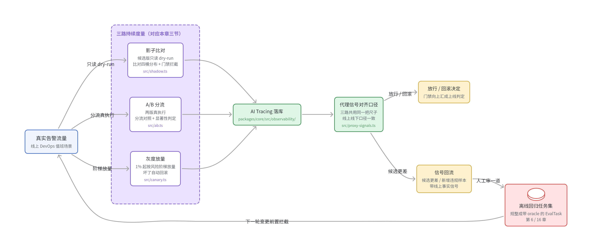
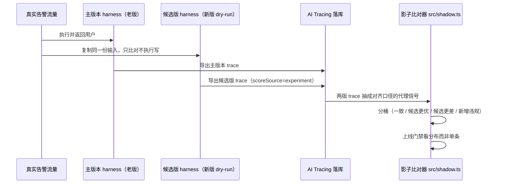
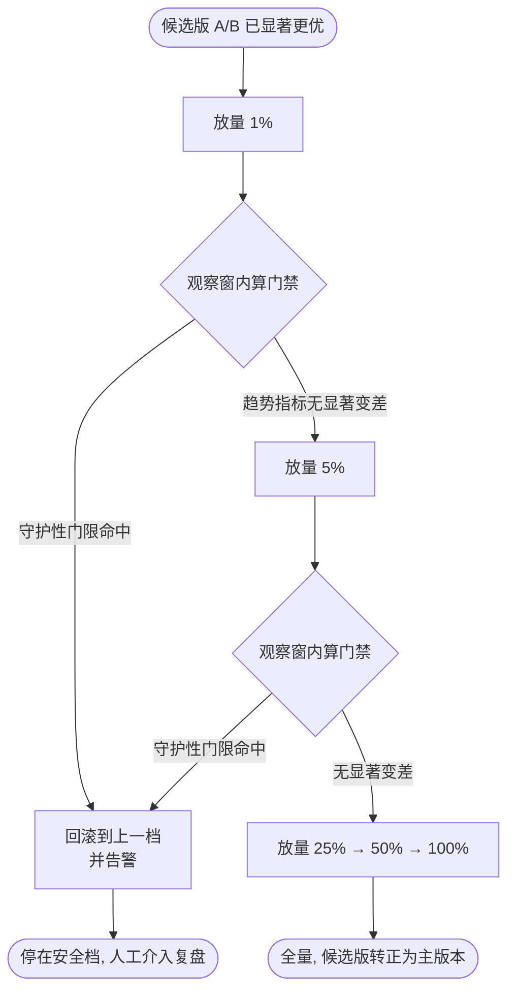

## 本章概览

到这里，离线评测的工具箱已经齐了：你能给 harness 量整体分（第 7 章）、能定位失败在哪一步（第 8、11 章）、能测稳定性（第 12 章）、能评该不该问人（第 13 章）。这些都在你自己造的任务集上跑。可任务集是你写的，它装得下你想到的情况，装不下你没想到的——而线上每天都在制造你没想到的情况。

这一章讲怎么把评测从离线延伸到线上：用影子流量在不影响用户的前提下比对新旧两版、用 A/B 分流拿真实流量做对照实验、用灰度逐步放量并设好回滚门限。难点不在搭管道，而在两件事：线上没有现成的正确答案（不像离线有 oracle），你得用代理信号来近似；以及线上的样本是流式、带噪声、还会随时间漂移的，得用第 4 章那套统计纪律来读，不能看一眼曲线就拍板。

载体仍是那个 DevOps 值班助手。前面各章都在离线把它评透，这一章把镜头切到生产现场：它正持续接真实告警、真实下手处理，怎么在不打扰用户的前提下被持续守护。

## 开篇：离线全绿，线上慢慢烂

先说一个和第 1 章不同的痛点。第 1 章那次是改一句话漏了升级，当场翻车，复盘能抓到现行。这次更阴。

某个季度的目标是降低值班助手误改配置的概率，于是你把升级阈值调严了：原来模型自己判断"拿不准就升级"，现在改成只要操作命中一张高危关键词表，就强制走人工。这个改动方向正确，离线评测集二百条任务跑完，误改率从 3% 降到 0，安全维度满分，没有任何回归。发布。

接下来两周，没有任何告警、没有任何事故。直到月底有人翻值班记录，发现人类 oncall 被叫醒的次数涨了快一倍。细看才明白：那张关键词表太宽，把一大批本来安全、值班助手过去能自助处理的常规操作（比如给某个无状态服务扩容）也拦下来升级了。每一次升级单看都"没错"——确实走了人工、确实没误改——离线评测集里压根没有这类常规操作的样本，所以分一点没掉。可线上的真实流量里，这类常规操作占了大头。系统在"安全"这个维度上变好了，在"别没事找人"这个维度上悄悄烂掉，而且烂得很慢，慢到两周都没人察觉。

这次失败暴露的不是某个 bug，是离线评测的结构性盲区：**你的任务集是你对"线上会发生什么"的一份猜测，它和真实流量的分布永远有差距。**离线全绿只证明"在我猜到的情况里没退化"，证明不了"在真实流量里没退化"。要补这个盲区，评测得跟到线上去，在真实流量上持续量。

线上持续评估要回答三个递进的问题：

1. 新版在真实流量上，行为和老版差在哪？——**影子（shadow）**，不影响用户地比对。
2. 这个差别是真变好还是噪声？——**A/B**，分流做对照实验，用第 4 章的统计判。
3. 确认变好了，怎么安全地全量？——**灰度（canary）**，逐步放量 + 自动回滚门限。

这三步不是孤立的检查项，而是一条数据持续流动的闭环：真实流量进来，分三路（影子只读比对、A/B 分流真执行、灰度阶梯放量）被持续度量，度量结果一路向上汇成放行/回滚决定，另一路把线上新暴露的样本回流进离线任务集，让下一轮变更在离线就被拦住。整条闭环如图 15-1 所示。



> 图 15-1：线上持续评估闭环的数据流向。真实流量分影子 / A/B / 灰度三路被度量（对应本章三节），度量结果一路汇成放行 / 回滚决定、一路把线上样本回流进离线任务集；`代理信号对齐口径`（`src/proxy-signals.ts`）是三路共用的同一把尺子，也正是线上线下口径必须一致的工程落点。这是本书线上闭环的门面图。

## 线上没有 oracle：拿什么打分

离线评测每条任务都带 `oracle`（第 5 章 `TaskOracle`：期望终态、该不该升级、不该碰的写操作）。线上没有。一条真实告警进来，没人提前告诉你"正确处理"长什么样。这是线上评估和离线评估最本质的区别，绕不过去。

应对办法是用**代理信号（proxy signal）**近似质量，分三类，可靠性递减：

- **可代码判定的硬信号**：值班助手有没有碰它绝对不该碰的写操作（对应 oracle 的 `forbiddenWrites`）、有没有在高危操作上跳过升级、一次处理花了多少 token 和多少秒。这些是确定性的（第 2 章术语：确定性评测），线上线下口径一致，最可信。
- **延迟到来的事实信号**：这条告警最后有没有真的被解决（事故有没有关单）、值班助手改的配置后来有没有被人回滚、被升级的工单人类最终判定为"该升级"还是"白叫"。这些是线上独有的金标准，但要等几分钟到几天才回来，得异步回填。
- **模型判定的软信号**：拿一个 LLM judge 给线上轨迹打质量分（对应第 1 章提到的 Mastra `scorers/llm/`）。线上量大，judge 成本和噪声都要控，通常只对采样出来的小部分轨迹跑——具体采样率按预算和风险定，量大时往往从个位数百分比起步，高危场景再往上调。采样别用纯随机：优先采样影子/灰度里被分到"候选更差"和"新增违规"桶的轨迹，用同样的预算覆盖到更多高风险轨迹，比均匀抽样划算得多。代价是采样率越低、judge 跑过的样本越少，估计的方差越大，所以报分时误差棒（第 4 章）要相应放宽——别拿 1% 采样跑出来的窄置信区间当成全量结论。

工程上，这三类信号都通过 Mastra 的 AI Tracing 落库后再算。Mastra 的可观测层（源码 `packages/core/src/observability/`）在 agent 每次运行时产出结构化 span（`SpanType.AGENT_RUN` / `TOOL_CALL` / `MODEL_GENERATION` 等，见 `types/tracing.ts`），span 经 `ObservabilityExporter`（接口定义在 `types/core.ts:587`，导出的 span 数据结构 `ExportedSpan` 见 `types/tracing.ts:943`）导出到你的存储或第三方平台（Braintrust、Langfuse 这类，对应 `BraintrustExporter` 等 exporter 实现）。延迟到来的事实信号和人工判定，用 `mastra.observability.addScore`（`types/core.ts:335`）按 `traceId` 异步把分挂回对应的 trace 上——这是 trace 级回流（不是 span 级），也正是线上数据回流的落点。`addScore` 接收的 `ScoreInput`（`types/scores.ts:13`）带一个 `scoreSource` 字段，类型是 `string`（`types/scores.ts:30`），不受任何联合类型约束；按惯例传 `'experiment'` 与日常 live 打分区分开。Mastra 内部另有一个 `ScorerScoreSource = 'live' | 'trace' | 'experiment'` 联合类型（`types/core.ts:129`）描述打分流程的来源，但它不约束你这里手填的 `scoreSource`。

落地到代码，回流分两步。第一步在 Mastra 实例上注册一个第三方 exporter，让线上 trace 持续落到能长期查询的平台（这里用 Langfuse，换 Braintrust 同理）：

```typescript
import { Observability } from '@mastra/observability';
import { LangfuseExporter } from '@mastra/langfuse';

export const mastra = new Mastra({
  observability: new Observability({
    configs: {
      default: {
        serviceName: 'oncall-assistant',
        // 线上 trace 落到 Langfuse，事实信号回来时按 traceId 找回对应 trace
        exporters: [new LangfuseExporter({ publicKey, secretKey, baseUrl })],
      },
    },
  }),
});
```

第二步，当延迟到来的事实信号回来时（关单 webhook、配置被回滚的事件、人工判定工单白叫），按当初记下的 `traceId` 把分异步挂回对应 trace。回流时把 `scoreSource` 标成 `'experiment'`，和日常 live 打分区分开。这个区分不是在代码里临时筛的：分数带着 `scoreSource` 一起落进 Langfuse，A/B 分析阶段是在 Langfuse 侧按 `scoreSource = 'experiment'` 过滤查询，只把实验期打的分拉出来算，日常 live 分不进这次实验的统计：

```typescript
// 异步收到"这条告警最终关单了"的事实信号后回流打分
await mastra.observability.addScore({
  traceId, // 当初运行时记下的 trace id
  score: {
    scorerId: 'incident-resolved',
    score: resolved ? 1 : 0,
    scoreSource: 'experiment', // 区分 A/B 实验打分与日常 live 打分
    reason: resolved ? '事故已关单' : '升级后人工判定白叫',
  },
});
```

人工判定走对称的 `addFeedback`（`types/core.ts:351`），挂的是结构化反馈而非数值分。这两个 API（`addScore` / `addFeedback`，都按 `traceId` 把数据挂回 trace）就是本章"延迟事实信号回流"的工程落点。

关键纪律：**线上的代理信号必须和离线 oracle 对齐口径。**第 7 章状态基评分判"碰了 `patchConfig` 但 oracle 标了 `forbiddenWrites` 包含它 = 失败"，线上这条硬信号必须用同一段判定逻辑、同一个口径，否则线上线下两套分根本没法比，影子比对也就失去意义。本章示例把这段判定抽成一个跨线上线下共用的纯函数。

## 影子流量：不影响用户的比对

影子是上线前的最后一道、也是风险最低的一道关。做法：真实流量照常进**主版本（老版，给用户返回结果）**，同时把同一份输入**复制一份喂给候选版（新版）**，候选版的输出只用于比对、不返回给用户、也不真正执行写操作。用户全程感知不到候选版存在，候选版却已经在真实流量上跑了一遍。一条流量在影子里走过的完整路径如图 15-2 所示。



> 图 15-2：一条流量在影子比对里的时序。主 / 候选 harness 即 harness-lab 的两个 `HarnessAdapter` 实例（第 5 章），候选版由 `adapter.withConfig()` 切成 dry-run 变体；`AI Tracing 落库` 对应 `packages/core/src/observability/` 的 `ObservabilityExporter`；`影子比对器` 是本章示例 `src/shadow.ts`，分桶复用 `src/proxy-signals.ts` 里那段与第 7 章对齐口径的状态判定。

影子的核心是候选版**只读化**。值班助手的高危写工具（`patchConfig` / `restartService`）在影子里必须被换成 dry-run 版——记录"它想这么改"，但不真的改。这件事用 adapter 的 `withConfig({ replace: ... })` 做最干净：评测层把写工具替换成 dry-run 实现，候选版的 `RunResult` 照常产出 `steps` 和 `finalState`，只是 `finalState` 是"假如执行了会变成什么"的推演态，不是真实环境态。

比对不要看单条，要看分布。把每条流量在主/候选两版上的代理信号拉齐，分到四个桶里：

- **一致**：两版行为等价，安全。
- **候选更优**：老版误升级、新版正确自助（或反之老版误改、新版拦住）。
- **候选更差**：新版出现了老版没有的违规或退化——这是你最该盯的桶。
- **新增违规**：候选版碰了 `forbiddenWrites`、或在该升级处跳过——一票否决项，哪怕只有几条也要拦。

回到本章开头那次"过度升级"的故障：如果当时先放影子，"候选更差"桶里会立刻堆起一大批"老版自助、新版升级"的常规操作流量，分布一眼就看出来——那次故障本可以在上线前就被这道关拦住。

## A/B 分流：真实流量对照实验

影子能比"行为差异"，但比不了"延迟到来的事实信号"——候选版没真执行，你不知道它改的配置后来会不会被回滚、它处理的告警最后有没有关单。要拿到这类金标准，候选版必须真的接一部分流量、真的执行。这就是 A/B：把真实流量按比例随机分到 A（老版）和 B（新版），两版都真实执行，再比两组的代理信号。

A/B 是一次正经的对照实验，第 4 章那套统计纪律全部生效，一条都不能省：

- **随机分流**：按请求/会话稳定哈希分桶，同一个值班会话始终落同一版，别让一个会话在两版间跳。
- **报分带误差棒**：每版的通过率是二项比例，用 Wilson 区间（第 4 章 `wilsonInterval`），不是裸点估计。
- **差异要做显著性检验**：两版通过率之差用双比例 z 检验（第 4 章 `twoProportionZTest`），p 值过线才下结论。本章开头那次故障的另一面教训是：升级率涨了一倍这种差异，做检验一眼显著；可很多真实差异只有一两个百分点，不检验根本分不清是真变化还是流量波动。
- **多指标要校正**：你同时盯误改率、升级率、关单率、时延好几个指标，同时比多项就有"撞上假阳性"的风险，门槛用 Bonferroni 收紧（第 4 章 `bonferroniThreshold`）。
- **算够样本量再看**：低频事件（误改率本来就 3%）要积累到足够样本，差异才检得出来。开实验前先用第 4 章 `sampleSizePerGroup` 估要跑多久，别跑半天发现样本不够、什么都没法下结论。

```typescript
// A/B 分流判定（完整版见 examples/15-online-shadow-ab/src/ab.ts）
// 比较 A、B 两版在真实流量上的通过率，带 Wilson 区间和显著性检验。
// numMetrics 是同时盯的指标数（这里默认 4：通过率/误改率/升级率/时延），门槛据此收紧。
export function decideAB(a: ArmStats, b: ArmStats, numMetrics = 4): ABVerdict {
  const ciA = wilsonInterval(a.pass, a.total); // 老版通过率 95% 区间
  const ciB = wilsonInterval(b.pass, b.total); // 新版通过率 95% 区间
  // 约定第一组传 B、第二组传 A，于是 diff = pB - pA，>0 表示新版更高
  const test = twoProportionZTest(b.pass, b.total, a.pass, a.total);
  const threshold = bonferroniThreshold(numMetrics);
  const significant = test.pValue < threshold;
  let verdict: ABVerdict['verdict'] = '差异不显著，继续观察或加样本';
  if (significant && test.diff > 0) verdict = 'B 显著更好';
  else if (significant && test.diff < 0) verdict = 'B 显著更差，回滚';
  return { verdict, diff: test.diff, pValue: test.pValue, threshold, ciA, ciB };
}
```

影子和 A/B 不是二选一，是接力：先影子（零风险，比行为差异、拦新增违规），影子干净了再 A/B（小比例真实流量，拿延迟事实信号、做显著性结论）。

## 灰度放量：阶梯放大 + 自动回滚

A/B 给出"B 显著更好"之后，不要一把全量。灰度是把候选版的流量占比阶梯式放大——1% → 5% → 25% → 50% → 100%——每一档停一段观察窗，窗内持续算门禁指标，**任一档触线就自动回滚到上一档**，而不是等人盯着曲线手动救火。

灰度门限要分两类，对应第 3 章的维度划分：

- **守护性门限（guardrail，一票否决）**：新增违规数 > 0、误改率绝对值超过红线、p99 时延爆表——这类是安全和成本的底线（第 3 章安全/成本维度），命中立即回滚，不看显著性，因为底线问题不容你慢慢攒样本。
- **趋势性门限（trend，看显著性）**：通过率、关单率这类质量指标，要等本档样本够了、做完显著性检验，确认"没有显著变差"才放行下一档。

每一档的"放量 → 观察窗算门禁 → 放行或回滚"如图 15-3 所示：守护性门限命中走左边一票回滚，趋势指标无显著变差才走右边进下一档。



> 图 15-3：灰度放量与自动回滚状态机。`观察窗内算门禁` 复用 A/B 那套带 Wilson CI + 显著性检验的判定（`src/ab.ts`）；`守护性门限` 与 `趋势性门限` 的判定在本章示例 `src/canary.ts`。

灰度门限的指标，和第 16 章的防劣化门禁是同一套判定逻辑，只是触发场景不同：第 16 章在**变更合入时**按 change manifest 选择性回归后门禁；这一章在**线上放量时**按观察窗门禁。两处共用第 4 章的统计件和第 7 章对齐口径的状态判定，这也是为什么前面反复强调线上线下口径必须一致——一致了，离线门禁和线上门限才能复用同一套代码，整条防劣化闭环才闭得上。

## 线上信号回流离线

线上持续评估最有价值的产出，不是某次发布的放行/回滚决定，而是它源源不断暴露的、你离线没想到的真实情况。本章开头那批"被误升级的常规操作"，一旦在影子或灰度里被识别出来，就该被**沉淀成离线任务集的新样本**：把那条真实流量的输入、初始态、以及它在线上拿到的事实信号（关单了/被回滚了/人工判定白叫了），规整成一条带 `oracle` 的 `EvalTask`（第 5 章），加进回归集。

这样下一次改动，离线评测就能提前拦住同类问题，不必再等线上烂两周。线上发现 → 回流离线 → 离线提前拦 → 再上线再发现，这条循环每转一圈，离线任务集就更贴近真实流量分布一分，开头那种"离线全绿线上烂"的盲区就收窄一分。这正好接上第 6 章（任务集构建）和第 16 章（防劣化闭环）：线上是离线任务集最好的样本来源，离线是线上变更最前置的护栏。

需要诚实交代边界：把线上信号回流离线、自动扩充回归集，业界有成熟实践（即"数据飞轮"，姊妹篇上册讲过基础），但**全自动**回流容易把噪声和异常样本也一并灌进任务集，污染基准。本章示例只做到"把候选样本捞出来、标好线上事实信号、交人工审一道再入集"，不做无人值守的自动入集——这是工程稳妥的做法，不是技术不能。

## 小结

- 离线评测的结构性盲区：任务集是你对线上的猜测，和真实流量分布永远有差距，离线全绿证明不了线上不退化；线上持续评估就是来补这个盲区的。
- 线上没有 oracle，得用代理信号近似质量——可代码判定的硬信号最可信、延迟到来的事实信号是金标准但要异步回填、LLM judge 软信号要采样且带误差棒；三类信号都靠 Mastra AI Tracing 落库后再算。
- 影子（候选版只读 dry-run、不影响用户）比行为差异、拦新增违规；A/B（真实流量分流、都真执行）拿延迟事实信号、做显著性结论；两者是接力，不是二选一。
- A/B 是正经对照实验，第 4 章统计纪律一条不能省：随机分流、Wilson 区间报分、双比例 z 检验、多指标 Bonferroni 校正、先估样本量。
- 灰度阶梯放量配自动回滚门限——守护性门限一票否决（不看显著性）、趋势性门限看显著性；这套门限和第 16 章的合入门禁共用同一套判定，前提是线上线下口径一致。
- 线上暴露的真实样本要回流离线、扩充回归集（带人工审一道，不做无人值守自动入集），让离线护栏越来越贴近真实流量。

## 配套代码

见 `examples/15-online-shadow-ab/`：一套不依赖真实 LLM、可独立跑通的线上持续评估管道。`src/proxy-signals.ts` 是跨线上线下对齐口径的代理信号判定（复用第 7 章状态判定形状）；`src/shadow.ts` 是影子比对器，把流量分到一致/更优/更差/新增违规四桶；`src/ab.ts` 用第 4 章的 Wilson 区间 + 双比例 z 检验 + Bonferroni 做 A/B 判定；`src/canary.ts` 实现守护性 + 趋势性两类灰度门限和自动回滚；`src/run.ts` 串起影子 → A/B → 灰度全流程，并演示把"候选更差"样本捞出来回流成离线 `EvalTask`。`npm i && npm run demo` 直接看一整条闭环跑出来的决定。
