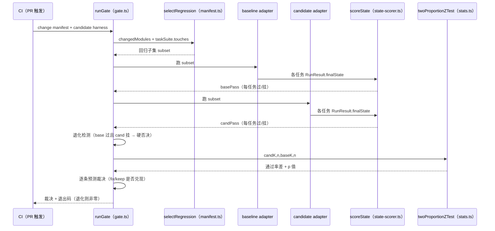
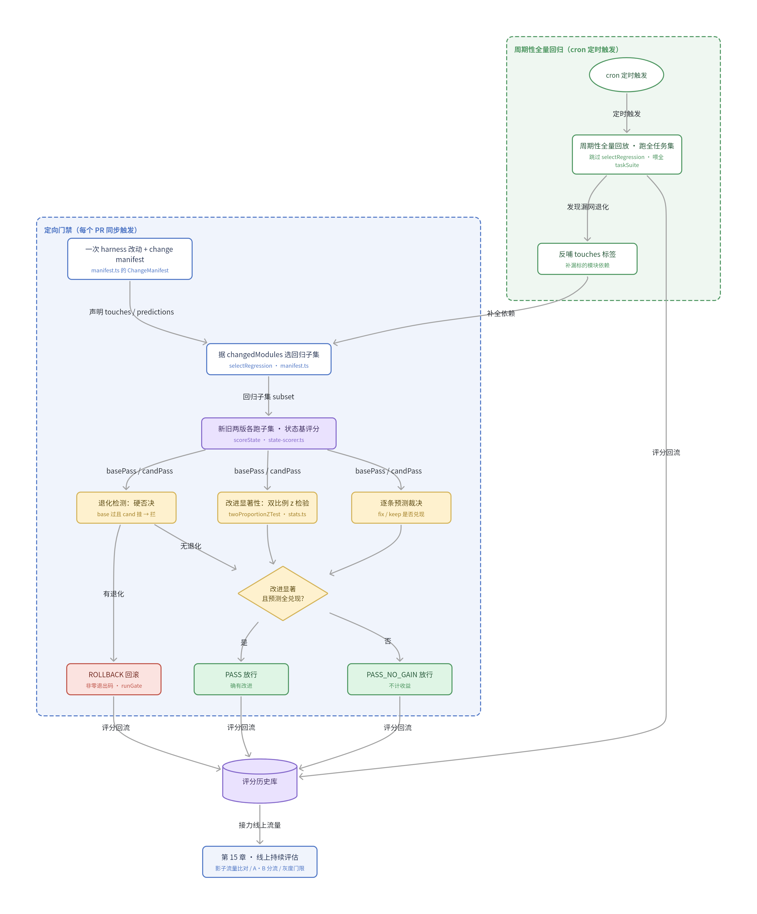

## 本章概览

到这一章，你已经能给值班助手量出整体分（第 7 章）、定位失败步（第 8、11 章）、测稳定性（第 12 章）、评人在回路（第 13 章）。这些都是"跑一次评测能回答的问题"。这一章要解决的是另一类问题：每次改完一版，怎么自动、可信地确认它没退化、而且确有改进——不靠人盯着跑、不靠拍脑袋说"应该没事"。

答案是把每次改动声明成一份 **change manifest**，据它选择性回归、做显著性门禁，串成一条"变更 → 定向回归 → 门禁裁决 → 放行或回滚"的防劣化闭环。本章先用一个具体的值班场景把这个需求逼出来，再给出 change manifest 的最小实现，最后把整条闭环跑通，并诚实交代一个反直觉的警示：harness 几乎预测不准自己的退化，所以门禁不能信它的自报。

## 开篇：没人敢跑全量的改动

这个场景和第 1 章那次"漏升级"无关，是另一种慢性病。

你的值班助手任务集攒到了三百多条，全量回放一遍要四十分钟、烧掉一笔不小的 token。一开始还好，每次发布前跑一遍。后来迭代变快，一天合五六个 PR，没人愿意为改一行 instructions 等四十分钟。于是规矩松了：小改动"目测没风险"就直接合，全量回归攒到周五一起跑。

周五跑出来，通过率从 0.91 掉到 0.86。问题是，这周合了十几个 PR，每个都"目测没风险"。掉的这 5 个点是哪个 PR 带来的？没人说得清。你只能挨个 revert 二分，又是一下午。更糟的是，有的退化是两个 PR 叠加才触发的，单独 revert 哪个都复现不出来。

把这次拖延拆开看，根子是两件事拧在一起：

- **回归太重，重到没人愿意每次跑**。全量回放对每个小改动都是浪费——一个只动了升级判定逻辑的 PR，没必要把查日志、查监控那些八竿子打不着的任务也跑一遍。
- **改动和影响之间没有留痕**。合并时谁都没记下"这个 PR 改了什么、预期影响哪些任务"，所以事后无从对账，只能靠 revert 二分硬找。

这两件事，正好是 change manifest 要补的两个洞：让回归变轻，让每次改动可对账。

## change manifest：可证伪的改动声明

change manifest 是一份跟着改动一起提交的声明（通常就放进 PR）。它回答两件事：

1. **这次改了哪些 harness 模块**（`changedModules`）——驱动选择性回归，只跑可能被影响的任务。
2. **期望发生什么**（`predictions`）——每条是一个**可证伪的预测**，下一轮评测用实际结果来裁决它兑没兑现。

第二点是这套方法的灵魂。它逼着改动的人在动手前先把话说死：我这一改，预期 `T06` 这条原本失败的边界任务会被修好，预期 `order`、`cdn` 这些正常服务不受影响。改动合并后，评测拿真实结果去核对每一条预测——修好的真修好了吗？说不受影响的真没动吗？没兑现的预测，就是一面照出"你以为的改动效果"和"实际效果"差距的镜子。

这个"每次改动附一个可证伪预测、下轮评测求交裁决"的思路，来自 2026 年 change manifest 相关的 arXiv preprint（见附录 B）。需要说清楚：它属于**前沿探索**，论文结论多为作者自报、尚未被独立大规模复现，本章给的是按这个思路做的一版最小实现，不是论文原物。把它当成"值得一试的工程范式"，而不是"经过验证的成熟定论"。

manifest 的 schema 用 zod 写出来很短（完整版在 `examples/src/manifest.ts`）：

```typescript
import { z } from 'zod';

// 一条可证伪预测：声称对某些任务的通过率会朝某个方向变
const PredictionSchema = z.object({
  tasks: z.array(z.string()).default([]),
  expect: z.enum(['fix', 'keep']), // fix=应该变好；keep=应该守住不动
  rationale: z.string(),           // 人读的理由，复盘时对照"当初怎么想的"
});

// change manifest：跟一次 harness 改动一起提交
const ChangeManifestSchema = z.object({
  id: z.string(),                         // 通常用 PR / commit 号
  changedModules: z.array(z.string()).min(1), // 改了哪些模块，驱动选择性回归
  predictions: z.array(PredictionSchema).default([]),
});
```

`expect` 只有两类，对应第 1 章就立下、贯穿全书的两个闭环方向：`fix` 是"提升"——这次改动要把某个原本做错的任务修好；`keep` 是"防劣化"——这些任务原本是对的，改完必须还对。两类都要兑现，才算这次改动"按设计工作"。

## 据 manifest 选回归子集

选择性回归的逻辑很直接：改了哪些模块，就回归所有"会经过这些模块"的任务。要做到这点，任务集里每条任务得知道自己会碰到哪些模块——给任务加一个 `touches` 标签即可：

```typescript
export interface TaggedTask extends EvalTask {
  touches: string[]; // 这条任务会用到的 harness 模块 id（工具 id / 'instructions'）
}
```

`touches` 不必手填。真实工程里它由 trace 反推：第 8 章的 OTAR trace 里，每个动作节点都带 `module` 字段，标了这一步由哪个 harness 模块产生；把一条任务跑出来的 trace 里出现过的模块收集起来，就是它的 `touches`。本章示例为了能独立、可复现地跑，先手标了，逻辑上等价。

有了标签，选子集就是一次集合求交（下面是 `manifest.ts` 里 `selectRegression` 的核心，`reason` 是给 CLI 打印用的人读说明）：

```typescript
export function selectRegression(
  manifest: ChangeManifest,
  tasks: { id: string; touches: string[] }[],
): RegressionPlan {
  const changed = new Set(manifest.changedModules);
  const byTouch = tasks
    .filter((t) => t.touches.some((m) => changed.has(m)))
    .map((t) => t.id);

  const byPrediction = manifest.predictions.flatMap((p) => p.tasks);
  const selected = [...new Set([...byTouch, ...byPrediction])];

  return {
    selected,
    reason:
      `改动模块 [${manifest.changedModules.join(', ')}] 命中 ${byTouch.length} 条任务，` +
      `预测显式点名追加 ${new Set(byPrediction).size} 条，去重后回归 ${selected.length} 条`,
  };
}
```

`byTouch` 是 touches 和 changedModules 有交集的任务；`byPrediction` 是 predictions 点名的任务——这是关键安全垫，哪怕某条任务的 touches 没和 changedModules 撞上，只要预测点了它的名就强制纳入：你既然敢预测它会变，就得真的跑它来验你的预测。

那个"安全垫"不是多余的。改动的影响半径常常超出 `changedModules` 的字面范围——你以为只动了 A 模块，实际波及了只经过 B 模块的任务。所以预测点名的任务一律强制回归，这是给"我以为"留的一道兜底。至于那些既没被 touch 命中、也没被预测点名的任务，这一轮就先不跑——它们留给本章后面「周期性全量回归的位置」一节讲的周期性全量回放去守，门禁这一关只跑可能被影响的那一片。

## 防劣化门禁的两套裁决标准

选出回归子集后，门禁对新旧两版 harness 各跑一遍、做状态基评分（第 7 章的 `scoreState`，比对终态与 oracle），然后裁决。门禁必须问两个**互相独立**的问题，混在一起问就会出错：

- **有没有退化？** 只要有一条任务 baseline 过、candidate 挂，就要拦。这个判断**不赌显著性**——回归门禁守的是"以前对的不能变错"，一条都不行。
- **声称的改进是不是真的？** 通过率涨了，但涨的是不是噪声？这个判断**必须过显著性**。第 4 章讲过，评测分是随机变量，单次涨 0.02 可能只是抖动。改进得过双比例 z 检验（同样在第 4 章的 `stats.ts` 里），否则不算"确有改进"。

为什么两个问题要用两套标准？因为它们的代价不对称。漏过一个退化，是把坏东西放进生产；错把噪声当改进，最多是虚报了一次"变好了"。前者必须零容忍，后者只需别自欺。把退化也拿去赌显著性，等于说"就退化了一条，样本太少不显著，放行吧"——这正是要避免的。

一次门禁内部的数据怎么从 manifest 一路流到裁决，如图 16-1 所示。manifest 先经 `selectRegression` 收敛成回归子集，子集分别喂给 baseline 和 candidate 两版 adapter 跑出两组 `RunResult`，各自过 `scoreState` 得到两张通过表，再分头汇进退化检测、显著性检验、预测裁决三条独立判断，最后由 `runGate` 合成一个裁决和退出码交给 CI。



图 16-1：一次门禁内部的数据流向。`selectRegression`、`scoreState`、`twoProportionZTest`、`runGate` 分别对应 `examples/src/` 下的 `manifest.ts`、`state-scorer.ts`、`stats.ts`、`gate.ts`。注意 basePass 和 candPass 流出后分三路汇入互相独立的三条判断——退化检测不经过 `twoProportionZTest`，这正是"退化硬否决、不赌显著性"在数据流上的体现。

下面这段代码就是图 16-1 里"退化检测 / 显著性 / 裁决"三个节点的实现：

```typescript
// 退化检测：任何一条 baseline 过、candidate 挂的任务，都是硬退化
const regressions = subset
  .filter((t) => basePass.get(t.id) && !candPass.get(t.id))
  .map((t) => t.id);

// 改进的显著性：双比例 z 检验（第 4 章），单子集比较门槛取 0.05
const z = twoProportionZTest(candK, n, baseK, n);
const alpha = bonferroniThreshold(1); // 单子集，等价 0.05
const improvedSignificantly = z.diff > 0 && z.pValue < alpha;

// 放行 / 回滚（保守优先：退化是硬否决，不看显著性）
if (regressions.length) {
  console.log(`裁决: ROLLBACK（检测到退化: ${regressions.join(', ')}）`);
  process.exitCode = 1; // 非零退出，CI 据此判红
} else if (improvedSignificantly && allPredictionsHeld) {
  console.log('裁决: PASS（无退化、改进显著、预测全兑现，放行）');
} else {
  console.log('裁决: PASS_NO_GAIN（无退化，但改进未达显著或预测未全兑现，放行但不计入收益）');
}
```

`bonferroniThreshold` 在这里是为多子集留的接口（第 4 章）：一次门禁如果同时对好几个回归子集分别做比较，比较次数多了，至少撞上一个假阳性的概率就上升，得把 0.05 收紧到 0.05/m。本章只有一个子集，等价于 0.05。

退化判断这里还藏着一个坑：它是拿"baseline 单次过、candidate 单次挂"下结论的，而第 12 章讲过，有些任务本身就有 flakiness——同一版 harness 反复跑，结果时过时挂。一条本来只有 70% 概率通过的任务，单次挂了未必是这次改动碰坏的，可能纯属抖动。对这类任务做"单次 pass → 单次 FAIL"的硬否决，误报率会很高，把好改动冤枉成退化。稳妥的做法有两条：要么对 flakiness 率超过某个阈值（比如 20%）的任务，改用第 12 章的 pass^k——跑 k 次取通过率，比较两版的通过率而非单次结果来判退化；要么干脆把"flakiness 足够低"作为一条任务能否进硬否决名单的前置条件，flakiness 高的任务不参与硬否决、只看趋势。哪种都行，关键是别让一条本就抖动的任务的一次偶然失败，把整个 PR 拦在门外。

把这道门禁放回它所在的完整防劣化闭环，如图 16-2 所示：每个 PR 触发一次"变更 → 定向回归 → 显著性门禁 → 放行或回滚"的同步关卡（图上半部分），三种裁决结果连同跑出的评分都回流进同一个评分历史；与之并行，一条由 cron 定时触发的周期性全量回归（图下半部分）跑全任务集，专门网住定向门禁因子集太窄而漏掉的退化，发现的漏网任务还会反哺 `touches` 标签，让下次定向回归选得更全。



图 16-2：change manifest 防劣化闭环。上半部分是每个 PR 同步触发的定向门禁，下半部分是 cron 定时触发的周期性全量回归，两层共用一个评分历史库（`L`）。各节点对应 `examples/src/` 里的实现：选子集是 `manifest.ts` 的 `selectRegression`，状态基评分是 `state-scorer.ts` 的 `scoreState`，显著性检验是 `stats.ts` 的 `twoProportionZTest`，整条裁决在 `gate.ts` 的 `runGate`；周期性全量回归与 `touches` 反哺这两块本章只给设计、不在 `examples/` 里实现。

## 跑一遍：好改动与坏改动

`npm run gate` 连跑两个场景，用确定性的 mock 适配器回放，不需要模型 key。

第一个是好改动。值班助手原本"错误率严格超过 0.05 才升级"，有人发现 `auth` 服务恰好 0.05、被卡在线下，于是把判定放宽到含等于。manifest 声明改了 `instructions` 模块，预测修好 `T06-borderline-auth`、守住 `order` 和 `cdn`。代码里用 `threshold=0.0499` 模拟"含等于"语义——值 0.05 对 0.0499 满足严格大于，效果与 `>= 0.05` 等价，读 `gate.ts` 时不要被这个 epsilon 迷惑。跑出来（下面输出里的 `✓`/`✗` 是 `gate.ts` 用 `console.log` 打的 CLI 标记，标"修好/退化"，不是 Markdown emoji）：

```
========== 门禁 [PR-482-放宽边界] ==========
  T06-borderline-auth    FAIL  → pass   ✓ 修好
通过率: baseline 0.88 [0.53, 0.98]  →  candidate 1.00 [0.68, 1.00]
显著性: 通过率差 0.125, p=0.302 (门槛 0.05)
预测裁决:
  [fix] T06-borderline-auth    FAIL → pass  兑现
  [keep] T03-noop-order         pass → pass  兑现
  [keep] T07-noop-cdn           pass → pass  兑现
裁决: PASS_NO_GAIN（无退化，但改进未达显著或预测未全兑现，放行但不计入收益）
```

这条任务确实修好了，三条预测全兑现，但裁决是 `PASS_NO_GAIN` 而不是 `PASS`。原因在显著性那一行：回归子集只有 8 条，修一条带来 +0.125 的提升，双比例 z 检验给出 p≈0.30，远过不了 0.05。这不是 bug，是这一章想让你看清的一件事——**改对了不等于测得出改对了**。8 个样本撑不起"显著改进"这个结论，门禁诚实地放行但拒绝把它记成一次收益。要把这个改进坐实，要么扩大回归子集，要么先看第 4 章的样本量估计：想稳稳测出 0.1 的提升，需要的样本远不止 8 条。

第二个是坏改动。另一个人嫌升级太频繁、想"少打扰人"，把阈值粗心调到 0.07。他的 manifest 只预测"不影响既有判定"。跑出来：

```
========== 门禁 [PR-501-调高阈值] ==========
  T05-borderline-cart    pass  → FAIL   ✗ 退化
通过率: baseline 0.88 [0.53, 0.98]  →  candidate 0.75 [0.41, 0.93]
预测裁决:
  [keep] T06-borderline-auth    FAIL → FAIL  兑现
裁决: ROLLBACK（检测到退化: T05-borderline-cart）
```

阈值一抬，`cart`（0.06）也不再升级了，从 pass 翻成 FAIL。门禁直接 `ROLLBACK`，进程以非零码退出，挂在 CI 上就是一个红叉。

这第二个场景藏着本章最重要的一条诚实边界。改动者的 manifest 压根没预测到 `cart` 会被碰翻——他以为只动了 `auth` 相关的判定。换句话说，**harness 自己几乎预测不准自己的退化**。这不是杜撰：相关研究实测，harness 预测自己"修好了什么"的精度约 33.7%（约 5 倍于随机），但预测自己"碰坏了什么"的精度只有 11.8%（仅约 2 倍于随机）（数据来自 2026 change manifest arXiv preprint，作者自报未独立复现，见附录 B）。结论很硬：

> 回归门禁不能靠 manifest 的预测自报，必须有独立的回归评测集兜底。

manifest 的 `predictions` 适合驱动"提升"方向的对账（改对了没），但守"防劣化"这道关，靠的不是它，是那个不管你怎么预测、照样把整个相关子集跑一遍的独立回归集。本章的门禁正是这么设计的：`cart` 没被 manifest 点名，但它的 `touches` 含 `instructions`，被 `selectRegression` 按改动模块捞进了回归子集，于是被跑到、被抓住。预测错了不要紧，独立回归兜住了。

## 把门禁挂上 CI

防劣化闭环要真正生效，得长在 CI 里、每个 PR 自动触发，而不是靠人记得跑。落地只需两点对接：

- **退出码即门禁信号**。`gate.ts` 在检测到退化时把 `process.exitCode` 置为 1，CI 据非零退出码判红、挡住合并。放行（`PASS` / `PASS_NO_GAIN`）则零退出、放绿灯。这和第 4 章"报分必带 CI"、第 7 章整体分门禁一脉相承。
- **manifest 从 PR 来**。`changedModules` 可以从 PR 的 diff 自动推断（动了哪个工具文件、哪段 instructions），`predictions` 由改动者手写进 PR 模板。门禁在 CI 里读这份 manifest，选子集、跑、裁决、把结果评论回 PR。

这样每个 PR 合并前都被独立回归集过一遍，退化在进生产前就被挡下；同时每条预测都留下了"说没说中"的记录，攒起来就是团队对"自己有多懂自己的改动"的校准数据——回到那个 11.8% 的警示，这份记录会告诉你，你团队的退化预测到底有多不可信，从而知道该把多少筹码押在独立回归上。但定向门禁守的只是"被改动模块波及到的那一片"，剩下的那一大片任务谁来守，是下一节要补的事。

## 周期性全量回归的位置

定向门禁有一个结构性的盲区：它只跑 `selectRegression` 选出的那一片——`changedModules` 命中的、加上 predictions 点名的。可这个选择本身建立在两个假设上，而这两个假设都会漏。一是 `touches` 标签未必全：trace 反推出来的模块依赖，可能因为某条任务这次没走到某个分支而漏标了一条边。二是改动的真实影响半径可能跳出 `changedModules` 的字面范围——动了 instructions 里一句措辞，理论上只影响升级判定，实际却让某个八竿子打不着的工具调用时序变了。这两种漏，定向门禁按设计就跑不到，因为被漏的那些任务压根没进回归子集。

补这个盲区的办法不是把每个 PR 的回归子集无限放大（那就退回到"每次都全量、慢到没人跑"的老问题），而是再加一道节奏不同的兜底：**按固定节奏（比如每周一次、或每晚低峰）跑一遍全任务集**。它和定向门禁是两层、各管各的：

- **定向门禁**：每个 PR 触发，快、窄，只跑被改动波及的那一片，目标是把退化挡在合并前，是同步阻塞的关卡。
- **周期性全量回归**：定时触发，慢、全，把三百多条任务整套跑一遍，目标是网住定向门禁漏掉的那些——`touches` 没标全的、影响半径跳出 `changedModules` 的、还有多个 PR 叠加才触发的退化（单个 PR 的子集里各自都正常，合到一起才翻车）。它不阻塞单个 PR，但每周给主干一次"整体还健不健康"的体检。

两层的分工对应一对取舍：定向门禁拿覆盖面换速度，周期性全量拿速度换覆盖面。少了前者，每次改动都要等四十分钟，没人愿意每次跑；少了后者，`selectRegression` 漏选的退化会一直潜伏到某次偶然全量才暴露——正是本章开头那个"周五一跑掉了 5 个点、查不出是谁"的慢性病。两道一起上，既日常轻快，又不留长期盲区。

工程上，周期性全量回归复用的就是定向门禁那套零件：同一个状态基评分、同一套显著性检验、同一个适配器，落地只是把三处接线换掉：

- **任务列表换成全集**：跳过 `selectRegression` 的求交，直接把 `taskSuite` 全部喂给 runner。
- **触发方式换成 cron**：从 PR 触发改成定时触发（比如每晚低峰一跑），不阻塞单个 PR。
- **结果写进同一个评分历史库**：和定向门禁共用一套历史（图 16-2 的 `L`），两层的趋势才连得起来。

全量回归发现的退化，回头还能反哺 `touches` 标签：既然这条任务这次被某个改动碰翻了却没进子集，说明它的模块依赖标漏了，补上，下次定向门禁就能提前抓到（对应图 16-2 里 `K → M → B` 那条反哺边）。

离线这两层守的都是主干和回归任务集，守不到的是真实生产流量——线上才有的输入分布、并发时序、真实环境状态，离线任务集再全也覆盖不到。这正是第 15 章线上持续评估的接力点：周期性全量回归把退化数据回流进评分历史后，第 15 章的影子流量比对拿同一套状态基评分去核对线上 candidate 与 baseline 的终态是否一致，A/B 分流用本章的双比例 z 检验判线上指标差是否显著，灰度门限沿用本章的退出码信号决定放量还是回滚。离线全量回归把退化挡在发布前，线上影子/灰度把离线没覆盖到的真实流量问题挡在全量放量前，评分历史和统计工具箱两层通用。

## 小结

- change manifest 把每次改动声明成"改了哪些模块 + 一组可证伪预测"，让回归变轻（选择性回归）、让改动可对账（预测裁决）。它是 2026 年的前沿范式，本章按思路做了最小实现，非成熟定论。
- 选回归子集 = 改动模块与任务 `touches` 求交，外加预测点名的任务强制纳入；`touches` 可由第 8 章 OTAR trace 的 `module` 字段自动反推。
- 门禁问两个独立问题，用两套标准：退化是硬否决、不赌显著性；改进必须过双比例 z 检验（第 4 章），否则只算 `PASS_NO_GAIN` 而非真改进。
- 小样本下"改对了"常常"测不出改对了"——示例里修好一条任务仍 p≈0.30，门禁诚实地不记为收益，提醒你回看样本量。
- harness 几乎预测不准自己的退化（实测约 11.8%）：防劣化这道关不能信 manifest 自报，必须有独立回归集兜底，本章门禁正是靠它抓住了 manifest 没料到的退化。
- 退出码即门禁信号，挂上 CI 就是每个 PR 自动跑的防劣化闭环。
- 定向门禁只跑被改动波及的那一片，漏选的部分由本章「周期性全量回归」一节按节奏（如每周）跑全任务集兜住，发现的漏网退化反哺 `touches` 标签；全量回归只覆盖离线任务集，真实生产流量交给第 15 章的线上影子/灰度，两层共用本章的状态基评分、双比例 z 检验和退出码信号。

## 配套代码

见 `examples/`：`manifest.ts` 是 change manifest 的 zod schema 与据它选回归子集的 `selectRegression`；`gate.ts` 是可直接 `npm run gate` 的门禁主流程，连跑一个好改动（修好边界任务但样本不足以显著 → `PASS_NO_GAIN`）和一个坏改动（碰翻 manifest 没预测到的任务 → `ROLLBACK`，非零退出）；任务集、状态基评分、统计工具箱、适配器都直接复用第 4、5、7 章的实现，整条闭环用确定性 mock 跑通、无需模型 key。
