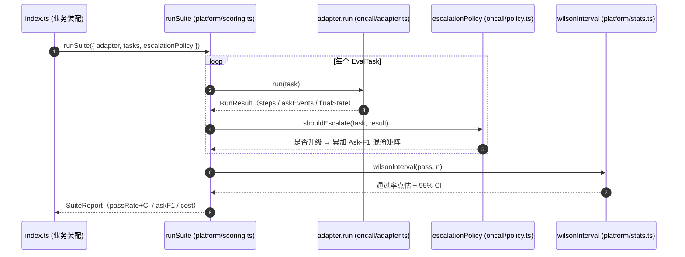

## 开篇：被复制七遍的 judge

值班助手上线半年后，团队从一个人扩到三个小组。日志组在评"查日志查得准不准"，监控组在评"告警归因对不对"，配置组在评"该不该升级"。各做各的，互不打扰，直到一次跨组复盘把三个人的评测脚本摆到一起。

三份脚本里，有一段几乎一模一样的代码出现了三遍：用 LLM 当 judge 给一条输出打分，重复采样三次取多数，再算一个 Wilson 区间。三个人各写各的，prompt 措辞不同、采样次数不同、区间公式有一个还写错了边界。更糟的是，配置组那份算出来的"整体分"和日志组那份口径不一样——一个把超时算成 fail，一个算成 error——两个分数没法横向比，可季度汇报里它们被放在了同一张表上。

那次复盘后我去 grep 了一下整个仓库，发现 `wilsonInterval` 这个函数被复制了七遍，`passHatK`（pass^k 估计）被复制了五遍，连第 8 章那个 OTAR trace 的节点定义都有两份各自演化、字段已经对不上的副本。每一份都是当初某个人为了赶一个业务评测，顺手从别处抄过来改的。它们一开始是同一段代码，半年后变成了七个会给出不同答案的版本。

评测做大之后绕不开一道选择：哪些东西该抽出来沉淀成一个**所有人共用的平台**，哪些该留在**各业务自己手里**。抽错了，要么是七份重复的 judge，要么是一个谁都不敢动、塞满业务特例的巨型框架。这一章讲怎么划这条线，以及怎么把前面十六章攒下的能力，收口成一个能复用、又留得住业务特化空间的 `harness-lab`。

## 通用机制 vs 业务判断

划线之前，得先有一把尺子。这把尺子很简单：**问一句"换一个完全不同的业务，这段东西还成立吗"。**

拿第 4 章那个 Wilson 区间举例。Wilson 区间是二项比例的置信区间，它只关心"n 次里成功了 k 次"，根本不在乎这 n 次是值班助手在改配置、还是电商客服在退款、还是代码 agent 在改 bug。换任何业务，公式一字不改。这种东西是**通用机制**——它回答的是统计、流程、数据结构这类与领域无关的问题。

再拿"该不该升级"这件事举例。值班助手里，"改生产配置必须升级、查日志不用升级"是一条业务策略；换成电商客服，对应的可能是"退款超过 500 块必须转人工"。同样是"该不该停下来问人"这个**形状**，但具体哪些操作算高危、阈值定在哪、漏一次的代价有多大，全是领域知识。这种东西是**业务判断**——它回答的是"在我这个领域里，什么算对、什么算危险"。

这两类东西混在一起写，是前面那七份重复 judge 的根源。正确的做法是把它们在代码里就分开：

| | 通用机制（沉淀进平台） | 业务判断（留在业务层） |
|---|---|---|
| 统计 | Wilson 区间、显著性检验、所需样本量 | 这个业务能接受多大的误差棒 |
| 稳定性 | pass^k / flakiness 的估计算法 | 这个任务跑几次算"够稳" |
| 评分引擎 | judge 的运行+重复采样+聚合机制 | judge 的 rubric、prompt、领域 persona |
| 归因 | 消融、Shapley 近似、反事实重跑的算法 | 哪些模块值得归因、阈值定多少 |
| trace | OTAR 节点结构、因果 DAG 构建 | 哪个步骤对应哪个业务语义 |
| 门禁 | change manifest 的 schema + 选回归算法 | 哪些变更影响哪些任务、卡多严 |
| 任务集 | EvalTask / oracle 的接口形状 | 具体的任务内容、期望终态、canary |

左列是"机制"，右列是"策略"。机制做成平台，所有业务共用同一份、同一个口径；策略做成可注入的参数和钩子，每个业务填自己的。业界常用一对说法描述这条线：通用的那部分是"task-agnostic eval"（与任务无关的通用质量，比如这条输出忠不忠实、相不相关），业务的那部分是"task eval"（你这个具体任务有没有做对）。两者用同一套引擎运行，但 rubric 和判定全然不同。这条线就是本章要在 `harness-lab` 里物理划出来的那条线。

## 平台层与业务层的分界

把上面那张表落到代码结构上，`harness-lab` 应该长成两层：一个与业务无关的**平台包**，加一组各业务自己维护的**业务插件**。中间用接口和钩子隔开，平台不认识任何具体业务，业务只依赖平台暴露的接口。这条分界如图 17-1 所示。

```mermaid
flowchart TB
    subgraph BIZ["业务层（每个业务一份，贴 KPI）"]
        T["任务集 + oracle<br/>(EvalTask[])"]
        R["judge rubric / persona<br/>(业务 prompt)"]
        P["业务策略<br/>(该不该升级 / 高危阈值)"]
        M["change manifest<br/>(本业务的变更声明)"]
    end

    subgraph PLAT["平台层 harness-lab（全公司一份，与业务无关）"]
        ST["stats: Wilson / 显著性 / 样本量<br/>第 4 章"]
        SC["scoring: judge 引擎 + 重采样聚合<br/>第 7 章"]
        PK["reliability: pass^k / flakiness<br/>第 12 章"]
        AT["attribution: 消融 / Shapley / 反事实<br/>第 9-11 章"]
        TR["trace: OTAR 节点 + 因果 DAG<br/>第 8 章"]
        GT["gate: change manifest 引擎 + 选回归<br/>第 16 章"]
        HK["hooks: 各钩子接口定义<br/>(EscalationPolicy 等)"]
        AD["adapter 接口<br/>第 5 章"]
    end

    subgraph HARNESS["被评的 harness（可替换）"]
        H["Mastra oncallAgent<br/>(oncall/adapter.ts)"]
    end

    BIZ -->|策略/rubric 经钩子注入| HK
    BIZ -->|任务集/数据注入| SC
    PLAT -->|run(task) 只依赖接口| AD
    AD --> H
```

> 图 17-1：harness-lab 平台层 vs 业务层的静态分界——业务层各业务一份、贴 KPI，平台层全公司一份、与业务无关，两层只通过钩子接口和 adapter 接口对接。

图里关键节点对应的源码模块：平台层 `stats` 对应第 4 章 `examples/04-eval-as-experiment/`，`scoring` 对应第 7 章 `examples/07-end-to-end-scoring/`，`reliability` 对应第 12 章 `examples/12-passk-flakiness/`，`attribution` 对应第 9–11 章，`trace` 对应第 8 章定义的 `OtarNode`（writing-kit §4），`gate` 对应第 16 章 `examples/16-change-manifest/`，`hooks` 对应本章 `platform/hooks.ts`（各钩子接口的定义处，下文那张包结构图里能找到同一个文件），`adapter` 对应第 5 章定义的 `HarnessAdapter`（writing-kit §4）。被评的 harness 通过 `oncall/adapter.ts` 里实现 `HarnessAdapter` 接口接入（示例给了免 key 的 `StubOncallAdapter` 和真接 Mastra 的 `buildMastraOncallAdapter()` 两版），附录 A 给出换成非 Mastra 载体的方法。

这张分层图和第 5 章那张 adapter 分层图是一脉相承的：第 5 章把 harness 从评测层解耦出去，这一章把业务策略从评测机制里解耦出去。两次解耦的方向相同——**让会变的东西（具体 harness、具体业务）通过接口接进来，让稳定的东西（评测机制）沉淀成不动的核心。**

## 划线两原则：复用与变更频率

知道该分两层，还得知道某段具体代码到底归哪层。光靠"通用还是业务"这一刀有时不够利落——有些东西看着通用，但只有你一个业务在用；有些看着业务特定，却被五个组抄来抄去。这里给两条更实操的原则。

**原则一：被复制到第三遍，就该进平台。** 第一次写某段评分逻辑，写在业务里没问题。第二个业务也要用，你复制粘贴，还能忍。到第三个业务又来抄的时候——本章开头那个 `wilsonInterval` 被复制七遍就是这么来的——这就是信号：它该被抽出来。这条原则的好处是它不需要你提前预判什么"通用"，而是让实际的复用频率告诉你答案。过早抽象和重复粘贴一样有害，等到第三遍再抽，抽出来的接口形状已经被三个真实用例验证过了。

**原则二：高频改的留业务层，低频改的进平台。** judge 的 rubric 会跟着业务理解的深入不断改——这周发现一类新的误判，下周就要调 prompt。这种高频变更的东西如果塞进平台，每改一次都得动平台、跑平台的全套测试、影响所有其他业务，没人受得了。反过来，Wilson 区间公式一年都不会动一次，放进平台谁也不碰它。把变更频率当成第二把尺子：**改得勤的东西离业务越近越好，改得少的东西沉得越深越稳。**

两条原则合起来，就能判断那些模棱两可的中间地带。比如"超时算 fail 还是 error"这个口径——它通用吗？算通用，每个业务都要决定。但它该进平台吗？该，因为它一旦不统一，跨业务的分数就没法比，而它本身又几乎不变。所以正确做法是：平台层提供一个**默认口径**（比如超时一律算 fail），同时留一个钩子允许业务覆盖，但覆盖要显式声明。默认统一、特例显式——这是平台设计里最常用的一招。

## 业务特化：钩子而非分叉

业务有特殊需求，最坏的应对是 fork 一份平台代码改。fork 出去的那份很快就和主干分叉，主干修了 bug 它享受不到，主干升级它跟不上，最后变成一份没人敢碰的孤儿代码。正确的姿势是平台在该让业务插手的地方留**钩子（hook）**，业务把自己的策略注入进去，而不是去改平台本身。

回到值班助手。"该不该升级"是纯业务判断，平台不可能内置。但平台可以定义这个判断的**形状**：给它一个任务和一次 run 的结果，让它返回"该不该升级"。业务实现这个函数，平台负责在评分流程里调用它、把结果汇成 Ask-F1（第 13 章）。平台管机制，业务管判断，两边通过一个窄接口对接：

```typescript
// 平台层只定义钩子的形状，不写任何业务判断
export interface EscalationPolicy {
  // 给定任务和一次运行结果，业务自己判断这次"该不该升级"
  shouldEscalate(task: EvalTask, result: RunResult): boolean;
}

// 业务层填自己的策略：值班场景里"轨迹中有一步是升级动作，就算请示了人"。
// StepRecord.kind 是 adapter 的 canonical 字段（writing-kit §4），
// 比按工具名硬匹配更稳——换工具名不用改这条策略。
export const oncallEscalationPolicy: EscalationPolicy = {
  shouldEscalate(task, result) {
    return result.steps.some((s) => s.kind === 'escalate');
  },
};
```

平台代码里永远不会出现 `escalateOncall` 这个值班场景专属的工具名——它只认 `EscalationPolicy` 这个接口和 `StepRecord.kind` 这个通用字段。换成电商客服，把"转人工"那一步同样标成 `kind: 'escalate'`，换一份 `refundEscalationPolicy` 注入进去，平台一行不改。这就是钩子相对 fork 的根本区别：业务的变化被**接口挡在平台外面**，平台保持干净、稳定、所有业务共享。

这套钩子模式贯穿整个 `harness-lab`：judge 的 rubric 是钩子，任务集是钩子，change manifest 是钩子，升级策略是钩子。平台提供运行这些钩子的引擎，业务提供钩子的内容。第 5 章的 `HarnessAdapter` 本身就是同一个模式的另一个实例——它是"换 harness"的钩子。整本书的代码能拼成一个系统，靠的就是这一组对齐的接口。

## 十六章收口成一个包

现在把前面的能力按这条线归一次位，得到 `harness-lab` 的最终包结构。左边是平台层（`src/platform/`，与业务无关），右边是业务层（`src/oncall/`，值班助手专属），`index.ts` 把两边组装成一个能跑的评测系统。

```text
harness-lab/
  src/
    platform/                  # 平台层：全公司共用，与业务无关
      adapter.ts               # 第 5 章：HarnessAdapter / EvalTask / RunResult 接口（canonical 定义在此）
      stats.ts                 # 第 4 章：wilsonInterval / 显著性 / 样本量（完整）
      scoring.ts               # 第 7 章：状态基评分 + 聚合 + judge 引擎（完整）
      reliability.ts           # 第 12 章：passHatK / flakiness（桩，完整实现见第 12 章）
      attribution.ts           # 第 9-11 章：ablation / shapley / 反事实（桩，完整实现见第 9-11 章）
      trace.ts                 # 第 8 章：OtarNode + 因果 DAG（桩，完整实现见第 8 章）
      gate.ts                  # 第 16 章：change manifest 引擎 + 选回归（桩，完整实现见第 16 章）
      hooks.ts                 # 各钩子的接口定义（EscalationPolicy 等，完整）
    oncall/                    # 业务层：值班助手专属，贴 KPI
      tasks.ts                 # 本业务的 EvalTask[] + oracle（每题带 tier: smoke/core/hard 三档）
      policy.ts                # oncallEscalationPolicy 等业务策略
      adapter.ts               # StubOncallAdapter / buildMastraOncallAdapter
      rubric.ts                # （未实现）本业务的 judge prompt / persona
      manifest.ts              # （未实现）本业务的 change manifest
    refund/                    # 业务层二：电商退款助手（换业务只换这一层，platform/ 一行不动）
      business.ts              # RefundStubAdapter + refundTasks + refundEscalationPolicy
    index.ts                   # 组装：平台引擎 + 业务钩子 → 可跑的评测
    swap-demo.ts               # 同一引擎先跑值班、再跑退款，证明 platform/ 不动
```

平台层这八个文件里，`adapter.ts`、`stats.ts`、`scoring.ts`、`hooks.ts` 是本章跑得通的完整实现，撑起 `npm run demo` 那条主线；`reliability.ts`、`attribution.ts`、`trace.ts`、`gate.ts` 标了「桩」——它们只保留接口和最小实现，完整版分别在第 12、9-11、8、16 章。结构图里留着这四个桩，是为了让你看清收口后的平台包到底由哪几块拼成，以及每块该去哪一章找完整代码；本章不重复实现它们。

业务层同理：配套示例里的钩子只覆盖 `EscalationPolicy` 这一条主线——`oncall/` 下实际只有 `tasks.ts`、`policy.ts`、`adapter.ts` 三个文件能跑通。其中 `tasks.ts` 里每条 `EvalTask` 都带了 `tier`（`smoke` 最简只读 / `core` 日常主路径 / `hard` 高危写），三档各覆盖一例，是给第 7 章那套按 `tier` 分层聚合的评分逻辑在本章备一份能跑的样本——本章 `platform/scoring.ts` 先出整体通过率，要按档分开看（高危那档跌了别被只读任务的高分盖住）就把第 7 章的分层聚合接上这份带 `tier` 的任务集。`rubric.ts`、`manifest.ts` 在图里标了「未实现」，是给你按第 7 章（judge rubric）、第 16 章（change manifest）的模式自填的钩子位，留着它们是为了让你看清平台/业务这条线在所有钩子上都一样划。

划线的判据就是前面两节那两把尺子。`stats.ts` 进平台，因为它通用、低频改、且开头被复制了七遍（三条原则全中）。`policy.ts` 留业务，因为它是纯业务判断、高频改、且只有值班这一个业务用。`adapter.ts` 出现在两层：接口定义在平台（`platform/adapter.ts`），具体的 Mastra 实现在业务（`oncall/adapter.ts`）——接口稳定、实现易变，正好沿着 adapter 这条缝劈开。

`index.ts` 里发生的事，就是把右边的钩子喂给左边的引擎：

```typescript
import { runSuite } from './platform/scoring';     // 平台：评分引擎
import { oncallTasks } from './oncall/tasks';       // 业务：任务集
import { oncallEscalationPolicy } from './oncall/policy'; // 业务：升级策略
import { StubOncallAdapter } from './oncall/adapter';     // 业务：接 Mastra

// 平台引擎只认接口，业务把自己的数据/策略/adapter 注入进来
const report = await runSuite({
  // 免 key 可跑的确定性桩；真接 Mastra 时换成 buildMastraOncallAdapter()
  adapter: new StubOncallAdapter(),
  tasks: oncallTasks,
  escalationPolicy: oncallEscalationPolicy,
});
```

这次注入之后，一条评测请求在两层之间怎么流动，如图 17-2 所示。注意整条链路里业务对象（adapter、tasks、policy）只在 `index.ts` 这一处被点名，进了平台引擎 `runSuite` 之后就退化成接口——平台逐任务回调业务注入的 adapter 和 policy，自己只管跑、聚合、算 Wilson CI，全程不认识"值班"两个字。



> 图 17-2：一次评测请求在平台层与业务层之间的运行时数据流。`runSuite` 是平台引擎，逐任务回调业务注入的 `adapter.run` 取 `RunResult`、回调 `escalationPolicy` 判定升级累加 Ask-F1，末尾调平台 `wilsonInterval` 出带 CI 的通过率；业务字符串止于 `index.ts`，不进平台。

换一个业务，只换 `oncall/` 这一层，`platform/` 一行不动。线划对了，**业务的增长就不会反过来侵蚀平台**——这正是配套示例里 `swap-demo.ts` 拿值班和退款两个业务跑同一份 `platform/` 验证的结论。

## 演进路线：别从平台开始

看到这套漂亮的两层结构，最容易犯的错是反过来——一上来就建平台。这几乎必然翻车：你还没有三个业务，凭空抽出来的"通用接口"都是想象的，等真业务来了发现形状全对不上，又得推倒重来。平台不是设计出来的，是从重复里长出来的。

实际的演进路线是图 17-3 这样三步，每一步的触发信号都来自真实重复，而不是提前设计：


> 图 17-3：harness-lab 从单脚本到团队平台的三步演进路线。阶段二由"第二个业务出现 + 复制到第三遍"触发，阶段三由"平台被业务特判污染"触发；多数团队停在阶段二即可。

阶段一就是你跟着这本书前十六章走完的状态：所有东西在一个 `harness-lab` 脚本里，能跑、能出分，但平台和业务还混着。这个阶段完全够用，别嫌它土——单业务下，混在一起反而改起来快。

阶段二的触发信号是第二个业务出现，并且你发现自己在复制粘贴评分、统计、pass^k 这些代码。这时按"复制第三遍"原则，把被反复抄的纯机制函数提进一个 `platform/` 目录。注意此时还不用急着设计完美接口，先让两三个业务共用同一份函数，接口形状会在共用中自己浮现。

阶段三的触发信号是平台开始被业务需求"污染"——有人想在平台的评分函数里加一个 `if (业务 === '值班')` 的特判。这是该上钩子的明确信号：把这种特判翻成一个钩子接口（像前面 `EscalationPolicy` 那样），让平台只认接口、业务填实现。走完这一步，平台才真正与业务无关，才扛得住更多业务接进来。

什么时候停？大多数团队停在阶段二就够了。阶段三的钩子化是有成本的——每个钩子都是一层间接，调试时要多跳一跳。**只有当业务数量多到"平台被污染"成了真问题时，才值得付这个成本。** 在那之前，过度设计的平台比重复的脚本更拖后腿。

## 别自己造：开源平台分工

`harness-lab` 是为了讲清方法论而手写的，真到生产里，平台层有相当一部分不必自己造。看清楚业界这几个工具各自占了上面分层图的哪一块，能帮你决定哪些自己写、哪些直接接。

- **Langfuse**（MIT，可自托管）：占的是 trace 记录 + 数据集 + 在线监控这一块。它能接住第 8 章的 OTAR trace 落盘、第 15 章的线上数据回流。Mastra 的 AI Tracing 通过 OtelBridge 就能往 Langfuse 导（第 8、15 章用到）。如果你需要一个能存 trace、管数据集、看线上指标的后端，这一层别自己写。

- **Inspect AI**（UK AISI，MIT）：占的是评测运行引擎 + 任务集 + LLM-judge 这一块，内建 tool-use / multi-turn / model-graded，还有 Agent Bridge 能对接其他 SDK。调研里把它评为"最适合自建私有 eval 的框架，推荐起步选它"。如果你不想从零写 `runSuite`，可以让它当平台层的评分引擎，业务钩子挂在它的接口上。

- **HAL**（Princeton，Holistic Agent Leaderboard，2025-10）：占的是大规模并行回放这一块——数百 VM 并行，把评测从数周压到数小时，一次跑两万多个 rollout。它代表的是平台层"规模"那一维。量级上有个粗略的分水岭：几百个任务、单机第 7 章那个并发 runner 几十分钟就能跑完，根本用不着 HAL；要等任务集涨到数千上万、单机一轮要跨周才轮得到结果时，并行 harness 才真正划算。换句话说，当你的任务集大到单机跑不完，需要的是 HAL 这种并行 harness，而不是把第 7 章那个并发 runner 硬撑到几千并发。

这三个工具和 `harness-lab` 不是替代关系，是**分层互补**：它们各自把平台层的某一块做厚了，而本书教你的是怎么把这些块按业务/机制的线组装起来、并在缝隙里填上业界还没有现成工具的部分——比如调研里明确指出的，**模块贡献度归因（第 9–11 章）目前没有成熟开源工具**，业界做法就是 feature flag + 重跑 + 算 delta，这块至今得自己写。知道哪块有轮子、哪块得自己造，比从头造一遍整个平台重要得多。

## 全书收口与下一步

走到这里，前面十六章在 DevOps 值班助手上装的每一层，都已经在 `harness-lab` 里有了位置：

- 第 1–4 章给了坐标系和地基——评的是 harness 不是模型，以及把评测当统计实验看的那套统计机制（沉进 `platform/stats.ts`）。
- 第 5–7 章把评测层挂上 harness——adapter 解耦、任务集、整体效果分（`platform/adapter.ts` + `platform/scoring.ts` + `oncall/tasks.ts`）。
- 第 8–11 章做模块归因——OTAR trace、消融、Shapley、反事实根因（`platform/trace.ts` + `platform/attribution.ts`）。
- 第 12 章管稳定性——pass^k 和 flakiness（`platform/reliability.ts`）。
- 第 13–14 章评只有 agent 才有的问题——HITL 的 Ask-F1、前后端双轨（`platform/hooks.ts` 的 `EscalationPolicy` + `oncall/policy.ts`）。
- 第 15–16 章闭环——线上持续评估、change manifest 防劣化（机制在 `platform/gate.ts`；业务侧的 `oncall/manifest.ts` 是留给你自填的钩子位）。
- 这一章把它们按业务/机制的线收口成一个能复用、留得住特化空间的包。

把这套东西用到你自己的系统上，按这个顺序动手最稳：

1. **先回答"评的是不是 harness"**。拿你手上的评测脚本对一遍：它评的是单条输出，还是整个系统的端到端行为？如果只有前者（很可能），第 1 章的那把尺子就是你第一个要补的缺口。
2. **先挂 adapter，再谈别的**（第 5 章）。给你的 harness 写一个 adapter，让评测层只依赖接口。这一步做完，后面所有能力才接得上去，也才换得动载体。
3. **先有整体分 + CI，再做归因**（第 7、4 章）。先能回答"整体行不行"并带上误差棒，比一上来就纠结"哪个模块拖后腿"更要紧——没有可信的整体分，归因出来的数也没基准可比。
4. **遇到 agent 特有的问题再装对应层**：时好时坏装 pass^k（第 12 章），该不该打断人装 Ask-F1（第 13 章），改完怕退化装 change manifest（第 16 章）。哪个痛装哪个，别一次全上。
5. **让它定期自己跑，而不是改一版手动跑一次**。change manifest 负责的是变更触发的定向回归（第 16 章），它不替代周期性的全量回归——后者也已在第 16 章交代过节奏（按周或按 sprint 全量重跑一遍、刷新 baseline），照那套接进你的 CI 排程即可，本章不再重复。
6. **平台留到第三个业务再抽**。单业务别建平台，按本章的演进路线，等重复真的发生了再沉淀，等平台真的被污染了再钩子化。

这本书没给你一个一键开箱的评测平台——那种东西要么不存在，要么贴不上你的业务。它给的是把评测系统一层层装起来的方法，外加每一层该划在哪、该不该自己造的判据。六步里没有哪一步要求你先有平台：第 1 步只需要一把尺子，第 2 步只需要一个 adapter，平台留到第 6 步、第三个业务真的来了再抽。手上那个跑过一次就扔的脚本，从第 1 步开始接，每接一层多守住一类回归。

## 小结

- 评测做大后的核心矛盾是平台化 vs 业务特化：抽错线，要么是七份重复的 judge，要么是塞满业务特例、没人敢动的巨型框架。
- 划线的尺子是"换个业务还成立吗"：通用机制（统计、评分引擎、pass^k、trace 结构、归因算法）沉进平台，业务判断（rubric、升级策略、任务集、阈值）留在业务层。
- 两条实操原则：复制到第三遍就该进平台；高频改的留业务、低频改的进平台。模棱两可的中间地带用"默认统一 + 特例显式"处理。
- 业务特化用钩子而不是 fork：平台定义接口（如 `EscalationPolicy`），业务注入实现，平台代码里永远不出现业务专属的字符串。`harness-lab` 整本书的代码靠这组对齐接口拼成系统。
- 别从平台开始：单脚本 → 复制第三遍抽公共函数 → 平台被污染才钩子化。大多数团队停在第二步就够，过度设计的平台比重复脚本更拖后腿。
- 平台层有现成轮子别自己造：Langfuse 管 trace/数据集，Inspect AI 当评分引擎，HAL 做大规模并行；但模块贡献度归因至今没有成熟开源工具，这块得自己写。

## 配套代码

见 `examples/17-platform-vs-bespoke/`：把前面各章的能力收口成一个分两层的 `harness-lab` 包——`platform/`（与业务无关的统计、评分、pass^k、trace 机制）+ `oncall/`（值班助手专属的任务集、升级策略、adapter）。示例演示一个完整的业务特化钩子 `EscalationPolicy`：平台引擎只认接口、业务注入值班策略算出 Ask-F1，再用一个最小脚本证明"换业务只换 `oncall/`、`platform/` 一行不动"。
